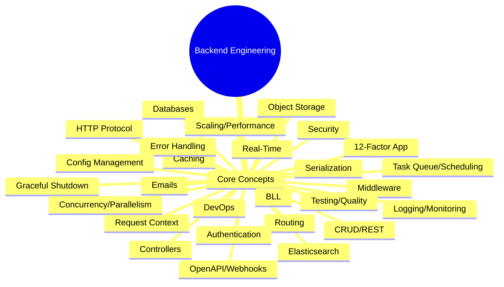

# 📝 Backend Engineering Roadmap: First Principles Series 🚀

This comprehensive roadmap note is based on the video "Roadmap for backend from first principles." It provides a logical, high-level summary and technical breakdown of essential backend engineering concepts, organized for easy GitHub reference.

> ⚡ **Backend engineering** goes well beyond implementing CRUD APIs. It is fundamentally about building reliable, scalable, fault-tolerant, and maintainable codebases and systems. Every new engineer faces a sprawling landscape of topics—this roadmap lays out all major components so you can learn efficiently and confidently.

***

## 📊 Major Topics & Key Concepts

| Section                        | Key Focus Areas                                                  | Essential Tools/Terms                |
|---------------------------------|-------------------------------------------------------------------|--------------------------------------|
| Roadmap Overview                | Scope, big-picture thinking                                       | Reliability, scalability, principles |
| HTTP Protocol                   | Requests, responses, headers, methods, status codes               | GET, POST, PUT, DELETE; CORS         |
| Routing                         | Mapping URLs, static/dynamic/nested/hierarchical/catchall routes  | Path/query params, versioning        |
| Serialization & Deserialization | Data formats (JSON, XML, Protobuf), structure & performance       | Parsing, validation, schema errors   |
| Authentication & Authorization  | Sessions, tokens, OAuth, RBAC/ABAC, hashing, security best practices | JWT, cookies, auditing, error handling|
| Validation & Transformation     | Data checks (syntactic, semantic, type), casting, normalization   | Error aggregation, sanitization      |
| Middlewares                     | Request/response cycle, chaining, cross-cutting concerns          | Logging, security, rate limiting     |
| Request Context                 | Scoped metadata/state per request                                 | Trace IDs, session info              |
| Handlers, Controllers & Services| MVC architecture, code reuse, centralized error handling          | Consistent messaging                 |
| CRUD Operations                 | Principles, mapping to HTTP, pagination, search, sorting          | Strict validation, response format   |
| RESTful Architecture            | API design principles, filtering, versioning, content negotiation | OpenAPI, Swagger, best practices     |
| Databases                       | Relational/NoSQL, ACID/CAP, schema design, ORM, migrations        | Indexing, transactions, pooling      |
| Business Logic Layer (BLL)      | Separation of concerns, error propagation                         | Service/domain models                |
| Caching                         | Strategies: client/server, memory, database, eviction policies    | TTL, LRU, hierarchical               |
| Transactional Emails            | Template anatomy, personalization                                 | Dynamic parameters, notifications    |
| Task Queuing & Scheduling       | Producer/consumer flows, background jobs, prioritization          | Broker, error retries, rate limiting |
| Elasticsearch                   | Inverted index, search analytics, field mappings, performance     | Segments, shards, Kibana             |
| Error Handling                  | Strategies, fail-safe, graceful degradation, logging/monitoring   | Sentry, ELK, alerting                |
| Config Management               | Separation of env/config, safe key handling, feature flags        | ENV files, secrets, dynamic configs  |
| Logging, Monitoring & Observability | Structured logs, metrics, alerts, security/compliance         | Prometheus, Grafana, thresholds      |
| Graceful Shutdown               | Signal handling, inflight requests, resource cleanup              | SIGINT, safe termination             |
| Security                        | Attack prevention (SQL, NoSQL, XSS, CSRF), design principles      | Input validation, encryption         |
| Scaling & Performance           | Bottleneck detection, optimizations, testing                      | Indexes, batch processing, profiling |
| Concurrency & Parallelism       | IO-bound vs CPU-bound, task handling                              | Async flows, parallel execution      |
| Object Storage & Large Files    | S3 usage, multipart uploads, streaming                            | Chunking, management                 |
| Real-Time Backend Systems       | WebSockets, server-sent events, Pub/Sub                           | Communication protocols              |
| Testing & Code Quality          | Unit/integration/end-to-end, CI/CD automation, metrics            | Linting, coverage, complexity index  |
| 12 Factor App Principles        | Modern app design paradigm                                        | Maintainability, modularity          |
| OpenAPI Standards               | Spec compliance, documentation automation                         | Swagger, Postman, API-first dev      |
| Webhooks                        | Event-driven integrations, secure responses, best practices       | Payloads, retry logic, signatures    |
| DevOps for Backend Engineers    | CI/CD, containerization, deployments/rollbacks, scaling strategies| Docker, Kubernetes, pipelines        |

***

## 🎯 Roadmap Process Flow

```mermaid
flowchart TD
  A[Start: Backend Roadmap Intro] --> B[High-Level System Understanding]
  B --> C[HTTP Protocol Deep Dive]
  C --> D[Routing & API Mapping]
  D --> E[Serialization/Deserialization]
  E --> F[Auth & Authorization Mechanisms]
  F --> G[Validation & Transformation Pipeline]
  G --> H[Middleware Setup]
  H --> I[Request Context Management]
  I --> J[Handlers & Controllers (MVC)]
  J --> K[CRUD Operations & RESTful Best Practices]
  K --> L[Database Systems & Strategies]
  L --> M[Business Logic Layer Design]
  M --> N[Caching Solutions]
  N --> O[Transactional Emails & Notifications]
  O --> P[Task Queuing/Scheduling]
  P --> Q[Elasticsearch/Search Integration]
  Q --> R[Error Handling & Recovery Strategies]
  R --> S[Config Management]
  S --> T[Logging, Monitoring, Observability]
  T --> U[Graceful Shutdown Procedures]
  U --> V[Security Architecture]
  V --> W[Scaling & Performance]
  W --> X[Concurrency/Parallelism]
  X --> Y[Object Storage/Large Files]
  Y --> Z[Real-Time Systems]
  Z --> AA[Testing, Code Quality, CI/CD]
  AA --> AB[12 Factor App Principles]
  AB --> AC[OpenAPI Standards]
  AC --> AD[Webhooks/Integrations]
  AD --> AE[DevOps for Backend Engineers]
  AE --> AF[End: Continuous Learning]
```

***

## 💡 Key Takeaways

- **Foundational Knowledge**: Understand underlying systems, not just framework-specific solutions.
- **Big Picture**: Know how each backend engineering topic connects for scalable and maintainable systems.
- **Practical Application**: Prioritize learning topics relevant to real-world backend challenges.

***

## ⚙️ Major Components Breakdown

### HTTP Protocol

| Concept                     | Description                                                                 | Example/Utility                           |
|-----------------------------|-----------------------------------------------------------------------------|-------------------------------------------|
| Methods                     | `GET`, `POST`, `PUT`, `DELETE`                                              | CRUD operations                           |
| Headers                     | Request, response, security, representational                               | CORS, content-type                        |
| Status Codes                | `200 OK`, `201 Created`, `400 Bad Request`, `404 Not Found`                  | Response handling                         |
| CORS                        | Cross-origin resource sharing                                               | Browser-server communication              |
| Compression                 | `gzip`, `deflate`, `br`                                                     | Reduce payload size                       |
| Versions                    | HTTP 1.1, HTTP 2.0, HTTP 3.0                                                | Performance improvements                  |

### Routing

- **Static/Dynamic Routes:** Easily map requests to backend logic.
- **Versioning:** URI, query, header-based.  
- **Securing & Grouping:** Middleware, permission checks, route optimizations.

### Serialization, Deserialization

- **Formats:** Text (JSON, XML), Binary (Protobuf).
- **Error Handling:** Validation, schema checks, null/date handling.

### Authentication & Authorization

| Type       | Description                                 |
|------------|---------------------------------------------|
| Stateful   | Session, cookies                            |
| Stateless  | Tokens, JWT                                 |
| Protocols  | OAuth2, OpenID Connect                      |
| Policies   | RBAC, ABAC                                  |
| Practices  | Salting, hashing, audit logs                |

### Validation and Transformation

- **Types:** Syntactic, semantic, type, conditional, relationship-based.
- **Best Practices:** Fail fast, consistent error messages, sanitization, normalization.

### Middlewares

- **Common Uses:** Security, CORS, authentication, logging, rate limiting.
- **Order of Execution:** Logging → Auth → Validation → Routing → Error Handling.

### Request Context

- **Scoped State:** Per-request metadata, session user info, trace IDs, timeout signals.

### Handlers, Controllers, Services

- MVC pattern for separation of presentation, business logic, and data access.

***

## 🚀 Backend Engineering: Career Essentials

| Principle                     | Rationale                                      |
|-------------------------------|------------------------------------------------|
| Separation of Concerns        | Isolate business logic, presentation, and data |
| Error Handling                | Gracefully deal with failures, provide clear messages    |
| Testing & Code Quality        | Automated tests, linting, maintainability metrics         |
| Security                      | Prevent injection, XSS, CSRF, ensure data validation    |
| Performance & Scaling         | Identify bottlenecks, caching, database optimization    |
| DevOps                        | CI/CD, containerization, horizontal/vertical scaling    |

***

## 🔥 Useful Quotes

> "Backend engineering is not just about building CRUD APIs; it's about constructing reliable, scalable, and maintainable codebases."  
> "If you learn only through a framework or language, you risk blind spots—true backend mastery comes from understanding foundational principles."

***

## 🧠 Mind Map: Backend Topics Overview



***

## ✅ Supplementary Details

<details>
  <summary>Feature Comparison: Middleware Types</summary>

| Type           | Usage                  | Example                  |
|----------------|------------------------|--------------------------|
| Security       | Add headers, prevent CSRF | `X-Content-Type`, CORS    |
| Logging        | Track requests/response | Request trace ID         |
| Error Handling | Catch/expose errors    | Normalizing error payload |
| Compression    | Shrink response size   | Gzip, deflate            |
| Data Parsing   | Handle payload formats | JSON, multipart forms    |
</details>

***

## 📚 Action Steps for Learners

- Focus on learning system design and fundamentals before diving deep into frameworks.
- Prioritize topics based on problem domains (auth, scaling, data, errors, etc.).
- Use diagrams and tables like above to relate concepts as you learn.
- Continuously review this roadmap alongside your backend journey for best results.

[1](https://www.youtube.com/watch?v=0Rwb4Xmlcwc&list=PLui3EUkuMTPgZcV0QhQrOcwMPcBCcd_Q1&index=1)
