# Backend Architecture: Handlers, Services, Repositories, Middleware & Request Context

## Table of Contents
1. [Introduction](#introduction)
2. [Request Lifecycle Overview](#request-lifecycle-overview)
3. [Handler/Controller Layer](#handlercontroller-layer)
4. [Service Layer](#service-layer)
5. [Repository Layer](#repository-layer)
6. [Layer Responsibilities Comparison](#layer-responsibilities-comparison)
7. [Middleware Concepts](#middleware-concepts)
8. [Common Middleware Types](#common-middleware-types)
9. [Request Context](#request-context)
10. [Best Practices and Design Principles](#best-practices-and-design-principles)

---

## Introduction

This document covers three fundamental backend architecture concepts:
- **Handlers, Services, and Repository Pattern**: Separation of concerns in backend architecture
- **Middleware**: Functions that execute in the middle of request lifecycle
- **Request Context**: Shared state accessible across the request pipeline

These patterns are **design patterns** rather than hard requirements, used to make codebases:
- More scalable
- More maintainable
- Easier to add features
- Easier to debug

---

## Request Lifecycle Overview

### External Request Flow

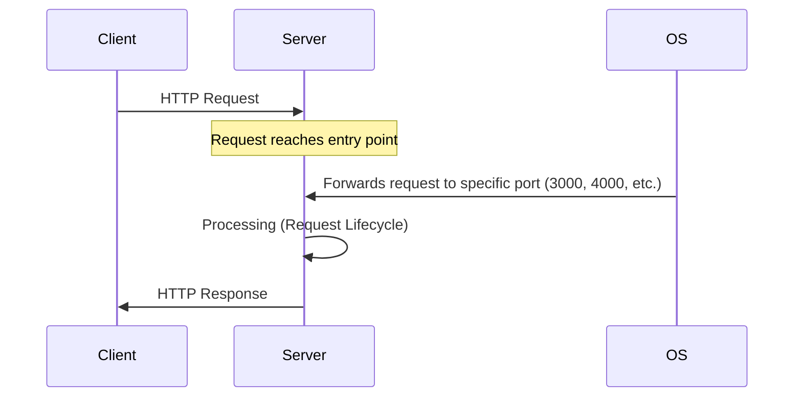

### Internal Request Lifecycle

The journey of a request inside the server:

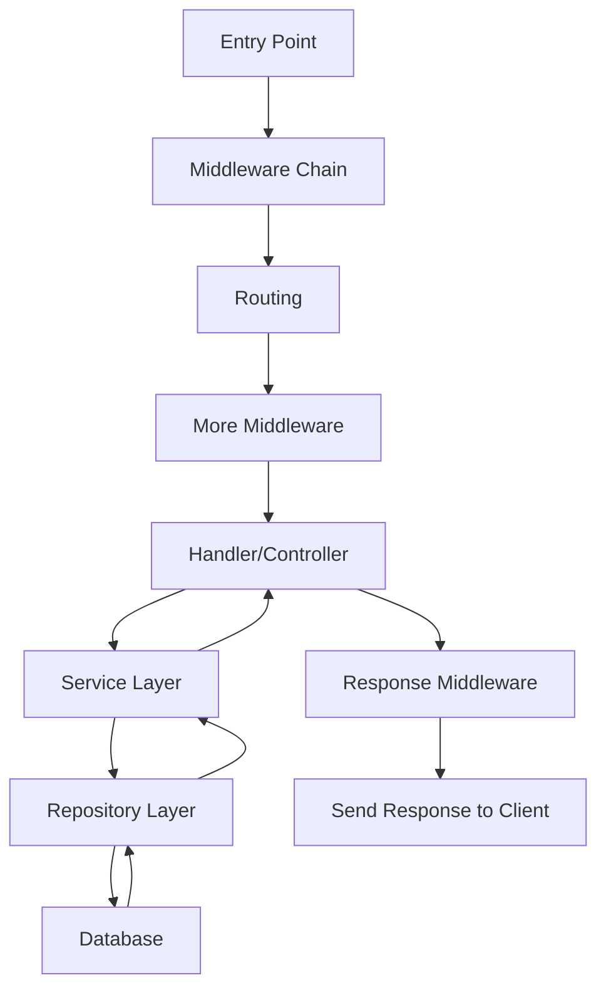

---

## Handler/Controller Layer

### Responsibilities

The Handler (also called Controller) is the **entry point** for processing a specific route. It deals with HTTP-specific concerns.

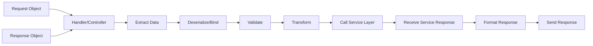

### Step-by-Step Handler Flow

#### Step 1: Data Extraction and Binding

**Binding** (Deserialization) converts JSON to native programming language format:

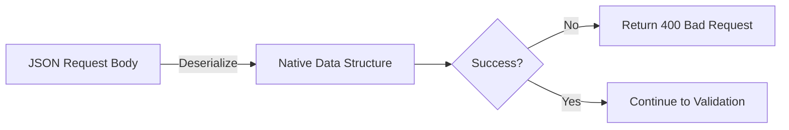

**Examples by Language:**
- **Node.js**: JSON automatically parsed to JavaScript objects (via middleware like `express.json()`)
- **Go**: Deserialize to struct
- **Python**: Deserialize to dictionary or class
- **Rust**: Deserialize to struct

If deserialization fails → **Return 400 (Bad Request)**

#### Step 2: Validation

Validate everything from external clients:
- Path parameters
- Query parameters  
- Request body
- Headers (when applicable)

Be **as specific as possible** during validation:
- Check data types
- Validate ranges
- Verify required fields
- Check formats (email, phone, etc.)

If validation fails → **Return 400 (Bad Request)**

#### Step 3: Transformation

Modify validated data for convenience:

**Example: Setting Defaults**
```
API: GET /books?sort=name
Query Parameter: sort (optional values: "name" or "date")

Transformation Pipeline:
1. If sort parameter not provided
2. Set default: sort = "date" (or "name")
3. Result: Database layer always receives a sort value
```

**Benefits:**
- Downstream layers receive predictable data
- Reduces conditional branching in service/repository layers
- Makes code more readable

#### Step 4: Call Service Layer

Pass all necessary data to service:
- Validated and transformed request data
- Authentication info (user ID, permissions)
- Any context needed for processing

#### Step 5: Format and Send Response

Based on service response:
- Decide appropriate HTTP status code
  - Success: 200, 201, 204
  - Client Error: 400, 401, 403, 404
  - Server Error: 500, 502, 503
- Format response body
- Set response headers
- Send response to client

### Handler Objects

Every handler receives (by default from runtime):

| Object | Purpose |
|--------|---------|
| **Request Object** | Contains all request data (headers, body, params, query) |
| **Response Object** | Used to send responses and modify response headers |

---

## Service Layer

### Core Principles

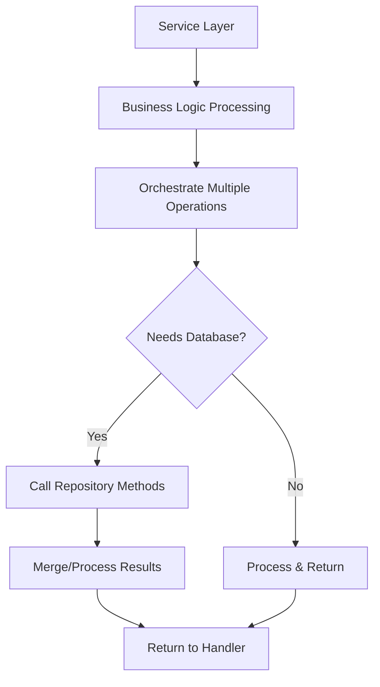

### Key Characteristics

1. **HTTP-Agnostic**: Service methods should NOT deal with HTTP concerns
   - No status codes
   - No request/response objects
   - Should be usable outside API context

2. **Business Logic Container**: All actual processing happens here
   - Data manipulation
   - External API calls
   - Email sending
   - Notification dispatching
   - Algorithm execution

3. **Orchestration**: Can use multiple repository methods
   - Fetch data from multiple sources
   - Merge different datasets
   - Apply complex business rules

### Service Method Pattern

```
Input: Business data (not HTTP data)
Processing: Complex operations, external calls, DB operations
Output: Business result (not HTTP response)
```

**Example Service Method Signature:**
```
// Good: HTTP-agnostic
function getBooksSorted(sortBy: string, userId: string): Book[]

// Bad: HTTP-coupled
function getBooksHandler(req: Request, res: Response): void
```

---

## Repository Layer

### Single Responsibility

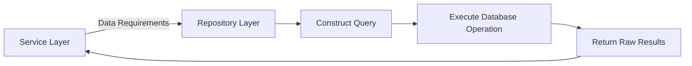

### Repository Pattern Rules

| Rule | Description | Example |
|------|-------------|---------|
| **Single Purpose** | One method = One type of operation | `getAllBooks()` OR `getBookById()` - not both in one method |
| **No Conditional Returns** | Don't return different data types based on parameters | Don't use optional parameter to return single book OR array of books |
| **Query Construction** | Sole responsibility is building and executing queries | Take filter/sort data → Build SQL/NoSQL query → Return results |
| **Raw Data Return** | Return database results without business logic | No data transformation, just what DB returns |

### Repository Method Examples

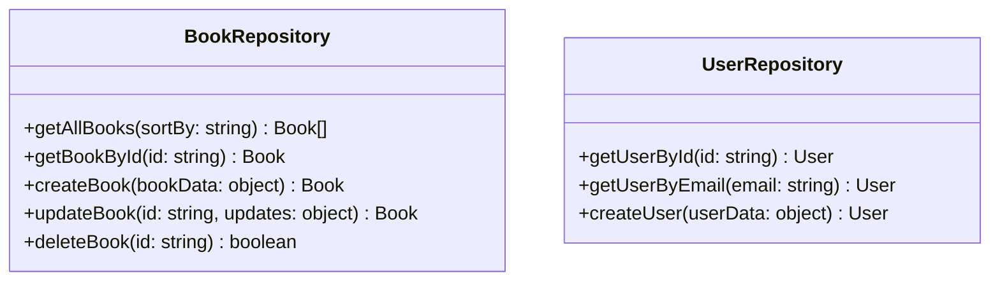

**Good Practice:**
```
✓ getAllBooks(sortBy: string): Book[]
✓ getBookById(id: string): Book

✗ getBooks(id?: string): Book | Book[]  // Bad: Conditional return
```

---

## Layer Responsibilities Comparison

| Aspect | Handler/Controller | Service | Repository |
|--------|-------------------|---------|------------|
| **Primary Focus** | HTTP Request/Response | Business Logic | Database Operations |
| **Receives** | Request, Response objects | Business data | Query parameters |
| **Returns** | HTTP Response | Business result | Raw database results |
| **Responsibilities** | • Extract data<br>• Validate<br>• Transform<br>• Format response | • Process business logic<br>• Orchestrate operations<br>• Call repositories<br>• External API calls | • Construct queries<br>• Execute DB operations<br>• Return results |
| **Knowledge of HTTP** | ✓ Full HTTP awareness | ✗ HTTP-agnostic | ✗ HTTP-agnostic |
| **Can call** | Service methods | Repository methods<br>External services | Database only |

### Complete Flow Example: Fetch All Books

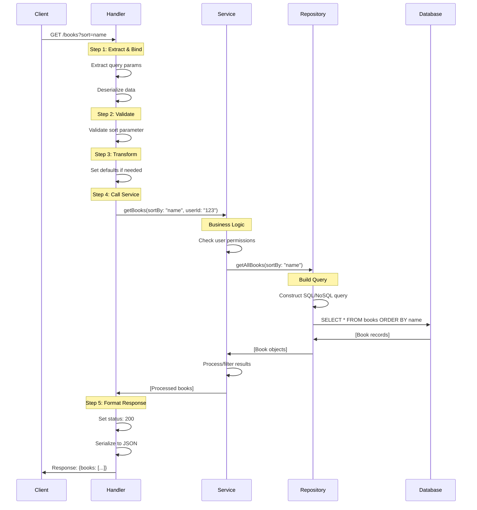

---

## Middleware Concepts

### What is Middleware?

**Middleware** = Functions executed in the **middle** of the request lifecycle

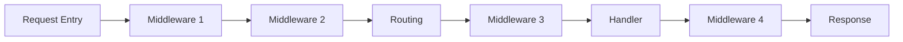

### Middleware Parameters

Every middleware receives (from runtime):

| Parameter | Type | Purpose |
|-----------|------|---------|
| **request** | Object | Read/modify request data |
| **response** | Object | Send response to client |
| **next** | Function | Pass execution to next middleware/handler |

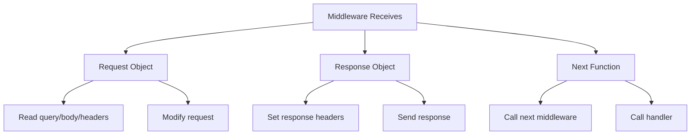

### The Next Function

**Purpose:** Pass execution to the next processing context

```mermaid
flowchart TD
    A[Middleware 1] -->|next()| B[Middleware 2]
    B -->|next()| C[Routing]
    C -->|next()| D[Handler]
    
    A -->|response.send()| E[Client]
    B -->|response.send()| E
```

**Key Point:** Middleware can:
- Call `next()` to continue the pipeline
- Send response and terminate the pipeline

### Why Use Middleware?

**Primary Reason:** **Reduce code duplication**

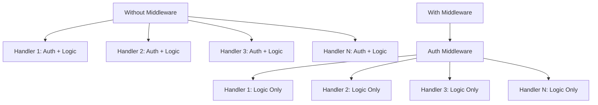

**Benefits:**
1. Write common operations once
2. Apply to multiple routes
3. Maintain consistency
4. Easier debugging
5. Centralized logic

### Middleware Execution Order

**CRITICAL:** Order matters!

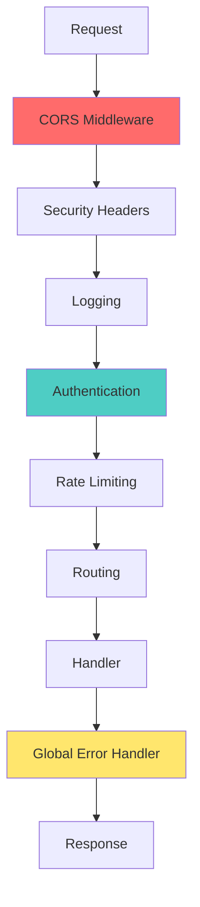

---

## Common Middleware Types

### 1. CORS Middleware

**Purpose:** Handle Cross-Origin Resource Sharing

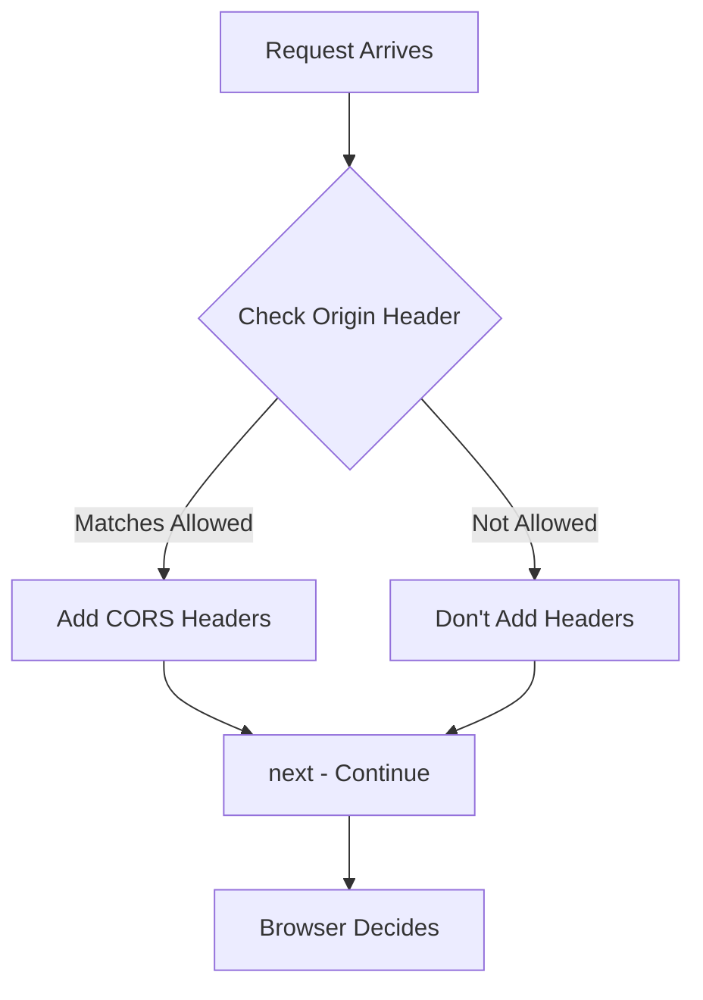

**Operations:**
1. Extract `Origin` header from request
2. Check if origin is in allowed list
3. If allowed: Add response headers
   - `Access-Control-Allow-Origin`
   - `Access-Control-Allow-Methods`
   - `Access-Control-Allow-Headers`
4. Call `next()`

**Why Middleware?**
- ✓ Needs to run on every request
- ✓ Deals with request/response objects
- ✓ Common functionality

### 2. Security Headers Middleware

**Purpose:** Add security-related HTTP headers

**Common Headers:**
- `Content-Security-Policy`
- `X-Frame-Options`
- `X-Content-Type-Options`
- `Strict-Transport-Security`

**Flow:**
```
Request → Add Security Headers → next() → Continue
```

### 3. Authentication Middleware

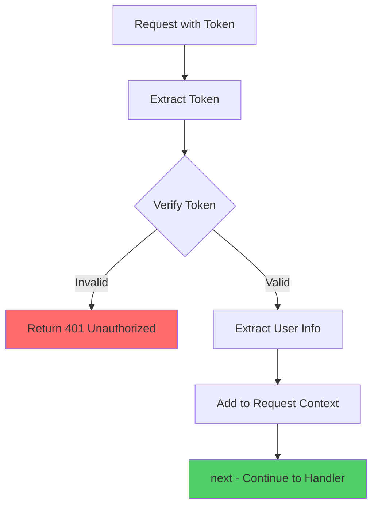

**Operations:**
1. Extract token (from headers/cookies)
2. Verify token (JWT validation, session check)
3. **On Failure:** Return `401 Unauthorized`
4. **On Success:**
   - Extract user ID, role, permissions
   - Store in request context
   - Call `next()`

**Why Middleware?**
- ✓ Authentication needed for multiple routes
- ✓ Early termination on failure saves resources
- ✓ Makes user info available downstream

### 4. Rate Limiting Middleware

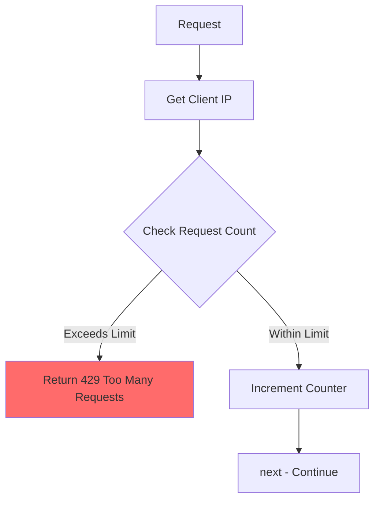

**Configuration Example:**
- **Threshold:** 30 requests
- **Time Window:** 2 seconds
- **Identifier:** IP address

**Operations:**
1. Extract client identifier (IP address)
2. Check request count in time window
3. **If exceeded:** Return `429 Too Many Requests`
4. **If okay:** Increment counter, call `next()`

### 5. Logging & Monitoring Middleware

**Purpose:** Log request details for debugging and auditing

**Information Logged:**
- Request method (GET, POST, etc.)
- Request path
- Query parameters
- Request body (sanitized)
- User agent
- IP address
- Timestamp
- Response time

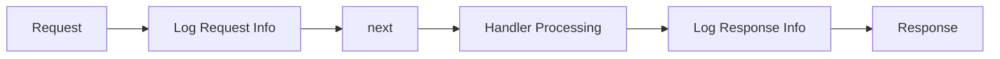

### 6. Global Error Handling Middleware

**Critical Position:** **LAST in middleware chain**

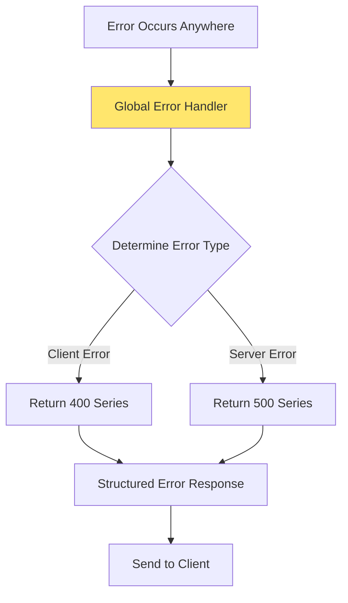

**Why Last?**
- Catches errors from all upstream middleware
- Catches errors from handlers
- If placed in middle, won't catch downstream errors

**Operations:**
1. Receive error from anywhere in pipeline
2. Determine error type (client vs server)
3. Structure error response:
   ```json
   {
     "status": "error",
     "code": "VALIDATION_ERROR",
     "message": "Invalid email format",
     "statusCode": 400
   }
   ```
4. Send appropriate HTTP status code

### 7. Compression Middleware

**Purpose:** Compress large responses

**Algorithm Examples:** Gzip, Brotli

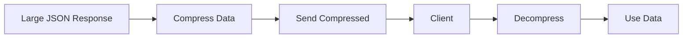

**Benefits:**
- Reduced bandwidth usage
- Faster transmission
- Modern browsers support decompression

### 8. Data Parsing Middleware

**Purpose:** Handle serialization/deserialization

**Examples:**
- `express.json()` in Node.js
- Body parser middleware

**Can include:**
- JSON deserialization
- URL-encoded parsing
- Multipart form data

---

## Middleware Ordering Best Practices

### Typical Order

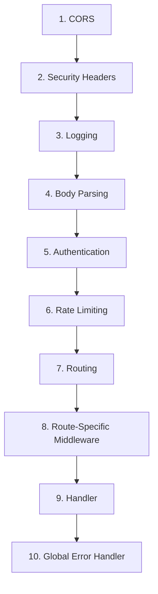

### Rationale

| Position | Middleware | Reason |
|----------|-----------|---------|
| **First** | CORS | Terminate early if origin not allowed |
| **Early** | Security Headers | Apply to all responses |
| **Early** | Logging | Capture all requests, even rejected ones |
| **Before Auth** | Body Parsing | Need parsed body for authentication |
| **Middle** | Authentication | Verify identity before expensive operations |
| **Before Handler** | Rate Limiting | Prevent abuse before hitting business logic |
| **Last** | Error Handler | Catch all errors from entire pipeline |

---

## Request Context

### What is Request Context?

**Request Context** = Shared state/storage scoped to a single request

```mermaid
graph TD
    A[Request Context] --> B[Key-Value Storage]
    B --> C[Accessible by All Middleware]
    B --> D[Accessible by Handler]
    B --> E[Accessible by Service Layer]
    
    F[Request 1] --> G[Context 1]
    H[Request 2] --> I[Context 2]
    J[Request 3] --> K[Context 3]
    
    style G fill:#a8dadc
    style I fill:#f1faee
    style K fill:#e9c46a
```

### Key Characteristics

| Property | Description |
|----------|-------------|
| **Scoped** | Each request has its own context |
| **Isolated** | Request 1's context ≠ Request 2's context |
| **Shared** | All middleware/handlers in same request access same context |
| **Temporary** | Destroyed after response sent |
| **Decouples** | Layers can communicate without tight coupling |

### Why Use Request Context?

**Problem Without Context:**
```mermaid
flowchart LR
    A[Auth Middleware] -->|Pass user_id as param| B[Handler]
    B -->|Pass user_id as param| C[Service]
    C -->|Pass user_id as param| D[Repository]
```
⚠️ **Tight coupling:** Every layer must explicitly pass data

**Solution With Context:**
```mermaid
flowchart TD
    A[Auth Middleware] -->|Set in context| B[Request Context]
    C[Handler] -->|Read from context| B
    D[Service] -->|Read from context| B
    E[Repository] -->|Read from context| B
```
✓ **Loose coupling:** Layers access shared storage

### Common Context Data

| Data Type | Example | Set By | Used By |
|-----------|---------|--------|---------|
| **User Identity** | `userId: "123"` | Auth Middleware | Handler, Service, Repository |
| **User Role** | `role: "admin"` | Auth Middleware | Authorization checks |
| **Request ID** | `requestId: "uuid-123"` | Logging Middleware | All layers (tracing) |
| **Permissions** | `permissions: ["read", "write"]` | Auth Middleware | RBAC checks |
| **Tracing Info** | `traceId: "abc"` | Monitoring Middleware | Distributed tracing |

### Request Context Flow

```mermaid
sequenceDiagram
    participant Req as Request
    participant M1 as Auth Middleware
    participant Ctx as Request Context
    participant M2 as Next Middleware
    participant H as Handler
    participant S as Service
    
    Req->>M1: Request arrives
    M1->>M1: Verify token
    M1->>Ctx: Set userId = "123"
    M1->>Ctx: Set role = "admin"
    M1->>M2: next()
    
    M2->>Ctx: Read userId
    M2->>H: next()
    
    H->>Ctx: Read userId, role
    H->>S: Call service
    
    S->>Ctx: Read userId
    S->>S: Use userId for DB insert
```

### Example Use Case: User Authentication

#### Without Context (Problematic)

```javascript
// Auth Middleware - extracts user
app.use((req, res, next) => {
  const userId = verifyToken(req.headers.token);
  req.userId = userId; // Modifying request object directly
  next();
});

// Handler - needs to pass userId explicitly
app.post('/books', (req, res) => {
  const { title, author } = req.body;
  const userId = req.userId; // Getting from modified request
  
  // Must pass userId to service
  const book = bookService.createBook(title, author, userId);
  res.json(book);
});

// Service - must accept userId parameter
function createBook(title, author, userId) {
  // Must pass userId to repository
  return bookRepository.insert({ title, author, userId });
}
```

⚠️ **Issues:**
- Direct modification of request object
- Every function must accept userId parameter
- Tight coupling

#### With Context (Better)

```javascript
// Auth Middleware - sets context
app.use((req, res, next) => {
  const userId = verifyToken(req.headers.token);
  req.context.set('userId', userId); // Set in context
  next();
});

// Handler - doesn't need userId parameter
app.post('/books', (req, res) => {
  const { title, author } = req.body;
  
  // Service accesses context internally
  const book = bookService.createBook(title, author);
  res.json(book);
});

// Service - reads from context
function createBook(title, author) {
  const userId = context.get('userId'); // Read from context
  return bookRepository.insert({ title, author, userId });
}
```

✓ **Benefits:**
- Clean function signatures
- Loose coupling
- Centralized state management

### Request ID for Distributed Tracing

```mermaid
flowchart TD
    A[Generate Request ID] --> B[Store in Context]
    B --> C[Log: Request ID - User Login]
    C --> D[Call External Service]
    D --> E[Include Request ID in Header]
    E --> F[External Service Logs with Same ID]
    F --> G[Response Logged with Request ID]
    
    H[Debugging] --> I[Search Logs by Request ID]
    I --> J[Trace Complete Journey]
```

**Example:**
```
Middleware: Generate UUID → Store in context
Handler: Log "Request abc-123: Creating book"
Service: Log "Request abc-123: Validating data"
Repository: Log "Request abc-123: Inserting into DB"
External API: Called with X-Request-ID: abc-123
Response: Log "Request abc-123: Success"
```

### Context for Cancellation & Timeouts

**Use Case:** Prevent hanging operations

```mermaid
flowchart TD
    A[Request with Timeout] --> B[Set Deadline in Context]
    B --> C[Handler Processing]
    C --> D{Timeout Exceeded?}
    D -->|Yes| E[Cancel Operation]
    D -->|No| F[Continue Processing]
    E --> G[Return Timeout Error]
    F --> H[Complete Successfully]
```

**Implementation Concept:**
1. Middleware sets timeout deadline in context
2. Long-running operations check context
3. If timeout exceeded, abort and return error
4. Prevents resource exhaustion

---

## Best Practices and Design Principles

### Layer Separation

| Principle | Description |
|-----------|-------------|
| **Single Responsibility** | Each layer has one primary job |
| **Abstraction** | Service layer doesn't know about HTTP |
| **Loose Coupling** | Layers communicate through interfaces, not direct dependencies |
| **Testability** | Each layer can be tested independently |

### Handler Best Practices

✓ **Do:**
- Extract and validate input
- Transform data for convenience
- Handle HTTP status codes
- Format responses
- Deal with serialization/deserialization

✗ **Don't:**
- Contain business logic
- Make database calls directly
- Have complex algorithms

### Service Best Practices

✓ **Do:**
- Contain all business logic
- Orchestrate multiple operations
- Be HTTP-agnostic (reusable outside API context)
- Call multiple repositories if needed
- Handle external API calls

✗ **Don't:**
- Deal with HTTP request/response
- Parse request bodies
- Set HTTP status codes
- Know about routes

### Repository Best Practices

✓ **Do:**
- Single operation per method
- Return raw database results
- Construct optimized queries
- Handle database-specific logic

✗ **Don't:**
- Apply business logic
- Transform data beyond DB requirements
- Have conditional return types
- Make external API calls

### Middleware Best Practices

✓ **Do:**
- Keep middleware focused on single concern
- Order middleware thoughtfully
- Use `next()` to continue pipeline
- Terminate early on errors
- Use for cross-cutting concerns

✗ **Don't:**
- Put business logic in middleware
- Forget to call `next()` when continuing
- Ignore middleware order
- Use for operation-specific logic

### Context Best Practices

✓ **Do:**
- Use for request-scoped data
- Store authentication info
- Generate request IDs for tracing
- Keep it lightweight
- Document what's stored

✗ **Don't:**
- Store large objects
- Use for cross-request state
- Modify context in repository layer
- Store sensitive data without consideration
- Overcomplicate with too many values

---

## Complete Example: Create Book API

### Full Request Flow

```mermaid
sequenceDiagram
    participant C as Client
    participant CORS as CORS Middleware
    participant Auth as Auth Middleware
    participant RL as Rate Limit
    participant H as Handler
    participant S as Service
    participant R as Repository
    participant DB as Database
    participant Err as Error Handler
    
    C->>CORS: POST /books<br/>{title, author}
    CORS->>CORS: Check origin
    CORS->>Auth: next()
    
    Auth->>Auth: Verify token
    Auth->>Auth: Set context(userId, role)
    Auth->>RL: next()
    
    RL->>RL: Check rate limit
    RL->>H: next()
    
    Note over H: Handler Layer
    H->>H: Extract & deserialize body
    H->>H: Validate: title, author present
    H->>H: Transform: trim strings
    H->>S: createBook(title, author)
    
    Note over S: Service Layer
    S->>S: Get userId from context
    S->>S: Check permissions
    S->>R: insertBook({title, author, userId})
    
    Note over R: Repository Layer
    R->>R: Construct INSERT query
    R->>DB: INSERT INTO books...
    DB->>R: {id: 1, title, author, userId}
    R->>S: Book object
    
    S->>S: Process result
    S->>H: Book object
    
    H->>H: Format response
    H->>C: 201 Created<br/>{book: {...}}
    
    Note over Err: No error occurred,<br/>error handler skipped
```

### With Error Scenario

```mermaid
sequenceDiagram
    participant C as Client
    participant Auth as Auth Middleware
    participant H as Handler
    participant Err as Error Handler
    
    C->>Auth: POST /books<br/>Invalid token
    Auth->>Auth: Verify token - FAIL
    Auth->>Err: throw AuthError
    
    Note over Err: Error Handler
    Err->>Err: Detect error type
    Err->>Err: Format error response
    Err->>C: 401 Unauthorized<br/>{error: "Invalid token"}
```

---

## Key Takeaways

### Architecture Summary

| Component | Analogy | Role |
|-----------|---------|------|
| **Handler** | Reception Desk | Receives requests, validates, directs to right place |
| **Service** | Manager | Makes decisions, coordinates operations |
| **Repository** | Filing Clerk | Retrieves/stores documents (data) |
| **Middleware** | Security/Reception | Screens everyone coming in |
| **Context** | Visitor Badge | Carries info throughout the building |

### Why This Architecture?

1. **Scalability**: Easy to add new features without affecting existing code
2. **Maintainability**: Clear separation makes debugging easier
3. **Testability**: Each layer can be unit tested independently
4. **Reusability**: Service methods can be called from multiple handlers or even non-HTTP contexts
5. **Team Collaboration**: Different team members can work on different layers
6. **Code Quality**: Enforces best practices and reduces duplication

### Remember

- **Not a Hard Requirement**: This is a design pattern, not a rule
- **Flexibility**: Adapt to your project's needs
- **Start Simple**: Can begin with just handlers and add layers as needed
- **Language Agnostic**: These patterns work across Node.js, Go, Python, Rust, etc.
- **Think About Flow**: Always consider the request lifecycle from client to database and back

---

## Final Diagram: Complete Architecture

```mermaid
flowchart TD
    Start[Client Request] --> Entry[Server Entry Point]
    
    Entry --> MW1[CORS Middleware]
    MW1 --> MW2[Security Headers]
    MW2 --> MW3[Logging Middleware]
    MW3 --> MW4[Body Parser]
    MW4 --> MW5[Auth Middleware]
    MW5 -.->|Set Context| CTX[Request Context]
    MW5 --> MW6[Rate Limiting]
    MW6 --> Route[Routing Algorithm]
    
    Route --> Handler[Handler/Controller Layer]
    Handler --> |1. Extract| H1[Extract Data]
    H1 --> |2. Deserialize| H2[Bind to Native Format]
    H2 --> |3. Validate| H3[Validate Input]
    H3 --> |4. Transform| H4[Transform Data]
    H4 --> |5. Call Service| Service[Service Layer]
    
    Service -.->|Read| CTX
    Service --> S1[Business Logic]
    S1 --> S2[Orchestrate Operations]
    S2 --> Repo[Repository Layer]
    
    Repo --> R1[Construct Query]
    R1 --> DB[(Database)]
    DB --> R2[Return Results]
    R2 --> Service
    
    Service --> Handler
    Handler --> |6. Format| H5[Format Response]
    H5 --> ErrMW[Error Handler Middleware]
    ErrMW --> End[Send Response to Client]
    
    style Handler fill:#a8dadc
    style Service fill:#f1faee
    style Repo fill:#e9c46a
    style CTX fill:#f4a261
    style ErrMW fill:#e76f51
```

---

**End of Document**

This comprehensive guide covers the fundamental backend architecture patterns used in production-grade applications across different programming languages and frameworks. Apply these patterns thoughtfully based on your project requirements and team standards.
