# Logging, Monitoring, and Observability: Comprehensive Notes

## Table of Contents

1. [Introduction](#introduction)
2. [Core Concepts Overview](#core-concepts-overview)
3. [Logging](#logging)
4. [Monitoring](#monitoring)
5. [Observability](#observability)
6. [Three Pillars of Observability](#three-pillars-of-observability)
7. [Log Levels](#log-levels)
8. [Structured vs Unstructured Logging](#structured-vs-unstructured-logging)
9. [Instrumentation and OpenTelemetry](#instrumentation-and-opentelemetry)
10. [Tools and Technologies](#tools-and-technologies)
11. [Workflow Integration](#workflow-integration)
12. [Implementation Best Practices](#implementation-best-practices)
13. [Practical Example](#practical-example)

---

## Introduction

**Logging, Monitoring, and Observability** are fundamental practices in modern distributed systems. These are not rigid rules but exist on a spectrum - no system can claim to follow 100% of best practices. Understanding these concepts is crucial for maintaining production systems, especially in distributed environments where applications run across multiple servers, regions, and serve global users.

### Key Characteristics

- **Spectrum-based practices**: Implementation varies by organization
- **No absolute standards**: Each company implements these differently
- **Essential for distributed systems**: Critical when services run across multiple regions
- **Closely tied to code**: Implementation requires understanding of code-level integration

---

## Core Concepts Overview

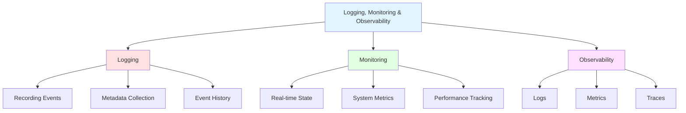

### Quick Definitions

| Practice | Purpose | Key Output |
|----------|---------|------------|
| **Logging** | Record all important events | What happened |
| **Monitoring** | Track system state in real-time | Patterns and trends |
| **Observability** | Understand internal state from external outputs | Component interactions |

---

## Logging

### Definition

**Logging** is the practice of recording all important events that occur throughout the application lifecycle. It creates a journal or diary that your backend application maintains for debugging and analysis purposes.

### What to Log

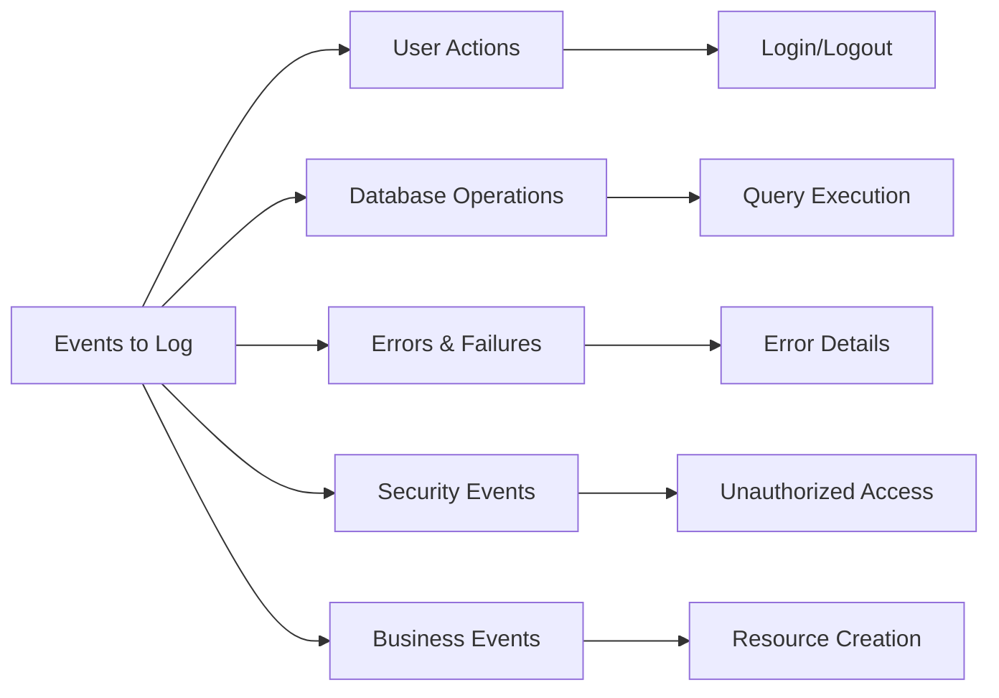

### Log Components

Each log entry should include:

1. **Timestamp**: When the event occurred
2. **User ID**: Who triggered the action
3. **Request ID**: Unique identifier for the request
4. **Context**: Relevant metadata (database query, function name, etc.)
5. **Level**: Severity/type of the log
6. **Message**: Description of the event

### Benefits of Logging

- Provides historical record of all events
- Enables debugging of past issues
- Tracks user behavior and system interactions
- Supports security audits
- Helps identify patterns in failures

---

## Monitoring

### Definition

**Monitoring** is the practice of continuously tracking the health and performance of your system in real-time (typically with 10-15 second delays).

### What Monitoring Tracks

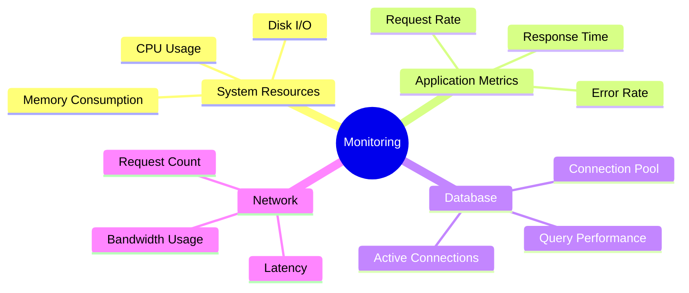

### Monitoring vs Logging

| Aspect | Monitoring | Logging |
|--------|-----------|---------|
| **Focus** | Current state | Historical events |
| **Data Type** | Metrics/Numbers | Event records |
| **Time Dimension** | Real-time + historical trends | Event timestamp |
| **Purpose** | Detect issues | Understand what happened |
| **Alert Capability** | Yes | No (requires analysis) |

### Typical Monitoring Parameters

1. **Request Metrics**
   - Requests per second (RPS)
   - Average response time
   - Request throughput

2. **Error Metrics**
   - Error rate percentage
   - Failed request count
   - Error types distribution

3. **Resource Metrics**
   - CPU utilization
   - Memory usage
   - Database connection count

4. **Business Metrics**
   - User actions (e.g., todos created)
   - Failed operations
   - Successful transactions

---

## Observability

### Definition

A system is **observable** when you can determine its internal state by examining its external outputs. Observability goes beyond monitoring - it not only tells you *that* something is wrong but also *what* is wrong and *why*.

### Evolution from Monitoring

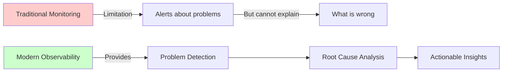

### Key Differences

**Traditional Monitoring:**
- Tells you there's a problem
- Provides alerts
- Shows metrics
- Limited context

**Observability:**
- Tells you there's a problem
- Explains what's wrong
- Shows full request path
- Provides complete context

---

## Three Pillars of Observability

A system is truly observable only when all three pillars are implemented:

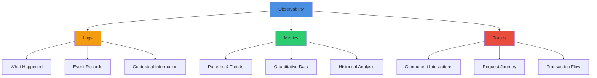

### 1. Logs (Pillar 1)

**Purpose**: Record of important events

**What they provide**:
- What exactly happened
- When it happened
- Who triggered it
- Context and metadata

**Example**: "User ID 123 created a todo item with title 'Buy groceries' at 2025-11-07 10:30:45"

### 2. Metrics (Pillar 2)

**Purpose**: Quantitative measurements

**What they provide**:
- Patterns over time
- Trends in system behavior
- Aggregate statistics
- Performance indicators

**Example**: "Error rate: 15%, Average response time: 250ms, Requests/sec: 150"

### 3. Traces (Pillar 3)

**Purpose**: Request journey tracking

**What they provide**:
- Component interactions
- Request flow path
- Where time is spent
- Failure points

**Example**: 
```
Request → Load Balancer → Handler → Service → Validation → Repository → Database
          10ms           5ms       20ms      5ms          30ms          50ms
```

---

## Log Levels

Log levels categorize the severity and purpose of log messages. Different levels are used in different environments.

### Standard Log Levels

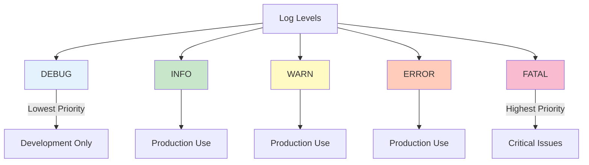

### Detailed Level Descriptions

| Level | Purpose | When to Use | Environment | Example |
|-------|---------|-------------|-------------|---------|
| **DEBUG** | Detailed diagnostic information | Troubleshooting, development | Development only | "Function parseRequest() called with params: {...}" |
| **INFO** | General operational messages | Successful operations, business events | Development + Production | "Todo created successfully with ID: 123" |
| **WARN** | Warning messages (not errors) | Potential issues, degraded performance | Development + Production | "User authentication failed - wrong password" |
| **ERROR** | Error events | Operation failures, exceptions | Development + Production | "Database query failed: connection timeout" |
| **FATAL** | Critical failures | Application crashes | Development + Production | "Cannot connect to database - shutting down" |

### Log Level Selection Logic

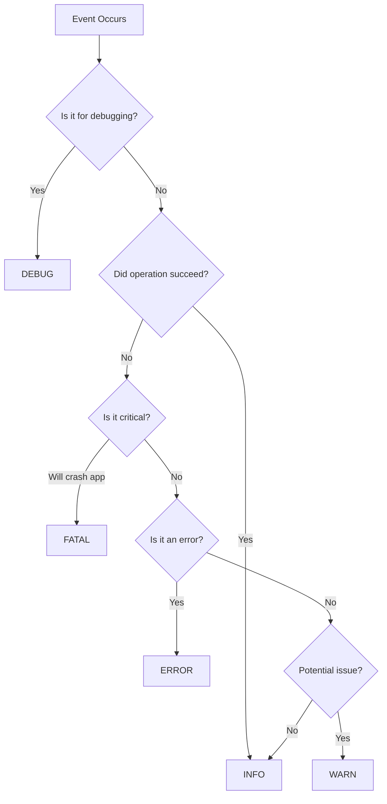

### Environment-based Configuration

**Development Environment:**
```
Log Level: DEBUG
Format: Console (human-readable)
Output: Terminal/Console
Colors: Enabled
```

**Production Environment:**
```
Log Level: INFO (or higher)
Format: JSON (structured)
Output: Log aggregation system
Colors: Disabled
```

---

## Structured vs Unstructured Logging

### Comparison Table

| Aspect | Unstructured (Console) | Structured (JSON) |
|--------|------------------------|-------------------|
| **Format** | Plain text with colors | JSON objects |
| **Readability** | High (humans) | Low (humans) |
| **Parseability** | Low (machines) | High (machines) |
| **Environment** | Development | Production |
| **Use Case** | Quick debugging | Log aggregation & analysis |
| **Performance** | Faster to read | Faster to parse |

### Unstructured Logging (Development)

**Purpose**: Human-friendly, easy to read during development

**Example Output:**
```
[INFO] 2025-11-07 10:30:45 | Connecting to database
[INFO] 2025-11-07 10:30:46 | Started background job server
[INFO] 2025-11-07 10:30:47 | Server started on port 8080
[ERROR] 2025-11-07 10:31:12 | Failed to create todo: validation error
```

**Characteristics:**
- Color-coded
- Easy to spot errors
- Natural language
- Good for terminal output
- Quick issue identification

### Structured Logging (Production)

**Purpose**: Machine-parseable, efficient for log management tools

**Example Output:**
```json
{
  "level": "INFO",
  "timestamp": "2025-11-07T10:30:45Z",
  "message": "Connecting to database",
  "service": "todo-api",
  "environment": "production"
}
```

**Characteristics:**
- Consistent format
- Easy to query
- Supports aggregation
- Efficient parsing
- Integration with log management tools

### Logging Flow Diagram

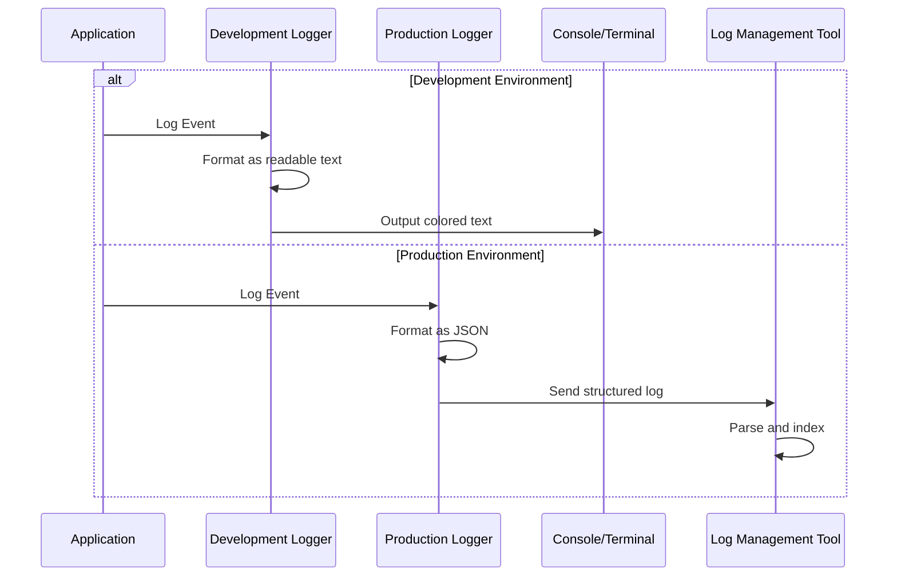

### Why Different Formats?

**Development** (Unstructured):
- Developers read logs directly
- Need quick visual scanning
- Colors help identify issues
- Plain text is faster to understand

**Production** (Structured):
- Tools parse logs automatically
- Need to extract specific fields
- JSON structure is queryable
- Supports complex filtering

---

## Instrumentation and OpenTelemetry

### Instrumentation

**Definition**: The practice of measuring and tracking various attributes of your application's functions and components.

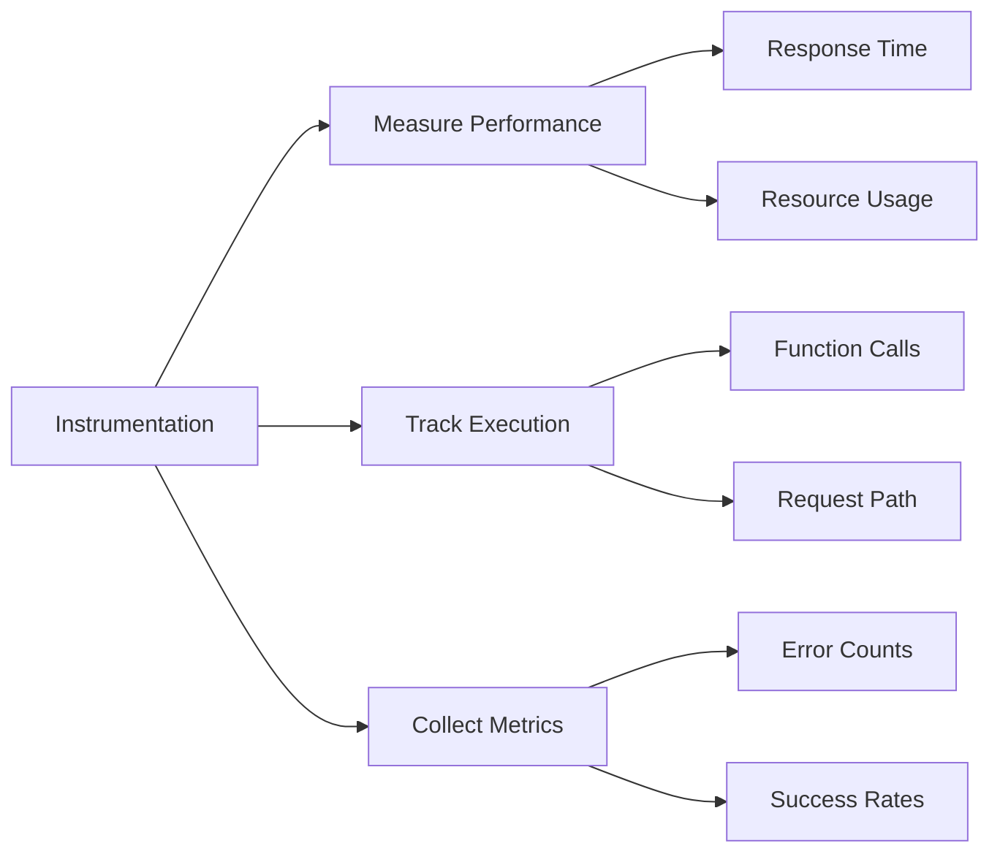

### What Gets Instrumented?

1. **Function Entry/Exit**
   - When function starts
   - When function completes
   - Duration

2. **Database Operations**
   - Query execution time
   - Connection pool status
   - Number of queries

3. **External API Calls**
   - Request time
   - Response status
   - Latency

4. **Business Operations**
   - User actions
   - Transaction completions
   - Resource creation/deletion

### OpenTelemetry

**OpenTelemetry** is an open-source standard that provides:
- Unified APIs for instrumentation
- SDKs for multiple languages
- Standardized data formats
- Vendor-neutral implementation

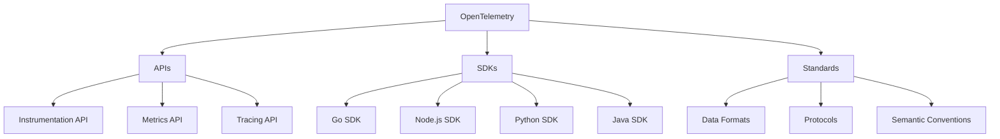

### Benefits of OpenTelemetry

| Benefit | Description |
|---------|-------------|
| **Vendor Neutral** | Not tied to specific tools |
| **Language Agnostic** | Works with major languages |
| **Standardized** | Consistent approach across systems |
| **Interoperable** | Works with various backend tools |
| **Open Source** | Community-driven development |

---

## Tools and Technologies

### Tool Categories

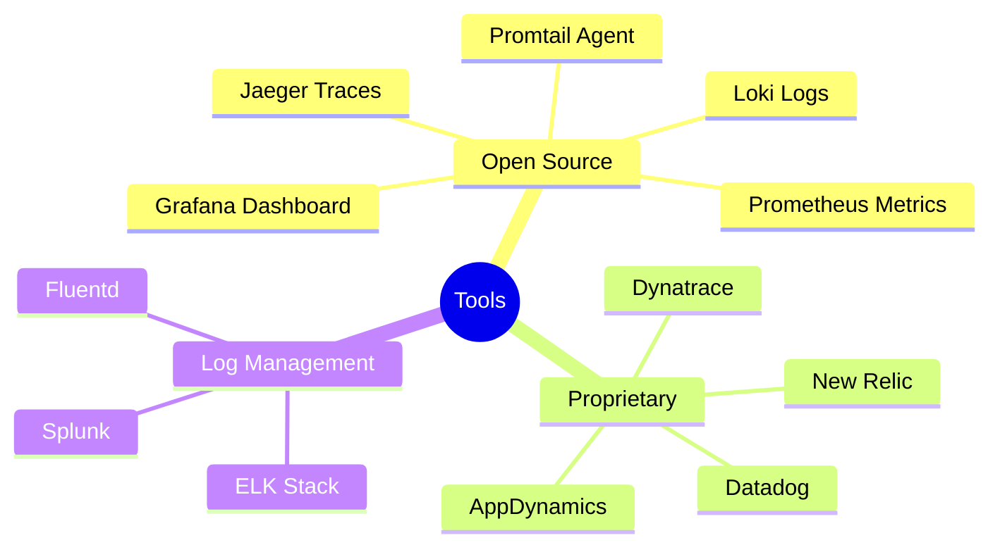

### Comparison Table

| Tool | Type | Purpose | Cost | Complexity |
|------|------|---------|------|------------|
| **Grafana** | Open Source | Visualization & Dashboards | Free | Medium |
| **Prometheus** | Open Source | Metrics Collection | Free | Medium |
| **Jaeger** | Open Source | Distributed Tracing | Free | Medium |
| **Loki** | Open Source | Log Aggregation | Free | Medium |
| **New Relic** | Proprietary | All-in-one Solution | Paid | Low |
| **Datadog** | Proprietary | All-in-one Solution | Paid | Low |
| **ELK Stack** | Open Source | Log Management | Free | High |

### The Grafana Stack (Open Source)

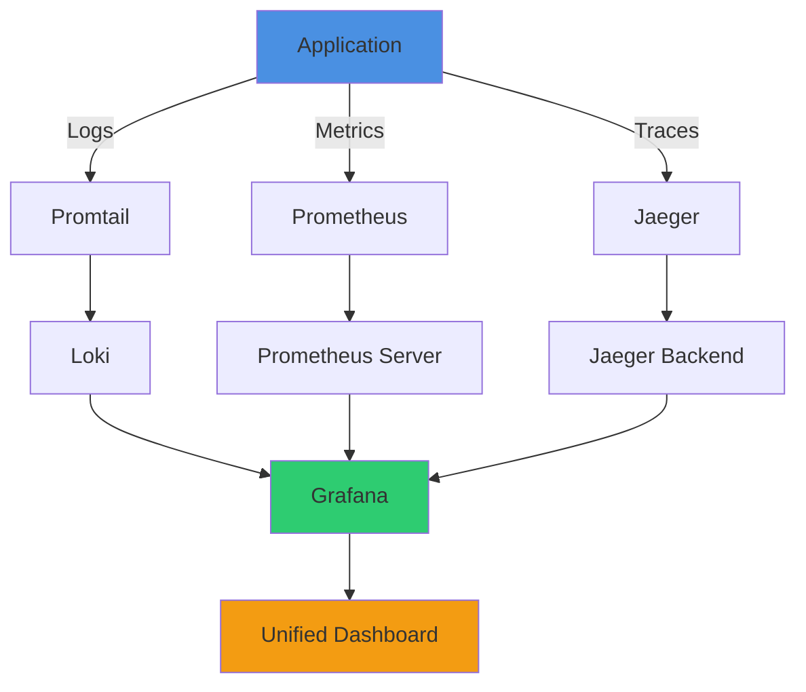

**Components:**
- **Promtail**: Log shipping agent
- **Loki**: Log aggregation system
- **Prometheus**: Metrics collection and storage
- **Jaeger**: Distributed tracing
- **Grafana**: Visualization and dashboards

### New Relic (Proprietary)

**All-in-one solution** that simplifies implementation:

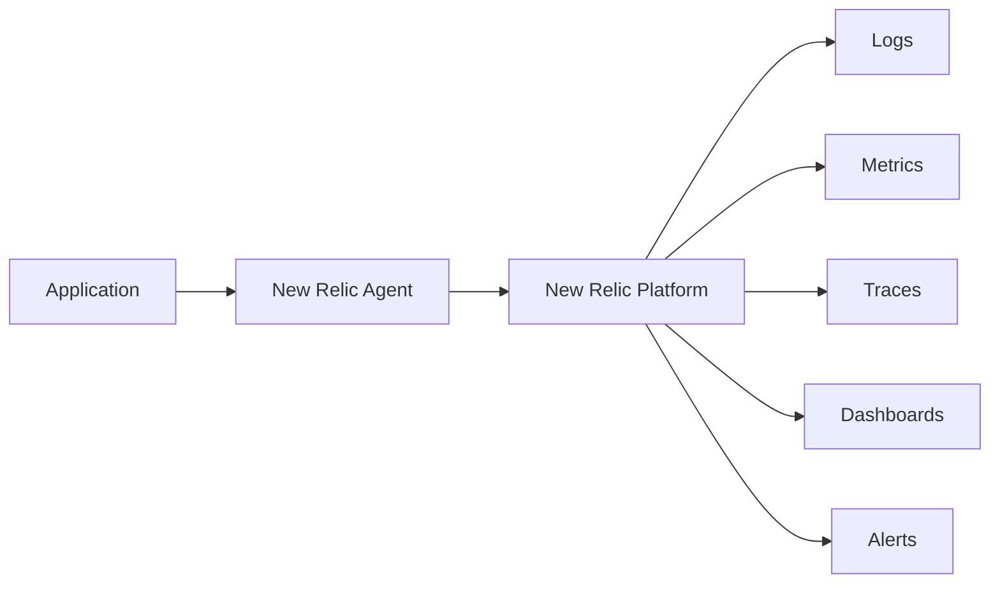

**Advantages:**
- Single integration point
- Less configuration required
- Managed infrastructure
- Built-in dashboards
- Automatic correlation

**When to Use:**
- Smaller teams
- Limited DevOps resources
- Need quick setup
- Want managed solution

### Tool Selection Criteria

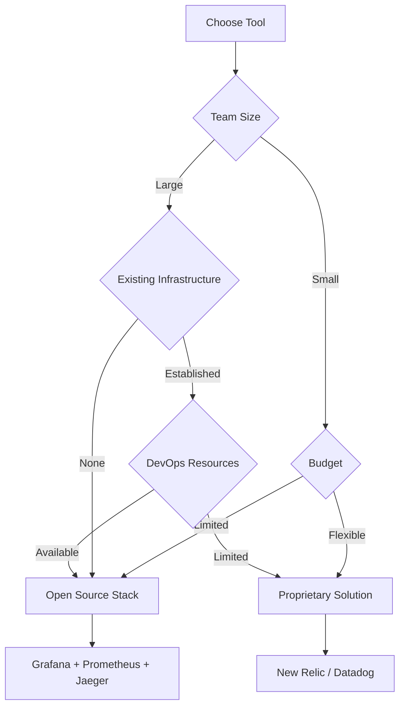

---

## Workflow Integration

### How All Three Components Work Together

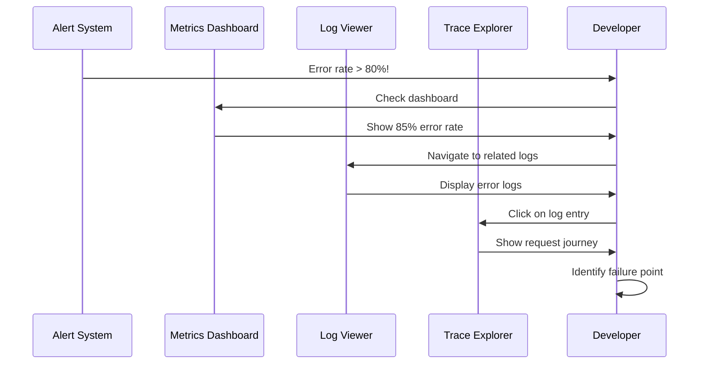

### Step-by-Step Debugging Workflow

**Step 1: Alert Triggered**
```
Alert: Error rate exceeded 80% threshold
Time: 2025-11-07 10:45:00
Service: todo-api
```

**Step 2: Check Metrics**
```
Current Metrics:
- Error Rate: 85%
- Average Response Time: 450ms
- Failed Requests: 170/200
```

**Step 3: View Logs**
```json
{
  "level": "ERROR",
  "timestamp": "2025-11-07T10:45:23Z",
  "message": "Database query failed",
  "error": "connection timeout",
  "userId": "123",
  "requestId": "abc-def-ghi"
}
```

**Step 4: Analyze Trace**
```
Request ID: abc-def-ghi
Handler (5ms) → Service (10ms) → Validation (5ms) → Repository (430ms - TIMEOUT) → Database (N/A)
```

**Step 5: Root Cause Identified**
```
Problem: Database connection timeout at Repository layer
Cause: Connection pool exhausted
Solution: Increase pool size or optimize queries
```

### Integration Flow Diagram

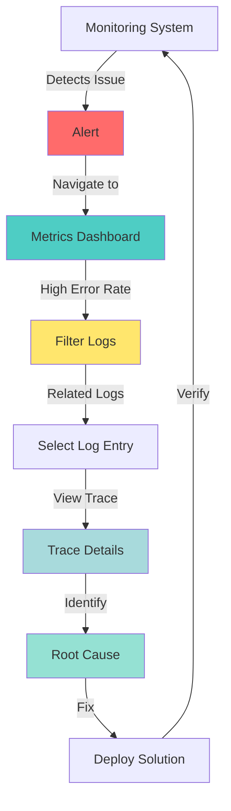

---

## Implementation Best Practices

### Code-Level Practices

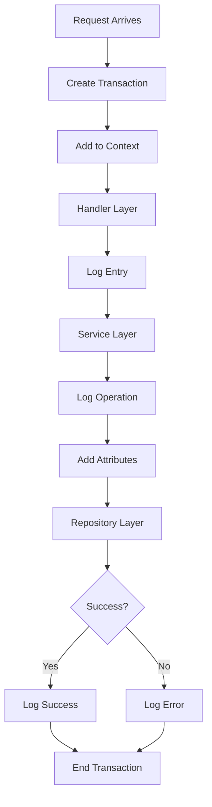

### Essential Implementation Steps

**1. Middleware Setup**
```
- Create transaction at request entry
- Extract request metadata (user ID, IP, etc.)
- Add transaction to context
- Pass context through layers
```

**2. Service Layer Instrumentation**
```
- Extract transaction from context
- Add business-specific attributes
- Log important operations
- Handle errors with proper logging
```

**3. Error Handling**
```
- Log error with appropriate level
- Add error to trace
- Include context (user ID, operation, etc.)
- Return meaningful error message
```

**4. Success Logging**
```
- Log successful operations
- Include relevant IDs (resource ID, etc.)
- Add metadata for tracking
- Use appropriate log level
```

### Configuration Best Practices

| Environment | Log Level | Format | Destination | Retention |
|-------------|-----------|--------|-------------|-----------|
| **Development** | DEBUG | Console (colored) | Terminal | N/A |
| **Staging** | INFO | JSON | Log aggregator | 7 days |
| **Production** | INFO | JSON | Log aggregator | 30 days |
| **Critical Errors** | ERROR/FATAL | JSON + Alert | Log aggregator + Alerting | 90 days |

### What to Include in Logs

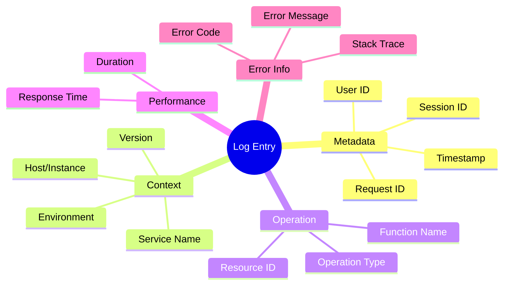

### Monitoring Setup Guidelines

**Metrics to Track:**

1. **System Metrics**
   - CPU usage percentage
   - Memory consumption
   - Disk I/O
   - Network bandwidth

2. **Application Metrics**
   - Request per second
   - Average response time
   - Error rate
   - Throughput

3. **Business Metrics**
   - User signups
   - Transactions completed
   - Resources created/deleted
   - Revenue-generating actions

4. **Database Metrics**
   - Query duration
   - Connection pool size
   - Active connections
   - Query failures

### Alert Configuration

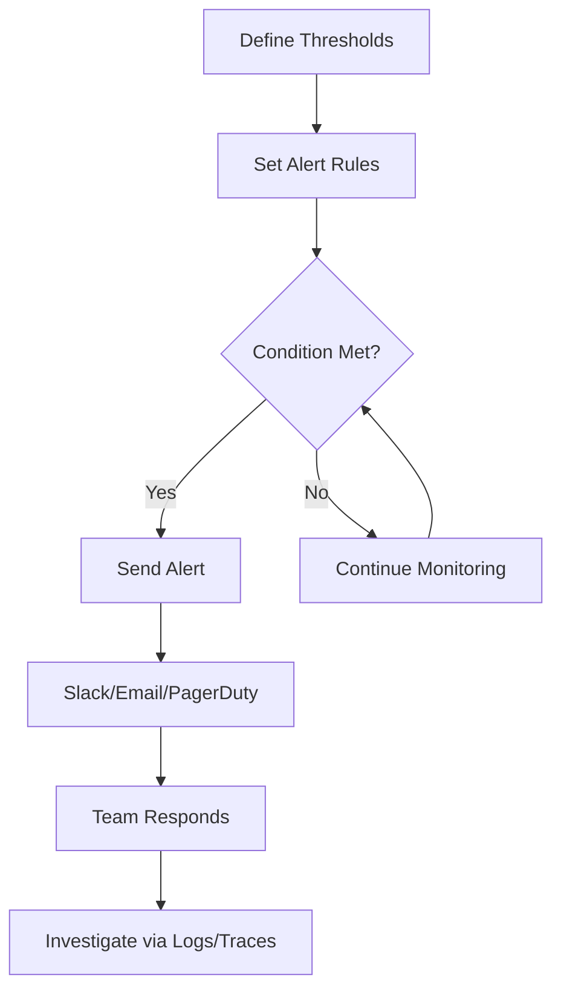

**Alert Examples:**

| Metric | Threshold | Action |
|--------|-----------|--------|
| Error Rate | > 5% | Send Slack alert |
| Response Time | > 1000ms | Send Slack alert |
| Error Rate | > 50% | Send PagerDuty alert |
| Database Connections | > 90% capacity | Send email + Slack |
| CPU Usage | > 80% for 5min | Send email |

---

## Practical Example

### Scenario: Creating a Todo Item

Let's walk through a complete example of how logging, monitoring, and observability work together when a user creates a todo item.

### Request Flow

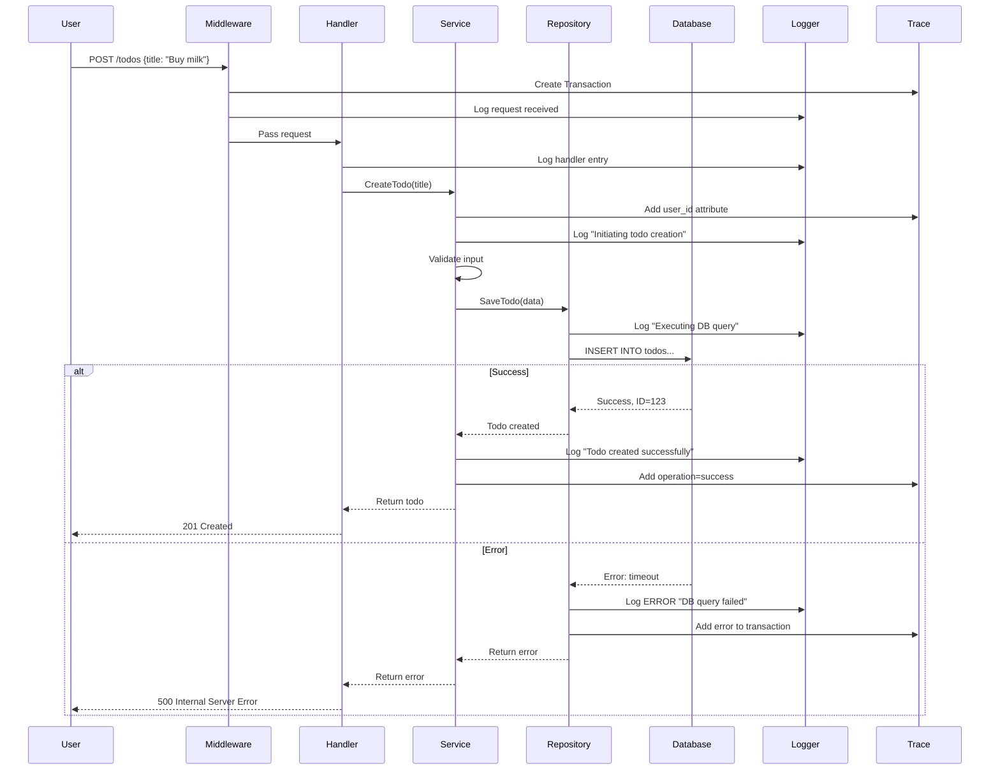

### Code Implementation Example (Conceptual)

**1. Middleware - Transaction Creation**
```go
// Enhanced tracing middleware
func EnhancedTracingMiddleware(next http.Handler) http.Handler {
    return http.HandlerFunc(func(w http.ResponseWriter, r *http.Request) {
        // Create new transaction
        txn := newrelic.FromContext(r.Context())
        
        // Add attributes
        txn.AddAttribute("service", "todo-api")
        txn.AddAttribute("environment", config.Environment)
        txn.AddAttribute("user_agent", r.UserAgent())
        txn.AddAttribute("request_id", r.Header.Get("X-Request-ID"))
        
        // Add to context
        ctx := newrelic.NewContext(r.Context(), txn)
        
        // Log request
        logger.Info("Request received",
            "method", r.Method,
            "path", r.URL.Path,
            "request_id", r.Header.Get("X-Request-ID"))
        
        next.ServeHTTP(w, r.WithContext(ctx))
    })
}
```

**2. Service Layer - Business Logic**
```go
func (s *TodoService) CreateTodo(ctx context.Context, title string) (*Todo, error) {
    // Extract transaction from context
    txn := newrelic.FromContext(ctx)
    defer txn.StartSegment("CreateTodoService").End()
    
    // Add attributes
    txn.AddAttribute("user_id", getUserID(ctx))
    txn.AddAttribute("title", title)
    
    // Log operation start
    logger.Info("Initiating todo creation",
        "user_id", getUserID(ctx),
        "title", title)
    
    // Validate
    if title == "" {
        logger.Warn("Validation failed: empty title")
        return nil, errors.New("title cannot be empty")
    }
    
    // Create todo
    todo, err := s.repo.Create(ctx, title)
    if err != nil {
        logger.Error("Failed to create todo",
            "error", err,
            "user_id", getUserID(ctx))
        txn.NoticeError(err)
        txn.AddAttribute("operation", "create")
        txn.AddAttribute("result", "error")
        return nil, err
    }
    
    // Log success
    logger.Info("Todo created successfully",
        "todo_id", todo.ID,
        "title", todo.Title)
    
    txn.AddAttribute("operation", "create")
    txn.AddAttribute("result", "success")
    txn.AddAttribute("todo_id", todo.ID)
    
    return todo, nil
}
```

### Dashboard View (New Relic Example)

**Metrics View:**
```
┌─────────────────────────────────────────────┐
│ Todo API - Last 30 minutes                  │
├─────────────────────────────────────────────┤
│ Transaction Time: 245ms (avg)               │
│ Throughput: 150 req/min                     │
│ Error Rate: 2.5%                            │
│ Apdex Score: 0.95                           │
└─────────────────────────────────────────────┘
```

**Error View:**
```
┌─────────────────────────────────────────────┐
│ HTTP Errors - Last 30 minutes               │
├─────────────────────────────────────────────┤
│ Unauthorized: 45 occurrences                │
│ Internal Server Error: 3 occurrences        │
│ Bad Request: 12 occurrences                 │
└─────────────────────────────────────────────┘
```

**Log Detail:**
```json
{
  "application": "todo-api",
  "environment": "production",
  "level": "ERROR",
  "message": "Database query failed",
  "error_code": 500,
  "hostname": "app-server-01",
  "ip": "192.168.1.10",
  "method": "POST",
  "route": "/todos",
  "span_id": "abc123def456",
  "timestamp": "2025-11-07T10:45:23Z",
  "user_id": "user-123",
  "request_id": "req-789",
  "details": {
    "error": "connection timeout",
    "query": "INSERT INTO todos...",
    "duration": "5000ms"
  }
}
```

**Trace View:**
```
Transaction: POST /todos
Total Duration: 5250ms
Status: Failed

├─ Middleware [50ms]
│  └─ Authentication [45ms]
├─ Handler [75ms]
│  └─ Input Validation [50ms]
├─ Service Layer [125ms]
│  ├─ Business Validation [75ms]
│  └─ Prepare Data [50ms]
└─ Repository Layer [5000ms - TIMEOUT]
   └─ Database Query [5000ms] ❌ FAILED
      Error: connection timeout
```

---

## Key Takeaways

### Critical Points to Remember

1. **Spectrum Implementation**
   - No system is 100% observable
   - Implement what makes sense for your scale
   - Iterate and improve over time

2. **Three Pillars are Essential**
   - Logs → What happened
   - Metrics → Patterns and trends
   - Traces → Component interactions
   - All three must work together

3. **Environment Matters**
   - Development: Human-readable, DEBUG level
   - Production: JSON format, INFO level minimum
   - Different needs require different approaches

4. **Tool Selection**
   - Open source: More control, more complexity
   - Proprietary: Easier setup, cost consideration
   - Choose based on team size and resources

5. **Collective Effort**
   - Developers: Implement in code
   - DevOps: Set up infrastructure
   - Both must work together

### Common Pitfalls to Avoid

```mermaid
graph TD
    A[Common Mistakes] --> B[Over-logging]
    A --> C[Under-logging]
    A --> D[No Structure]
    A --> E[Missing Context]
    A --> F[No Monitoring]
    
    B --> B1[Performance Impact]
    C --> C1[Missing Information]
    D --> D1[Hard to Parse]
    E --> E1[Cannot Debug]
    F --> F1[No Alerts]
```

| Pitfall | Consequence | Solution |
|---------|-------------|----------|
| **Logging everything** | Performance degradation, noise | Log only important events |
| **Not enough logs** | Cannot debug issues | Include all critical operations |
| **No log levels** | Cannot filter | Use appropriate levels |
| **Plain text in production** | Hard to parse | Use JSON format |
| **No trace correlation** | Cannot track requests | Implement proper instrumentation |
| **Missing context** | Incomplete picture | Include user ID, request ID, etc. |

### Best Practices Summary

✅ **DO:**
- Use appropriate log levels
- Structure logs in production
- Implement all three pillars
- Add meaningful context
- Set up alerts
- Monitor business metrics
- Correlate logs with traces

❌ **DON'T:**
- Log sensitive data (passwords, tokens)
- Use DEBUG in production
- Log without context
- Ignore error logging
- Skip instrumentation
- Forget to monitor metrics
- Rely on logs alone

---

## Conclusion

Logging, Monitoring, and Observability are not optional features but essential practices for modern distributed systems. While implementation exists on a spectrum, understanding and applying these concepts will significantly improve your ability to maintain, debug, and optimize production systems.

**Remember:**
- Start simple, iterate over time
- Prioritize what matters for your system
- Use tools that match your team's capabilities
- Make it a collaborative effort between developers and DevOps
- Continuously improve based on real-world needs

The investment in proper observability pays dividends when issues arise, turning hours of debugging into minutes of targeted investigation.
