# Graceful Shutdown: A Comprehensive Guide to Backend Server Management

## Table of Contents

1. [Introduction](#introduction)
2. [The Problem: Why Graceful Shutdown Matters](#the-problem-why-graceful-shutdown-matters)
3. [Process Lifecycle Management](#process-lifecycle-management)
4. [Understanding Operating System Signals](#understanding-operating-system-signals)
   - 4.1 [SIGTERM - The Polite Request](#sigterm---the-polite-request)
   - 4.2 [SIGINT - User Initiated Shutdown](#sigint---user-initiated-shutdown)
   - 4.3 [SIGKILL - The Nuclear Option](#sigkill---the-nuclear-option)
5. [Core Components of Graceful Shutdown](#core-components-of-graceful-shutdown)
   - 5.1 [Connection Draining](#connection-draining)
   - 5.2 [Resource Cleanup](#resource-cleanup)
6. [Implementation Workflow](#implementation-workflow)
7. [Timeout Considerations](#timeout-considerations)
8. [Best Practices and Design Considerations](#best-practices-and-design-considerations)
9. [Restaurant Analogy: Understanding the Process](#restaurant-analogy-understanding-the-process)
10. [Practical Code Example Walkthrough](#practical-code-example-walkthrough)
11. [Summary and Key Takeaways](#summary-and-key-takeaways)

---

## Introduction

**Graceful shutdown** is the art and science of teaching backend applications "good manners" - the ability to stop running without abruptly terminating ongoing operations. Instead of slamming the door when it's time to leave, a well-designed application politely:

1. Finishes ongoing conversations (processes requests)
2. Says goodbye to all guests (closes connections)
3. Cleans up after itself (releases resources)
4. Finally closes the door (terminates the process)

This comprehensive guide explores the technical mechanisms, design patterns, and implementation strategies for graceful shutdown in backend systems.

---

## The Problem: Why Graceful Shutdown Matters

### Critical Scenario

Consider this realistic production scenario:

```
User Action: Processing a payment transaction on an e-commerce platform
Server Event: Deployment triggered - server needs to restart
Question: What happens to the in-flight transaction?
```

### Potential Consequences Without Graceful Shutdown

| Issue | Impact | Example |
|-------|--------|---------|
| **Transaction Loss** | Payment completed but order not recorded | Customer charged but no order confirmation |
| **Double Charging** | Race condition during restart | Customer billed twice for same order |
| **Data Corruption** | Incomplete database writes | Partially updated records in database |
| **Connection Leaks** | Resources not properly released | Memory leaks, file handle exhaustion |
| **User Experience Degradation** | Failed requests, timeout errors | Customers see 500 errors mid-checkout |

### The Solution

Graceful shutdown provides a structured protocol for:
- **Completing in-flight operations** before shutdown
- **Preventing new connections** during shutdown phase
- **Cleaning up system resources** properly
- **Avoiding data corruption** and inconsistent states
- **Maintaining excellent user experience** even during deployments

---

## Process Lifecycle Management

Every application runs within a **process** in the operating system. Understanding the process lifecycle is fundamental to implementing graceful shutdown.

### Process Lifecycle Phases

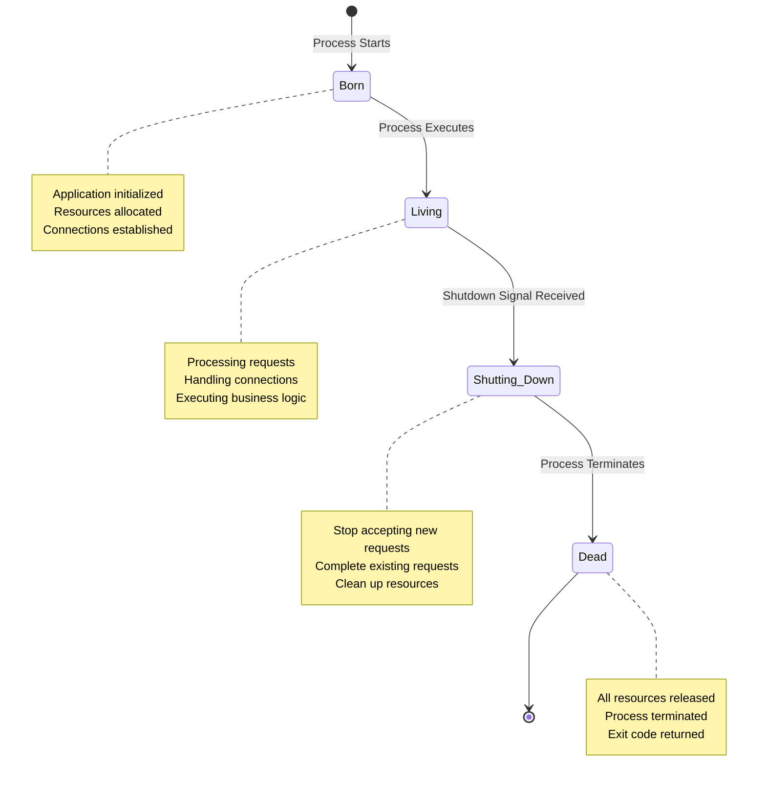

### Process-OS Communication Protocol

The operating system and your application don't communicate through text messages - they use **signals**.

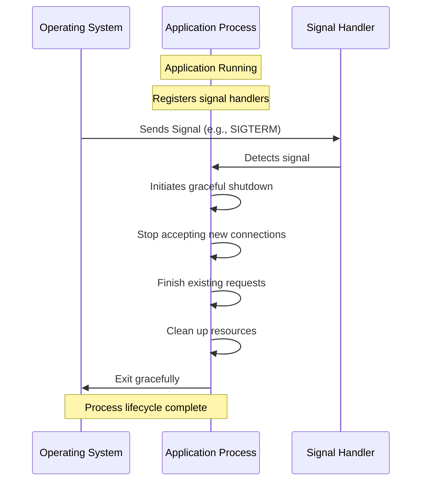

### Key Concepts

| Concept | Definition | Purpose |
|---------|------------|---------|
| **Process** | An instance of a running application | Execution unit managed by OS |
| **Signal** | Inter-process communication mechanism | OS-to-process messaging protocol |
| **Handler** | Code that listens for specific signals | Enables custom shutdown behavior |
| **IPC** | Inter-Process Communication | Method for processes to communicate |

---

## Understanding Operating System Signals

**Signals** are the Unix/Linux way of enabling Inter-Process Communication (IPC). They form the foundation of graceful shutdown implementation.

### Signal Registration

Before an application can handle shutdown gracefully, it must **register handlers** for specific signals:

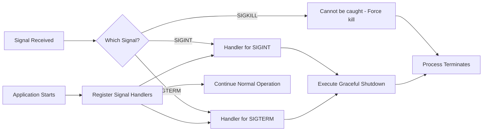

---

## SIGTERM - The Polite Request

### Overview

**SIGTERM** (Signal Terminate) is the polite way for the operating system to ask your application to shut down.

```
Signal Name: SIGTERM
Command: kill -TERM <pid>
Nature: Polite request
Can be caught: YES ✓
Can be ignored: YES ✓
```

### Characteristics

| Aspect | Description |
|--------|-------------|
| **Intent** | "Excuse me, could you please finish up and leave?" |
| **Opportunity** | Application gets time to complete ongoing work |
| **Window** | Typically 30-60 seconds before forced termination |
| **Typical Use** | Deployment systems, process managers, orchestration platforms |

### Who Uses SIGTERM?

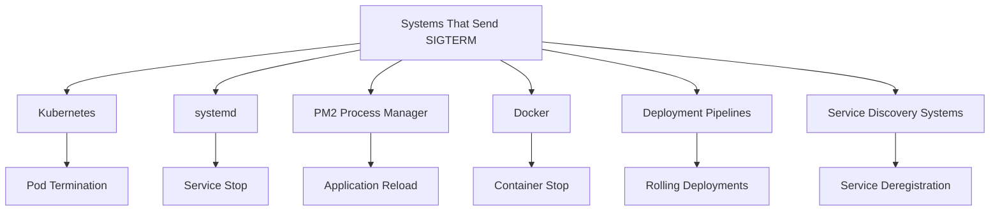

### SIGTERM Handling Steps

When your application receives SIGTERM:

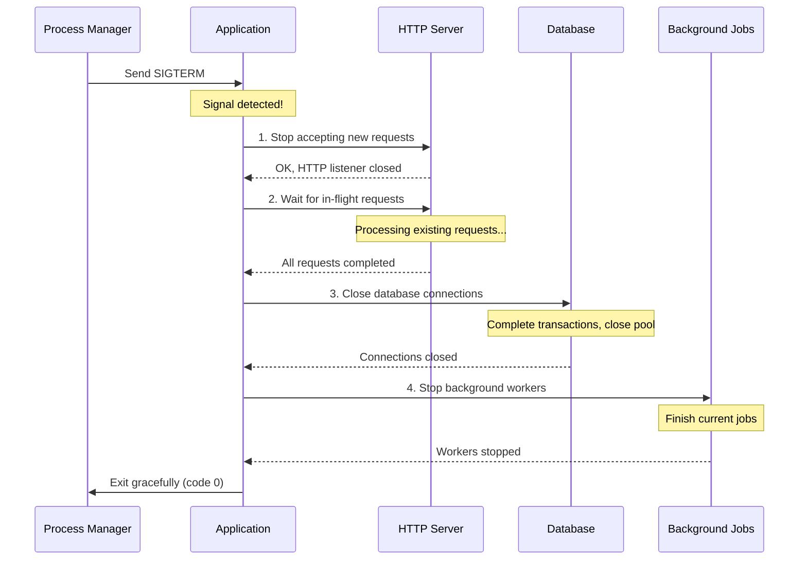

**Step-by-step actions:**

1. **Finish existing requests** - Complete all in-flight HTTP requests
2. **Clean up resources** - Release file handles, close connections, cleanup caches
3. **Exit** - Terminate the process with proper exit code

---

## SIGINT - User Initiated Shutdown

### Overview

**SIGINT** (Signal Interrupt) is triggered by user action, most commonly **Ctrl+C** in the terminal.

```
Signal Name: SIGINT
Trigger: Ctrl + C (keyboard)
Nature: User-initiated interrupt
Can be caught: YES ✓
Can be ignored: YES ✓
```

### Characteristics

| Aspect | Description |
|--------|-------------|
| **Trigger** | Requires keyboard input (Ctrl+C) |
| **Primary Use** | Development environments |
| **Initiated By** | Human developers, not programs |
| **Handling** | Should be handled identically to SIGTERM |

### Why Handle SIGINT Like SIGTERM?

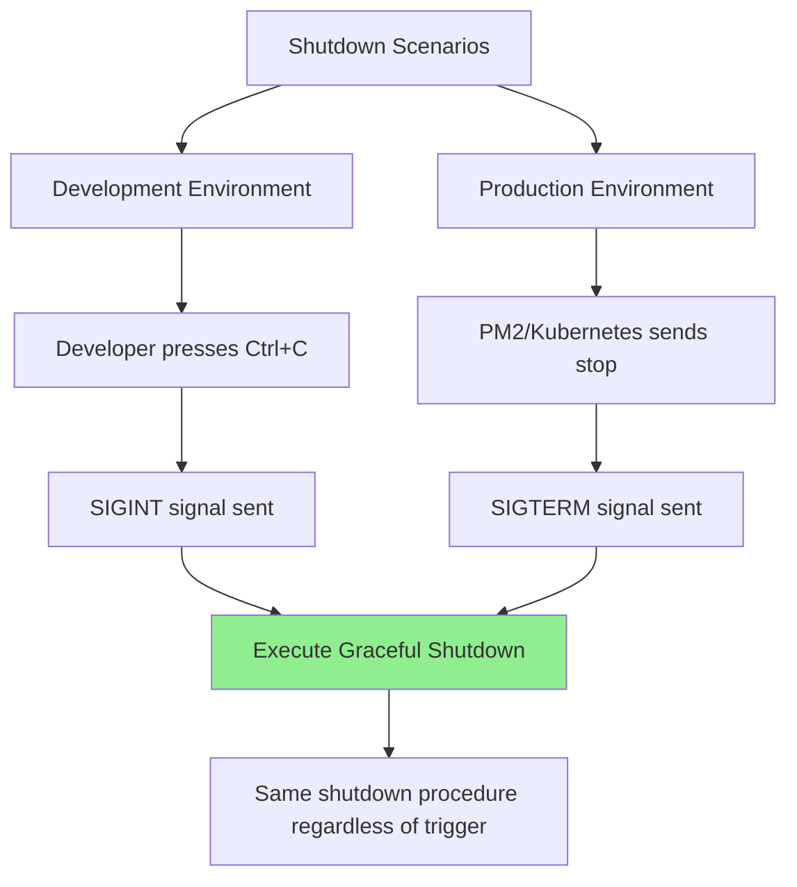

**Key Principle:** The intention is identical (shutdown cleanly), so the handling should be identical.

### Example Log Output

```
$ ./backend-server
Server starting on port 8080...
Database connected ✓
Background jobs started ✓
Ready to accept requests ✓

^C  [Ctrl+C pressed]
Signal received: interrupt
Initiating graceful shutdown...
✓ HTTP server stopped
✓ Database connections closed
✓ Background workers stopped
Server exited properly
```

---

## SIGKILL - The Nuclear Option

### Overview

**SIGKILL** is the ultimate force-termination signal that **cannot be caught or ignored**.

```
Signal Name: SIGKILL
Command: kill -9 <pid>
Nature: Immediate termination
Can be caught: NO ✗
Can be ignored: NO ✗
```

### Characteristics

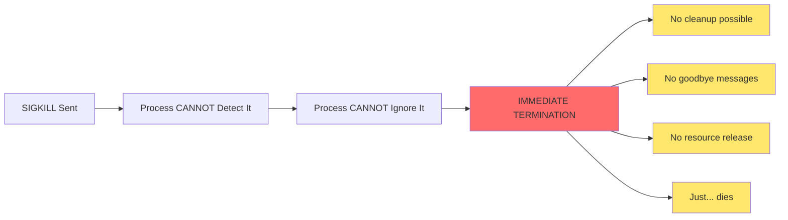

### The Power Plug Analogy

| Graceful Shutdown (SIGTERM) | Force Kill (SIGKILL) |
|----------------------------|----------------------|
| Click "Shutdown" in OS menu | Unplug the power cable |
| Computer closes apps, saves state | Computer dies instantly |
| Clean exit | Abrupt termination |
| Files saved | Risk of data corruption |

### Why SIGKILL Exists

SIGKILL serves as a backup mechanism when:

- Application doesn't respond to SIGTERM
- Application ignores SIGTERM
- Application takes too long to shutdown
- System needs immediate resource recovery

### The Grace Period Flow

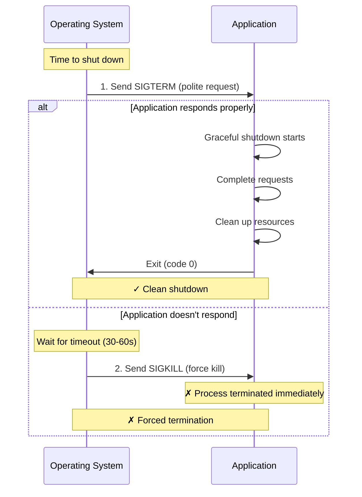

**Important:** This is why graceful shutdown is critical - you want to respond to the polite signals to avoid forced termination.

---

## Core Components of Graceful Shutdown

Graceful shutdown consists of two primary components:

1. **Connection Draining** - Handling in-flight requests
2. **Resource Cleanup** - Releasing system resources

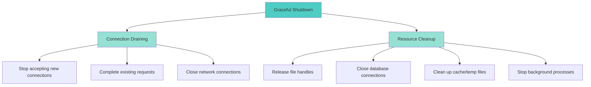

---

## Connection Draining

### What are "On-the-Fly" Requests?

**On-the-fly requests** (also called **in-flight requests**) are HTTP requests that your server is actively processing at the moment shutdown is initiated.

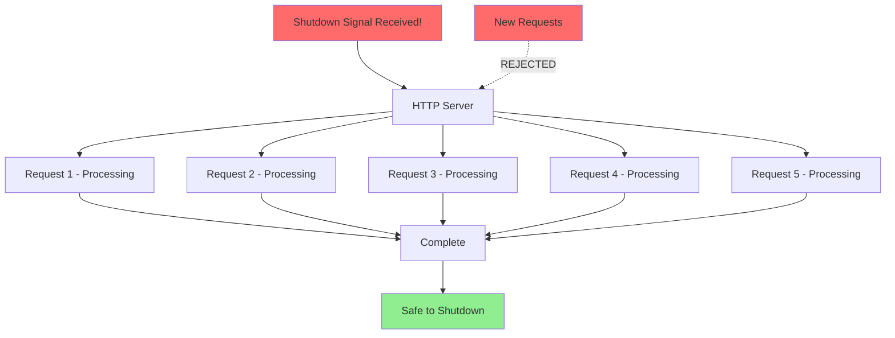

### Restaurant Analogy

Imagine a restaurant that needs to close:

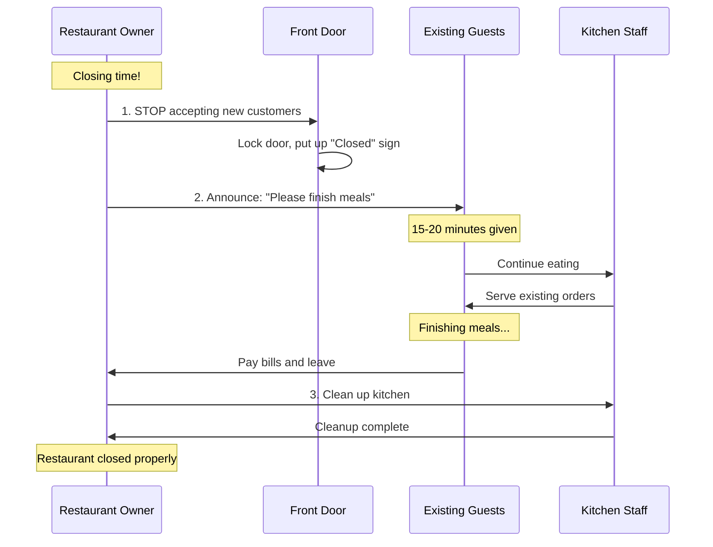

**Backend Equivalent:**

| Restaurant Action | Backend Action |
|------------------|----------------|
| Stop accepting new customers | Stop accepting new HTTP requests |
| Let existing customers finish | Complete in-flight requests |
| Announce closing time | Log shutdown initiated message |
| Give time limit (15-20 min) | Set timeout (30-60 seconds) |
| Clean up kitchen | Release resources |
| Close restaurant | Exit process |

### Connection Draining Implementation

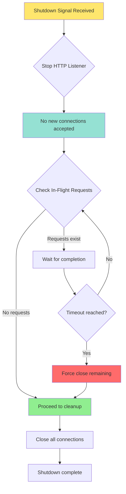

### Architecture-Specific Connection Draining

Different application architectures require different draining strategies:

| Architecture Type | Connection Draining Strategy |
|------------------|------------------------------|
| **HTTP Server** | Stop accepting new HTTP requests → Complete in-flight requests → Close HTTP listener |
| **Database** | Finish existing queries/transactions → Reject new queries → Close connection pool |
| **WebSocket** | Notify clients of closure → Wait for acknowledgment → Close socket connections |
| **Message Queue** | Stop consuming messages → Complete processing current messages → Disconnect from broker |
| **gRPC Server** | Stop accepting new streams → Complete active RPCs → Close server |

### Three-Step Process

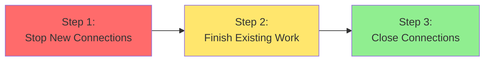

---

## Resource Cleanup

### What Are Resources?

**Resources** are system-level objects that your application acquired during execution and must release before termination.

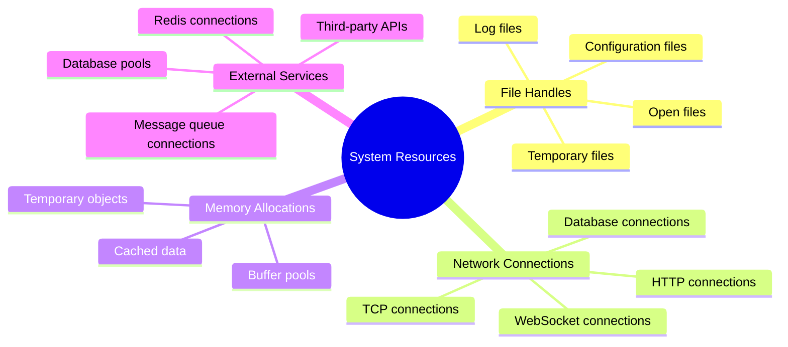

### Common Resources Requiring Cleanup

| Resource Type | Description | Consequence if Not Cleaned |
|--------------|-------------|---------------------------|
| **File Handles** | Operating system pointers to open files | File handle exhaustion, memory leaks |
| **Network Connections** | Active TCP/HTTP connections | Port exhaustion, socket leaks |
| **Database Connections** | Connection pool to database | Connection pool saturation |
| **Memory Allocations** | Heap memory, caches, buffers | Memory leaks, OOM errors |
| **Temporary Files** | Files in /tmp or similar | Disk space exhaustion |
| **Background Threads** | Worker threads, timers | CPU resource waste |

### File Handle Cleanup

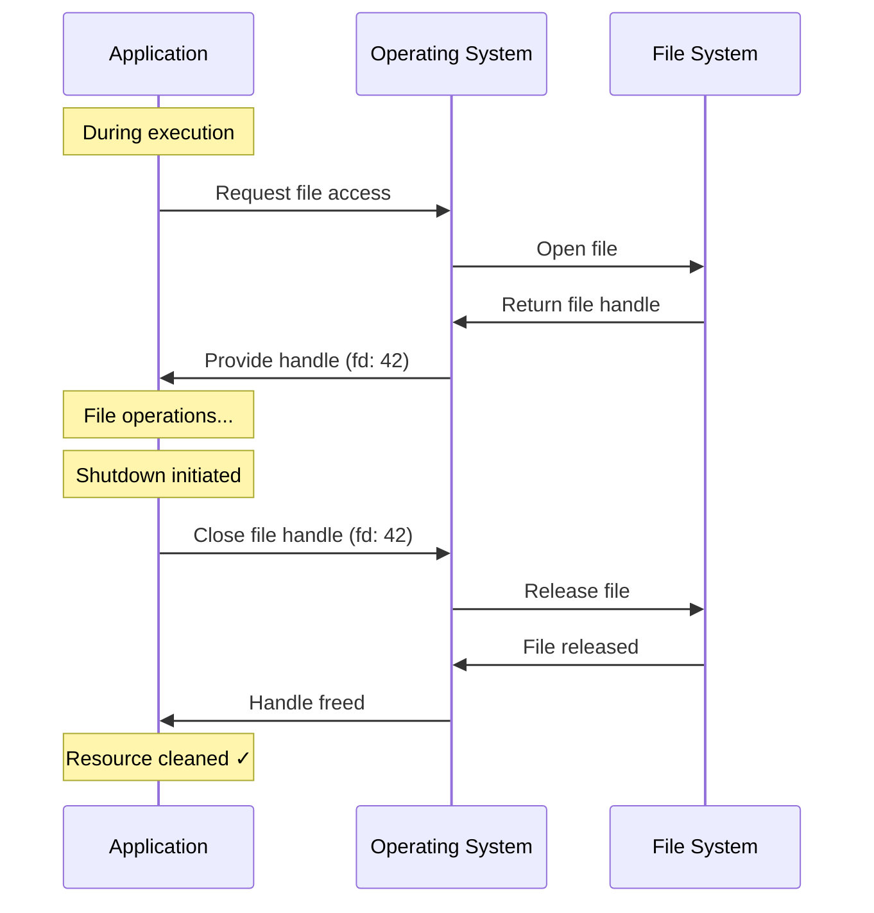

### Database Connection Cleanup

Database connections require special attention:

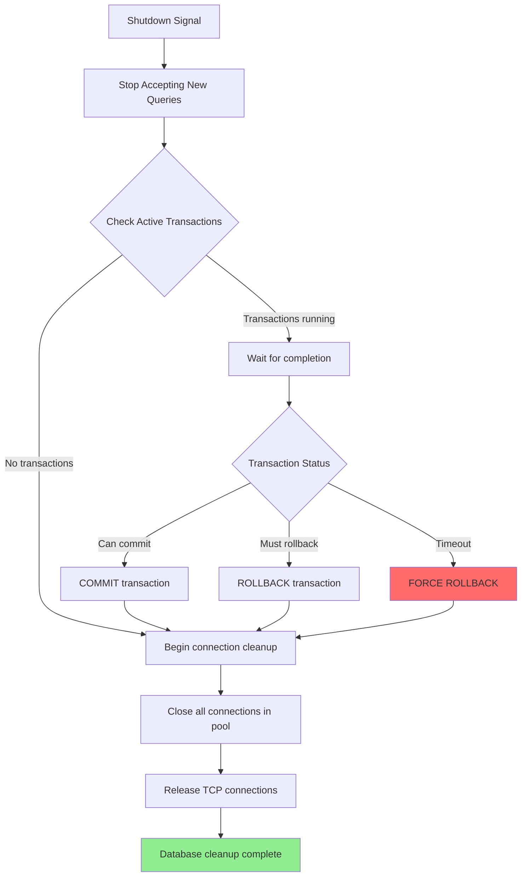

**Critical Steps for Database Cleanup:**

1. **Stop accepting new queries** - No new transactions start
2. **Complete active transactions** - Either COMMIT or ROLLBACK
3. **Close connection pool** - Release all pooled connections
4. **Release TCP connections** - Free network resources

### Network Connection Architecture

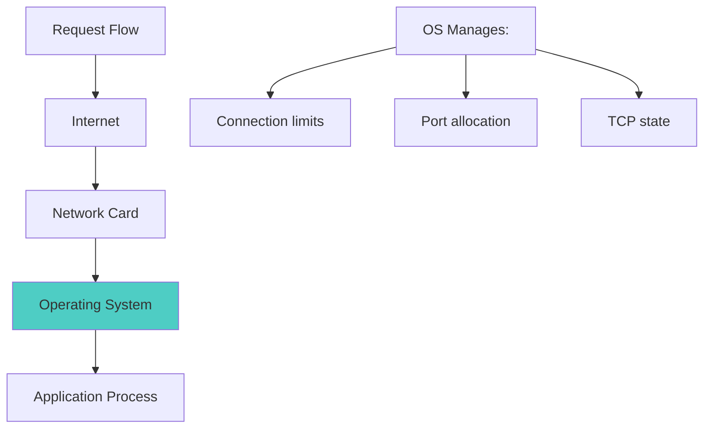

**Why cleanup matters:**
- Operating systems limit the number of connections per process
- Unclosed connections consume memory and ports
- Eventually leads to connection exhaustion
- Results in "Too many open files" errors

### Cleanup Order: Reverse Acquisition

**Golden Rule:** Clean up resources in the **reverse order** of acquisition.

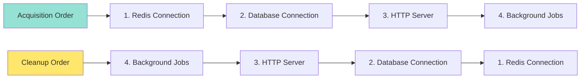

**Why reverse order?**

- Prevents cleaning up dependencies before dependent resources
- Example: Don't close database before completing queries that use it
- Ensures operations don't fail due to missing dependencies

### Resource Cleanup Example

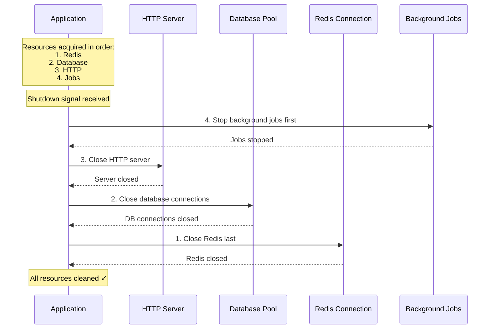

---

## Timeout Considerations

### The Timing Challenge

Connection draining must balance two competing concerns:

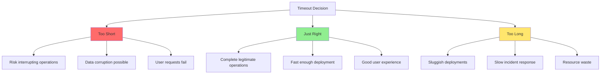

### Common Timeout Values

| Application Type | Typical Timeout | Rationale |
|-----------------|----------------|-----------|
| **Traditional HTTP API** | 30 seconds | Most requests complete in < 10s |
| **Long-polling endpoints** | 60-90 seconds | Allows for long-lived connections |
| **WebSocket server** | 60 seconds | Time for graceful closure handshake |
| **Background job processor** | 300 seconds (5 min) | Jobs may take longer to complete |
| **Database server** | 120 seconds | Complex transactions need time |

### Timeout Mechanism

```mermaid
sequenceDiagram
    participant Timer as Timeout Timer
    participant App as Application
    participant Requests as In-Flight Requests
    
    Note over App: Shutdown initiated
    App->>Timer: Start 30-second timer
    App->>Requests: Process existing requests
    
    alt Requests complete before timeout
        Requests->>App: All complete
        App->>Timer: Cancel timer
        Note over App: ✓ Clean shutdown
    else Timeout expires
        Timer->>App: 30 seconds elapsed!
        App->>Requests: Force close
        Note over App: ⚠ Forced shutdown
    end
```

### Calculating Appropriate Timeout

Consider these factors when setting timeout:

```
Timeout Calculation Formula:
────────────────────────────────────────────────

Timeout = P95_Request_Duration + Cleanup_Buffer + Safety_Margin

Where:
• P95_Request_Duration = 95th percentile request completion time
• Cleanup_Buffer = Time needed for resource cleanup (5-10s)
• Safety_Margin = Extra buffer for edge cases (10-20s)

Example:
• P95 Request Time: 8 seconds
• Cleanup: 7 seconds
• Safety: 15 seconds
• Total Timeout: 30 seconds
```

### Production System Timeout Flow

```mermaid
flowchart TD
    A[Shutdown Initiated] --> B[Start Timeout Clock]
    B --> C{Monitor Progress}
    
    C --> D{All work done?}
    D -->|Yes| E[Cancel timeout]
    D -->|No| F{Timeout expired?}
    
    F -->|No| C
    F -->|Yes| G[Force Shutdown]
    
    E --> H[Clean Exit]
    G --> I[Forced Exit - Log warnings]
    
    H --> J[Exit Code: 0]
    I --> K[Exit Code: 1]
    
    style E fill:#90EE90
    style G fill:#FF6B6B
    style H fill:#90EE90
    style I fill:#FF6B6B
```

---

## Implementation Workflow

### Complete Graceful Shutdown Process

```mermaid
flowchart TD
    Start([Application Running]) --> Signal[Signal Received]
    
    Signal --> Detect{Signal Type?}
    Detect -->|SIGTERM| Handler1[SIGTERM Handler]
    Detect -->|SIGINT| Handler2[SIGINT Handler]
    Detect -->|SIGKILL| Kill[Immediate Termination]
    
    Handler1 --> GS[Graceful Shutdown Routine]
    Handler2 --> GS
    
    GS --> Step1[1. Stop Accepting New Connections]
    Step1 --> Step2[2. Set Timeout Timer]
    Step2 --> Step3[3. Complete In-Flight Requests]
    
    Step3 --> Check{Timeout?}
    Check -->|No, work done| Step4[4. Close HTTP Server]
    Check -->|Yes| Force[Force Close Remaining]
    
    Force --> Step4
    Step4 --> Step5[5. Close Database Connections]
    Step5 --> Step6[6. Clean Up Cache/Temp Files]
    Step6 --> Step7[7. Stop Background Jobs]
    Step7 --> Step8[8. Final Cleanup]
    
    Step8 --> Log[Log Shutdown Complete]
    Log --> Exit([Exit Process])
    
    Kill --> Exit
    
    style Signal fill:#FFE66D
    style Kill fill:#FF6B6B
    style GS fill:#4ECDC4
    style Exit fill:#90EE90
```

### Detailed Step-by-Step Breakdown

#### Phase 1: Signal Detection

```mermaid
sequenceDiagram
    participant OS as Operating System
    participant SH as Signal Handler
    participant App as Application Main
    
    Note over App: Application starts
    App->>SH: Register handlers for SIGTERM, SIGINT
    Note over SH: Handlers waiting...
    
    Note over App: Application running normally...
    
    OS->>SH: Send signal (SIGTERM/SIGINT)
    SH->>SH: Detect signal type
    SH->>App: Trigger graceful shutdown function
    
    Note over App: Graceful shutdown begins
```

#### Phase 2: Connection Management

```mermaid
graph TD
    A[Shutdown Triggered] --> B[HTTP Server Listener]
    B --> C[Close Accept Socket]
    C --> D[Stop Accepting New Connections]
    
    D --> E{Active Connections?}
    E -->|Yes| F[Track All Active Requests]
    E -->|No| G[Proceed to Cleanup]
    
    F --> H[Wait for Completion]
    H --> I{All Done?}
    I -->|No| J{Timeout?}
    I -->|Yes| G
    
    J -->|No| H
    J -->|Yes| K[Force Close]
    K --> G
    
    style D fill:#FFE66D
    style G fill:#90EE90
    style K fill:#FF6B6B
```

#### Phase 3: Resource Cleanup

```mermaid
sequenceDiagram
    participant Main as Main Process
    participant HTTP as HTTP Server
    participant DB as Database
    participant Cache as Redis/Cache
    participant Jobs as Background Jobs
    participant Files as File Handles
    
    Note over Main: All requests completed
    
    Main->>HTTP: Close HTTP server
    HTTP-->>Main: Server closed
    
    Main->>DB: Close database pool
    Note over DB: Commit/rollback transactions
    Note over DB: Close all connections
    DB-->>Main: Database closed
    
    Main->>Cache: Close cache connections
    Cache-->>Main: Cache closed
    
    Main->>Jobs: Stop background workers
    Note over Jobs: Complete current jobs
    Note over Jobs: Reject new jobs
    Jobs-->>Main: Workers stopped
    
    Main->>Files: Close file handles
    Files-->>Main: Files closed
    
    Note over Main: All resources cleaned
    Main->>Main: Exit process (code 0)
```

---

## Best Practices and Design Considerations

### Essential Practices

| Practice | Description | Impact |
|----------|-------------|--------|
| **Handle Both SIGTERM and SIGINT** | Treat them identically in your handlers | Consistent behavior across environments |
| **Set Appropriate Timeouts** | Based on application's typical request duration | Balance between completion and speed |
| **Reverse Order Cleanup** | Clean up in reverse order of acquisition | Prevent dependency issues |
| **Comprehensive Logging** | Log each shutdown step | Debugging and monitoring |
| **Idempotent Cleanup** | Ensure cleanup can be called multiple times safely | Prevent errors on retry |
| **Health Check Integration** | Fail health checks immediately on shutdown | Load balancer draining |
| **Graceful by Default** | Make graceful shutdown the default behavior | Prevent accidental data loss |

### Service Discovery Integration

```mermaid
sequenceDiagram
    participant LB as Load Balancer
    participant SD as Service Discovery
    participant HC as Health Check
    participant App as Application
    
    Note over App: Normal operation
    HC->>App: Health check
    App-->>HC: Status: Healthy
    HC->>SD: Report healthy
    SD->>LB: Route traffic to app
    
    Note over App: Shutdown signal received
    App->>HC: Mark as unhealthy immediately
    HC->>SD: Report unhealthy
    SD->>LB: Remove from rotation
    
    Note over LB: Stop sending new traffic
    
    Note over App: Complete existing requests
    App->>App: Graceful shutdown
    
    Note over App: Process terminated
```

### Health Check Best Practices During Shutdown

1. **Immediately fail health checks** when shutdown signal received
2. **Wait for load balancer** to remove instance from rotation (2-5 seconds)
3. **Then begin** connection draining
4. **Ensures** no new traffic arrives during shutdown

### Error Handling in Graceful Shutdown

```mermaid
flowchart TD
    A[Shutdown Initiated] --> B{Try HTTP Close}
    B -->|Success| C{Try DB Close}
    B -->|Error| E1[Log HTTP error]
    
    E1 --> C
    
    C -->|Success| D{Try Cache Close}
    C -->|Error| E2[Log DB error]
    
    E2 --> D
    
    D -->|Success| F[All Cleanup Done]
    D -->|Error| E3[Log Cache error]
    
    E3 --> F
    
    F --> G{Any Errors?}
    G -->|Yes| H[Exit with code 1]
    G -->|No| I[Exit with code 0]
    
    style E1 fill:#FF6B6B
    style E2 fill:#FF6B6B
    style E3 fill:#FF6B6B
    style I fill:#90EE90
```

**Key principle:** Even if individual cleanup steps fail, attempt ALL cleanup steps and log errors comprehensively.

---

## Practical Code Example Walkthrough

### Go-based Implementation Structure

```mermaid
graph TD
    A[Main Function] --> B[Register Signal Handlers]
    B --> C[Initialize Resources]
    
    C --> C1[Connect to Redis]
    C1 --> C2[Connect to Database]
    C2 --> C3[Start HTTP Server]
    C3 --> C4[Start Background Jobs]
    
    C4 --> D[Wait for Signal]
    
    D --> E[Signal Received]
    E --> F[Call gracefulShutdown]
    
    F --> G[Shutdown Background Jobs]
    G --> H[Shutdown HTTP Server]
    H --> I[Close Database]
    I --> J[Close Redis]
    
    J --> K[Log: Server exited properly]
    K --> L[Exit]
    
    style F fill:#4ECDC4
    style L fill:#90EE90
```

### Application Startup Sequence

```
Server Logs:
────────────────────────────────────
✓ Connected to database
✓ Background job server started
✓ Server starting on port 8080
✓ Ready to accept requests
```

### Shutdown Sequence Log Analysis

```
User Action: Ctrl+C pressed
────────────────────────────────────
^C
Signal received: interrupt
Initiating graceful shutdown...

[Cleanup Phase]
✓ Closed database connection
[AsyncQ Logs]
→ Starting graceful shutdown
→ Waiting for all workers to finish
→ All workers have finished
→ Exiting

[Final]
✓ Server exited properly

Time taken: ~1 second
```

### Log Timeline Visualization

```mermaid
gantt
    title Graceful Shutdown Timeline
    dateFormat  X
    axisFormat %Ls
    
    section Signal
    Ctrl+C Pressed           :milestone, 0, 0
    Signal Detected          :active, 0, 100
    
    section Shutdown
    Initiate Shutdown        :active, 100, 200
    Stop HTTP Server         :active, 200, 400
    Close DB Connections     :active, 400, 600
    Stop Background Jobs     :active, 600, 900
    
    section Complete
    Log Exit Message         :active, 900, 950
    Process Terminates       :milestone, 1000, 1000
```

### Framework Support

Most modern frameworks provide graceful shutdown out-of-the-box:

| Framework | Language | Graceful Shutdown Support |
|-----------|----------|--------------------------|
| **Express.js** | Node.js | Built-in with proper signal handling |
| **Gin** | Go | Context cancellation support |
| **FastAPI** | Python | Lifespan events |
| **Spring Boot** | Java | Graceful shutdown configuration |
| **ASP.NET Core** | C# | Hosted service lifetime management |
| **Actix-web** | Rust | Signal handler support |

**Important:** Most frameworks provide the mechanism, but **you must implement the handler logic** for your specific resources.

---

## Summary and Key Takeaways

### The Five Pillars of Graceful Shutdown

```mermaid
mindmap
    root((Graceful Shutdown))
        Signal Handling
            Register handlers
            Detect SIGTERM
            Detect SIGINT
            Ignore SIGKILL concerns
        Connection Draining
            Stop new connections
            Complete in-flight work
            Respect timeouts
        Resource Cleanup
            Reverse order
            Close databases
            Release file handles
            Stop background jobs
        Error Handling
            Log all errors
            Continue cleanup
            Proper exit codes
        User Experience
            No failed requests
            No data corruption
            Seamless deployments
```

### Quick Reference Table

| Component | Purpose | Timeout | Priority |
|-----------|---------|---------|----------|
| **Signal Registration** | Enable shutdown detection | N/A | Critical |
| **HTTP Server Stop** | Prevent new requests | 30-60s | High |
| **Request Completion** | Finish in-flight work | 30-60s | High |
| **Database Cleanup** | Close connections, commit/rollback | 10-20s | Critical |
| **Cache Cleanup** | Close Redis/memcached | 5-10s | Medium |
| **File Handle Cleanup** | Close open files | 5s | Medium |
| **Background Jobs** | Stop workers gracefully | 60-300s | High |
| **Final Exit** | Terminate process | N/A | Critical |

### Critical Success Factors

1. **Always handle SIGTERM and SIGINT** - These are your application's polite shutdown signals
2. **Set reasonable timeouts** - Balance between completion and deployment speed
3. **Clean up in reverse order** - Prevent dependency issues
4. **Log extensively** - Make debugging shutdown issues easier
5. **Test your shutdown** - Regularly test in development and staging
6. **Monitor in production** - Track shutdown duration and errors
7. **Coordinate with load balancers** - Ensure traffic stops before shutdown

### Common Pitfalls to Avoid

```mermaid
graph LR
    A[Common Mistakes] --> B[Ignoring SIGTERM]
    A --> C[No timeout mechanism]
    A --> D[Wrong cleanup order]
    A --> E[Not failing health checks]
    A --> F[Incomplete resource cleanup]
    
    B --> B1[Results in SIGKILL]
    C --> C1[Hangs indefinitely]
    D --> D1[Dependency errors]
    E --> E1[New traffic during shutdown]
    F --> F1[Resource leaks]
    
    style B1 fill:#FF6B6B
    style C1 fill:#FF6B6B
    style D1 fill:#FF6B6B
    style E1 fill:#FF6B6B
    style F1 fill:#FF6B6B
```

### The Ultimate Goal

```mermaid
graph TD
    A[Graceful Shutdown] --> B[Zero Data Loss]
    A --> C[Zero Failed Requests]
    A --> D[Fast Deployments]
    A --> E[Excellent UX]
    
    B --> F[Production Ready System]
    C --> F
    D --> F
    E --> F
    
    F --> G[Happy Users]
    F --> H[Happy Developers]
    F --> I[Happy Operations]
    
    style F fill:#90EE90
    style G fill:#4ECDC4
    style H fill:#4ECDC4
    style I fill:#4ECDC4
```

---

## Conclusion

Graceful shutdown is not just a technical implementation detail - it's a fundamental requirement for **production-ready systems**. By properly handling shutdown signals, draining connections, and cleaning up resources, you ensure:

- **Data integrity** - No corrupted transactions
- **User experience** - No failed requests during deployments
- **System stability** - No resource leaks or connection exhaustion
- **Operational excellence** - Fast, safe, reliable deployments

Remember: **Your application should have good manners** - don't slam the door when leaving, finish your conversations, clean up after yourself, and exit gracefully.

