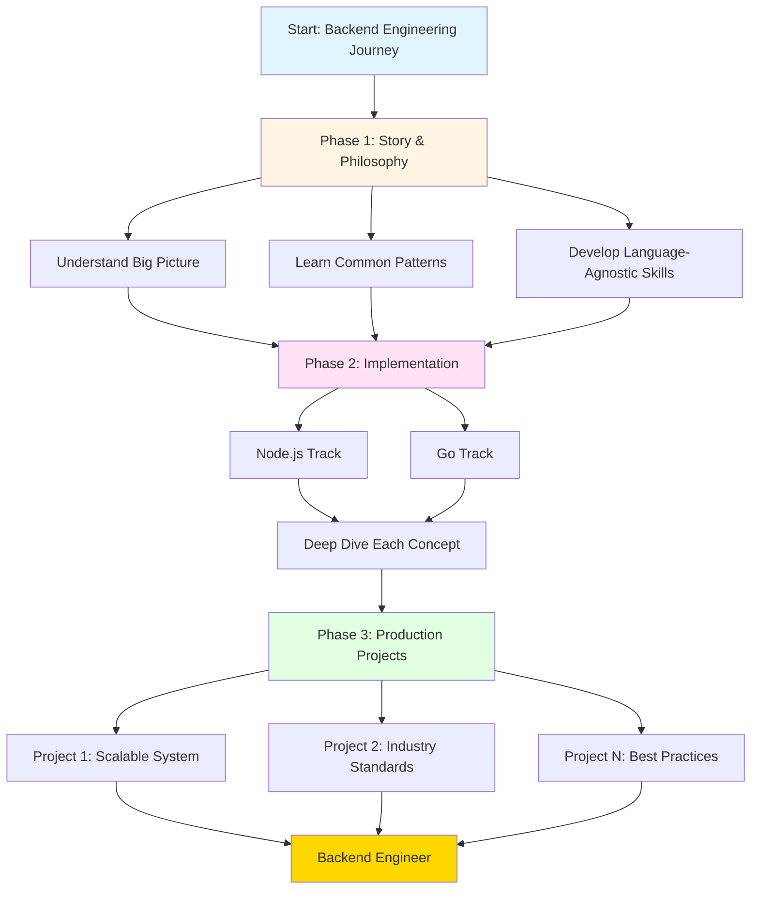
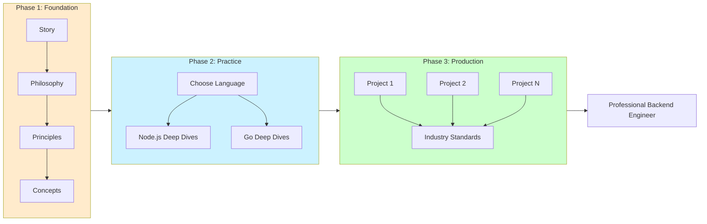
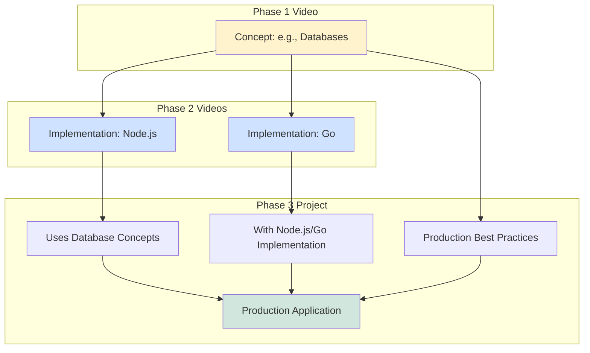
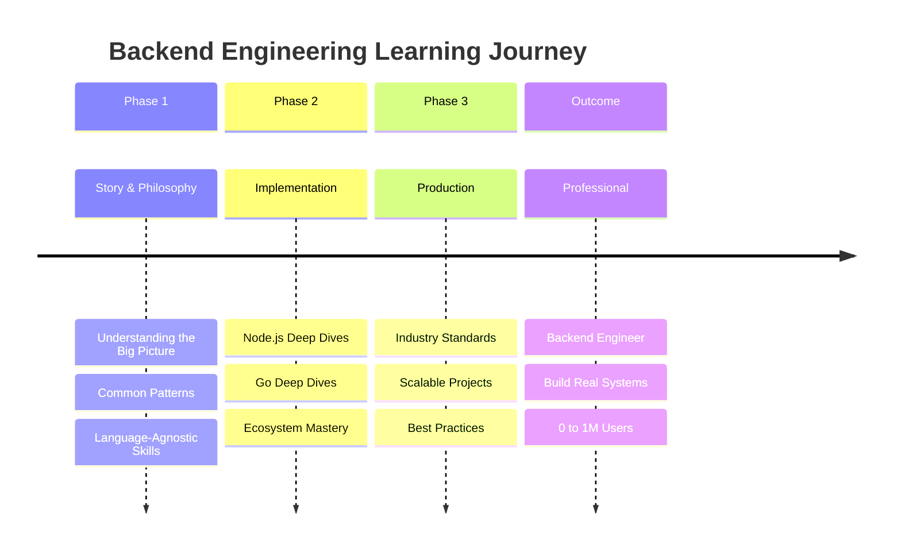
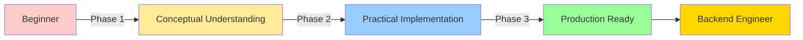

# Backend Engineering Learning Path - Comprehensive Notes

## Overview
This video introduces a structured learning journey to become a production-ready backend engineer, organized into three distinct phases with specific goals and outcomes.

---

## 📋 Three-Phase Learning Structure

### **Phase 1: Story and Philosophy**
**Duration/Position:** Playlist 1 (Current)  
**Focus:** Foundational understanding and big-picture thinking

#### Key Objectives:
- **Understand the narrative** of backend engineering
- **Learn philosophies** behind backend systems
- **Explore big questions** in system design
- **Study inner workings** of components
- **Understand machine collaboration** and interactions
- **Develop language-agnostic skills** (Framework-independent knowledge)

#### What You'll Learn:
| Aspect | Description |
|--------|-------------|
| **Big Picture** | How production-grade backends work as complete systems |
| **Common Patterns** | Recurring patterns across all backend applications |
| **Abstraction Understanding** | How languages, runtimes, frameworks, and libraries abstract complex concepts |
| **Component Relationships** | How different parts of a backend system connect and collaborate |
| **Philosophical Foundation** | The "why" behind architectural decisions |

#### Expected Outcome:
- Clear mental models of backend systems
- Ability to see patterns independent of technology stack
- Foundation for understanding any backend technology
- Skills that transcend specific tools or frameworks

---

### **Phase 2: Implementation**
**Duration/Position:** Playlist 2 (Planned)  
**Focus:** Practical application in specific languages

#### Language Choices:
1. **Node.js** - JavaScript ecosystem
2. **Go (Golang)** - Go ecosystem

> **Note:** Both chosen based on instructor's firsthand daily experience

#### Structure:
```
Story/Philosophy Concept → Implementation in Node.js
                         → Implementation in Go
```

#### Approach:
| Element | Description |
|---------|-------------|
| **Principle-by-Principle** | Each concept from Phase 1 gets dedicated implementation video(s) |
| **Deep Dives** | Thorough exploration of each topic in chosen language |
| **Ecosystem Coverage** | Language-specific tools, libraries, and best practices |
| **Direct Mapping** | Most Phase 1 videos will have corresponding Phase 2 implementation videos |

#### Example Case Study: Databases

**Concept Coverage:**
- Database fundamentals
- Database drivers
- Migration strategies
- Day-to-day database operations

**Implementation Coverage:**

| Language | Driver | Topics |
|----------|--------|--------|
| **Node.js** | postgres-js | Connection pooling, query building, transactions, error handling |
| **Go** | pgx | Type-safe queries, connection management, performance optimization |

Both will cover PostgreSQL with language-specific deep dives on every database concept.

---

### **Phase 3: Production**
**Duration/Position:** Playlist 3 (Future)  
**Focus:** Real-world, production-grade applications

#### Integration Points:
```
Phase 1 Concepts + Phase 2 Skills → Production Projects
```

#### Characteristics:
| Feature | Description |
|---------|-------------|
| **End-to-End Projects** | Complete applications from start to finish |
| **Industry Standards** | Following current best practices |
| **Scalability Focus** | Systems designed to scale from 0 to 1M+ users |
| **Maintainability** | Code and architecture built for long-term sustainability |
| **Follow-Along** | Projects designed for learners to build alongside |
| **Multiple Projects** | Several complete projects covering different scenarios |

#### Project Goals:
- Apply all learned concepts
- Combine philosophy with implementation
- Build real, deployable systems
- Practice production-ready code quality
- Implement scaling strategies
- Create maintainable codebases

---

## 🎯 Learning Path Visualization



---

## 📊 Complete Learning Journey Overview



---

## 🔄 Content Mapping Strategy



---

## 💡 Key Skills Developed

### Phase-by-Phase Skill Progression

| Phase | Skills Acquired | Competency Level |
|-------|----------------|------------------|
| **Phase 1** | • Conceptual understanding<br>• Pattern recognition<br>• System thinking<br>• Architecture principles | **Foundation** |
| **Phase 2** | • Language mastery<br>• Ecosystem knowledge<br>• Tool proficiency<br>• Code implementation | **Intermediate** |
| **Phase 3** | • Production deployment<br>• Scaling strategies<br>• Maintenance practices<br>• Industry standards | **Advanced/Professional** |

---

## 🎓 Expected Outcomes

### By Journey's End

If you **complete all three phases** and **internalize the concepts**:

#### ✅ You Can:
1. **Confidently call yourself** a Backend Engineer
2. **Build real systems** from scratch
3. **Scale applications** from 0 to 1M+ users
4. **Write maintainable code** that lasts
5. **Apply best practices** automatically
6. **Understand system trade-offs** deeply
7. **Work with any backend stack** (due to language-agnostic foundation)
8. **Debug complex issues** effectively
9. **Make architectural decisions** confidently
10. **Collaborate with teams** using industry terminology

---

## 📚 Detailed Topic Example: Database Coverage

### How One Topic Spans All Three Phases

```mermaid
graph LR
    subgraph P1["Phase 1: Concepts"]
        A[What are Databases?]
        B[Drivers & Connections]
        C[Migrations]
        D[Query Patterns]
        E[Transactions]
    end
    
    subgraph P2["Phase 2: Implementation"]
        F1[Node.js + postgres-js]
        F2[Go + pgx]
        G1[Connection Pooling]
        G2[Query Building]
        H1[Migration Tools]
        H2[Error Handling]
    end
    
    subgraph P3["Phase 3: Production"]
        I[Real Database Schema]
        J[Performance Optimization]
        K[Backup Strategies]
        L[Monitoring & Alerts]
    end
    
    P1 --> P2
    P2 --> P3
    
    style P1 fill:#fff8dc
    style P2 fill:#e6f3ff
    style P3 fill:#e6ffe6
```



---

## 🛤️ Learning Pathway Summary



---

## 🎯 Critical Success Factors

### To Maximize Learning:

| Factor | Description | Why It Matters |
|--------|-------------|----------------|
| **Follow Sequentially** | Complete Phase 1 before Phase 2, etc. | Each phase builds on the previous |
| **Internalize Concepts** | Don't just watch - understand deeply | Surface knowledge won't transfer to production |
| **Follow Along Projects** | Code alongside the tutorials | Active learning > passive watching |
| **Practice Between Videos** | Apply concepts to your own projects | Reinforces learning and reveals gaps |
| **Focus on Principles** | Understand "why" not just "how" | Enables adaptation to new technologies |

---

## 📈 Skill Level Progression



---

## 🔑 Key Takeaways

### What Makes This Approach Unique:

1. **Philosophy First**: Understanding "why" before "how"
2. **Language Agnostic Foundation**: Skills that transfer across technologies
3. **Dual Implementation**: See the same concepts in two different ecosystems
4. **Production Focus**: Not just tutorials, but real-world applications
5. **Scalability Emphasis**: From zero to millions of users
6. **Maintainability**: Code that lasts beyond the initial build
7. **Complete Journey**: From concept to production-ready engineer

---

## 🎬 Final Note

> **The instructor emphasizes:** This is a complete transformation journey. By following all three phases, completing the projects, and internalizing the concepts, you'll have the skills and confidence to build production systems that scale and can be maintained over time.

The path is clear: **Story → Implementation → Production → Backend Engineer** 🚀
