I'll read the uploaded file to create comprehensive notes for you.# Backend Engineering Fundamentals - Comprehensive Notes

## Table of Contents
1. [What is a Backend?](#what-is-a-backend)
2. [How Backends Work - Complete Request Flow](#how-backends-work)
3. [Practical Example: AWS Deployment Architecture](#aws-deployment)
4. [Frontend vs Backend: Execution Model](#frontend-vs-backend)
5. [Why We Need Backends](#why-we-need-backends)
6. [Why Backend Logic Cannot Live in Frontend](#backend-logic-restrictions)

---

## 1. What is a Backend? {#what-is-a-backend}

### Traditional Definition

A **backend** is a computer that:
- **Listens** for incoming requests (HTTP, WebSocket, gRPC, etc.)
- Uses **open ports** (e.g., 80 for HTTP, 443 for HTTPS)
- Is **accessible over the internet**
- Allows **clients/frontends** to connect, send, and receive data

### Why Called a "Server"?

It **provides** or **serves** content:
- **Static files**: Images, JavaScript, HTML, CSS
- **Dynamic data**: JSON responses
- **Accepts data**: From client requests

### Backend Components Overview

| Component | Purpose | Example |
|-----------|---------|---------|
| **Server** | Main application processing requests | Node.js, Go, Python servers |
| **Port** | Entry point for requests | 80 (HTTP), 443 (HTTPS), 3000, 3001 |
| **Protocol** | Communication standard | HTTP, HTTPS, WebSocket, gRPC |
| **Response Format** | Data structure returned | JSON, HTML, XML, Binary |

---

## 2. How Backends Work - Complete Request Flow {#how-backends-work}

### Request Journey Visualization

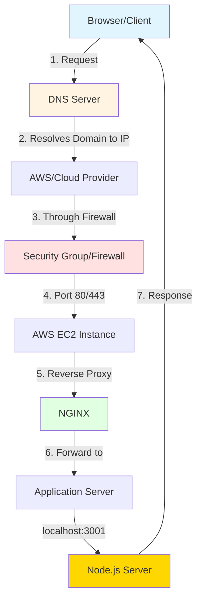

### Detailed Request Flow Breakdown

#### Step 1: Domain Resolution (DNS)
```
User enters: backend-demo.senius.do.xyz
              ↓
DNS Server resolves to IP: xxx.xxx.xxx.xxx
```

**DNS Record Types:**

| Record Type | Purpose | Example |
|-------------|---------|---------|
| **A Record** | Points domain to IP address | `backend-demo → 52.xx.xx.xx` |
| **CNAME Record** | Points domain to another domain | `www → example.com` |

#### Step 2: AWS Infrastructure

**Example Configuration:**
- **Service**: AWS EC2 Instance
- **Public IP**: The IP from DNS A record
- **Region**: Configured in AWS console

#### Step 3: Security Group (Firewall)

**Allowed Ports Configuration:**

| Port | Protocol | Purpose | Allow Rule |
|------|----------|---------|------------|
| **22** | SSH | Terminal/Command Line access | SSH access |
| **80** | HTTP | Unsecured web traffic | HTTP requests |
| **443** | HTTPS | Secured web traffic (SSL) | HTTPS requests |

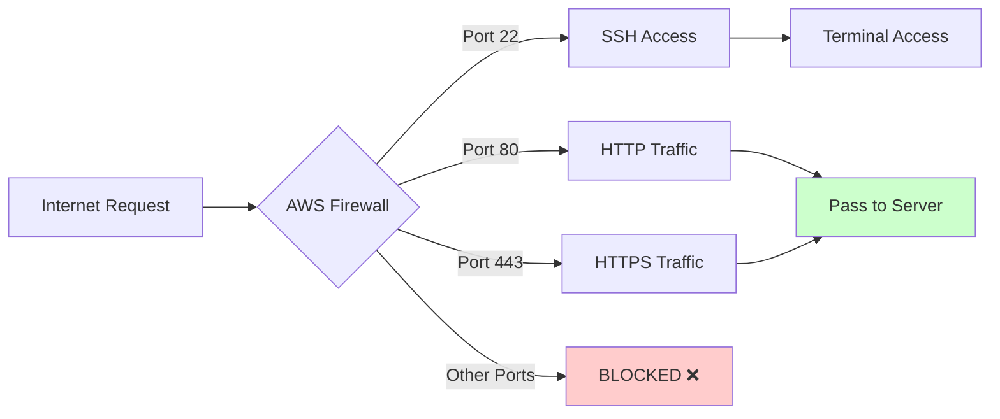

**Critical Point**: If these ports aren't allowed, AWS blocks the request **before** it reaches the server.

#### Step 4: Reverse Proxy (NGINX)

**Purpose**: Centralized request management

**NGINX Configuration:**

```nginx
# Listen on port 80
server {
    listen 80;
    
    # Redirect HTTP to HTTPS
    return 301 https://$host$request_uri;
}

# Listen on port 443 (HTTPS)
server {
    listen 443 ssl;
    server_name backend-demo.senius.do.xyz;
    
    # SSL certificates (managed by certbot)
    ssl_certificate /path/to/cert;
    ssl_certificate_key /path/to/key;
    
    # Forward to application server
    location / {
        proxy_pass http://localhost:3001;
        proxy_set_header Host $host;
        proxy_set_header X-Real-IP $remote_addr;
    }
}
```

**Request Routing:**
```
Port 80 (HTTP) → Redirect → Port 443 (HTTPS) → localhost:3001
```

#### Step 5: Application Server (Node.js)

**Process Management** (using PM2):

```bash
pm2 list
# Shows:
# - frontend: Port 3000
# - backend: Port 3001 (Node.js server)
```

**Verification:**
```bash
curl localhost:3001/users
# Returns: User data (JSON)
```

---

## 3. Practical Example: AWS Deployment Architecture {#aws-deployment}

### Complete Architecture Diagram

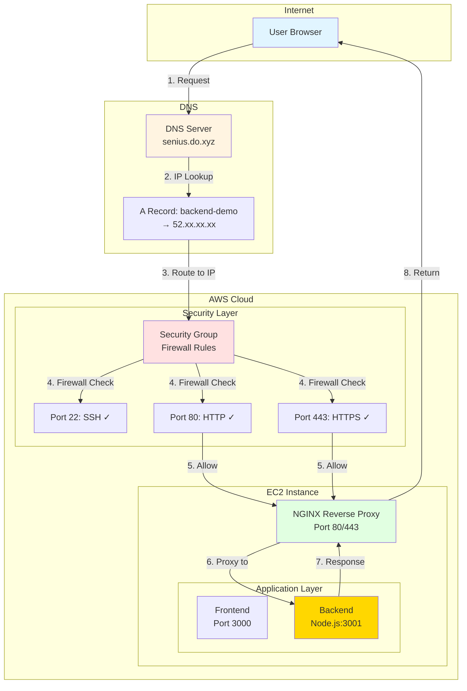

### Component Details Table

| Component | Location | Configuration | Purpose |
|-----------|----------|---------------|---------|
| **DNS Server** | Cloud DNS Provider | A Record: `backend-demo.senius.do.xyz → 52.xx.xx.xx` | Resolves domain to IP |
| **AWS EC2** | AWS Region | Public IP: `52.xx.xx.xx` | Hosts application |
| **Security Group** | AWS Firewall | Ports: 22, 80, 443 | Controls access |
| **NGINX** | EC2 Instance | Listens on 80/443, forwards to 3001 | Reverse proxy |
| **Node.js Server** | EC2 Instance | Runs on localhost:3001 | Application logic |
| **PM2** | Process Manager | Manages Node.js processes | Keeps server running |

### Request Flow Summary

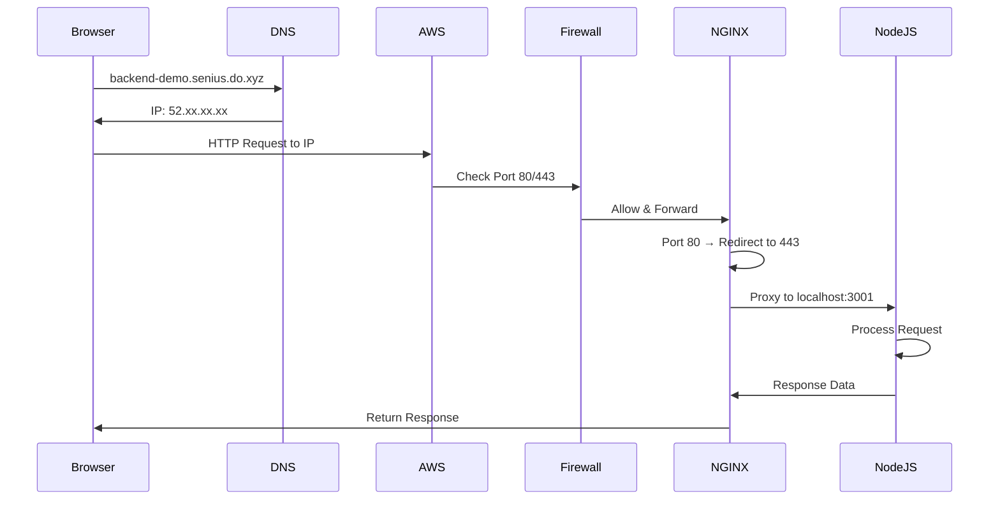

---

## 4. Frontend vs Backend: Execution Model {#frontend-vs-backend}

### Key Difference: Where Code Executes

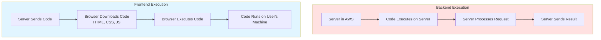

### Execution Comparison Table

| Aspect | Backend | Frontend |
|--------|---------|----------|
| **Code Location** | Runs on server | Downloads to browser |
| **Execution Environment** | Server runtime (Node.js, Go, etc.) | Browser runtime (V8, SpiderMonkey) |
| **Processing Location** | Remote server | User's device |
| **Access to Resources** | Full system access | Sandboxed/Limited |
| **Network Control** | Can call any API | CORS restricted |
| **File System** | Full access | No access |
| **Database** | Direct connection | Not possible |
| **Computing Power** | Server resources | User's device resources |

### Frontend Loading Process

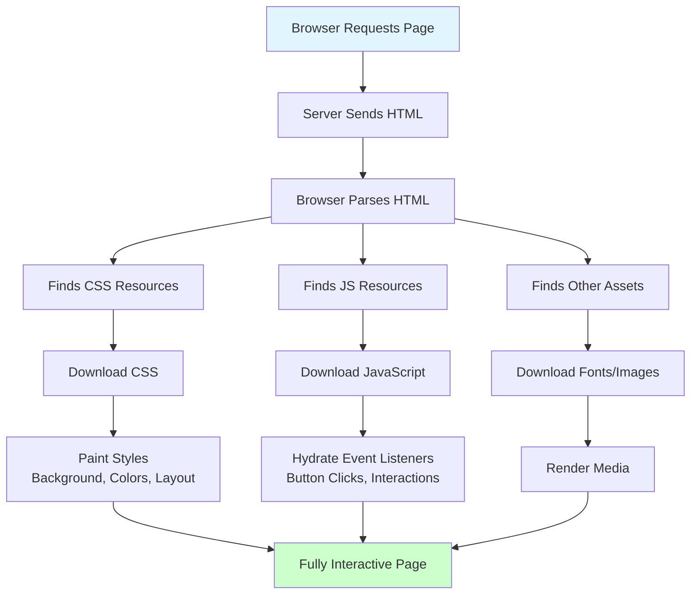

### Browser as Runtime

**What Happens:**
1. **Server sends code** (HTML, CSS, JS)
2. **Browser downloads** all resources
3. **Browser executes** JavaScript locally
4. **User interacts** with the page

**Example:**
```javascript
// This code is sent to browser
button.addEventListener('click', () => {
    // Executes on USER'S machine
    window.location.href = '/another-page';
});
```

---

## 5. Why We Need Backends {#why-we-need-backends}

### Real-World Scenario: Social Media Feed

**Example Use Case:**
> User scrolls through Instagram/Twitter feed

**What Happens:**

```mermaid
graph LR
    A[User Opens App] --> B[Frontend Loads]
    B --> C[Request to Backend]
    C --> D[Backend Queries Database]
    D --> E[Filter & Sort Posts]
    E --> F[Check User Permissions]
    F --> G[Return Personalized Feed]
    G --> H[Frontend Displays Posts]
    
    style C fill:#ffd700
    style D fill:#ffd700
    style E fill:#ffd700
    style F fill:#ffd700
```

**Why Backend is Essential:**

| Task | Why Backend Needed | What Happens |
|------|-------------------|--------------|
| **Data Storage** | Store millions of posts | Database queries |
| **User Authentication** | Verify who's logged in | Session management |
| **Personalization** | Show relevant content | Algorithm processing |
| **Data Security** | Protect private data | Access control |
| **Business Logic** | Feed algorithms | Complex computations |

---

## 6. Why Backend Logic Cannot Live in Frontend {#backend-logic-restrictions}

### Four Critical Reasons

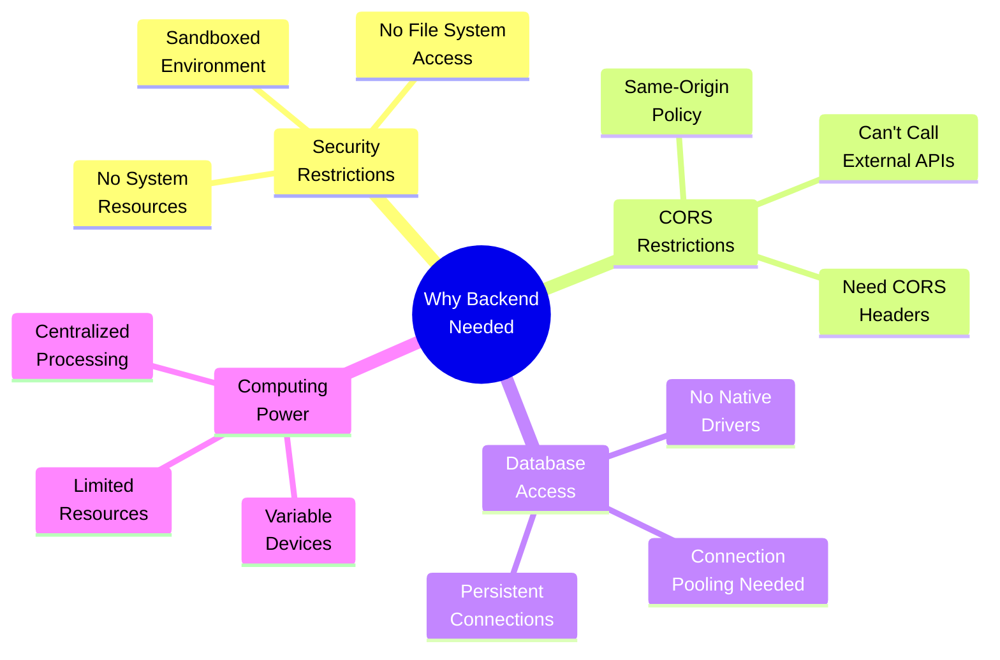

### Reason 1: Security Restrictions

#### Browser Sandbox Environment

**What is Sandboxing?**
Browsers isolate JavaScript code from the operating system to prevent malicious code from accessing user data.

**Limited Access:**

| Browser CAN Access | Browser CANNOT Access |
|-------------------|----------------------|
| ✅ DOM (Document Object) | ❌ File System |
| ✅ Browser APIs (localStorage, cookies) | ❌ Operating System |
| ✅ Same-origin resources | ❌ System Processes |
| ✅ APIs with CORS headers | ❌ Environment Variables |
| ✅ Limited memory | ❌ Network sockets |

**Why This Matters:**

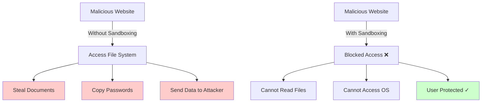

**Real-World Scenario:**
```
User visits malicious-site.com
↓
Site tries to access ~/Documents/
↓
Browser blocks access ✓
↓
User's files remain safe
```

**Backend Needs:**
- Write to log files
- Read environment variables
- Access configuration files
- Manage system resources

❌ **Browsers won't allow this**

---

### Reason 2: CORS (Cross-Origin Resource Sharing) Restrictions

#### What is CORS?

**Definition**: Browser security policy that restricts JavaScript from calling APIs on different domains.

#### Same-Origin Policy

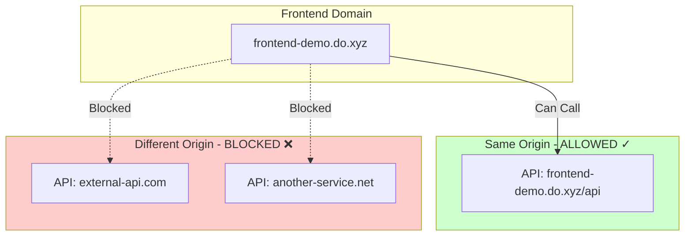

#### CORS Header Requirements

**For External API to Work:**

```http
# Response must include:
Access-Control-Allow-Origin: https://frontend-demo.do.xyz
Access-Control-Allow-Methods: GET, POST, PUT
Access-Control-Allow-Headers: Content-Type
```

| Scenario | Can Call? | Why? |
|----------|-----------|------|
| `frontend.com` → `frontend.com/api` | ✅ Yes | Same origin |
| `frontend.com` → `api.external.com` (with CORS) | ✅ Yes | CORS headers present |
| `frontend.com` → `api.external.com` (no CORS) | ❌ No | Missing CORS headers |

**Problem for Backends:**
- Need to call **multiple external services**
- **Can't control** which APIs have CORS
- **Many APIs** don't support browser CORS
- Backend servers **don't have** CORS restrictions

**Backend Solution:**
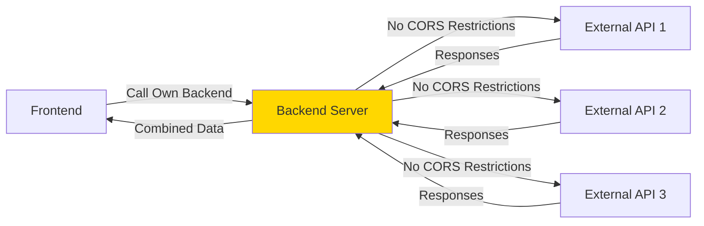

---

### Reason 3: Database Connections

#### Native Database Drivers

**What are Drivers?**
Software that allows applications to communicate efficiently with databases.

**Common Database Drivers:**

| Language | PostgreSQL Driver | MongoDB Driver | MySQL Driver |
|----------|------------------|----------------|--------------|
| **Node.js** | `pg`, `postgres-js` | `mongodb` | `mysql2` |
| **Go** | `pgx` | `mongo-go-driver` | `go-sql-driver` |
| **Python** | `psycopg2` | `pymongo` | `mysql-connector` |

#### Why Browsers Can't Use Database Drivers

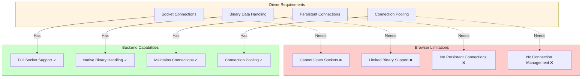

#### Connection Pooling

**What is Connection Pooling?**
Maintaining a pool of reusable database connections instead of creating new connections for each request.

**Why It's Critical:**

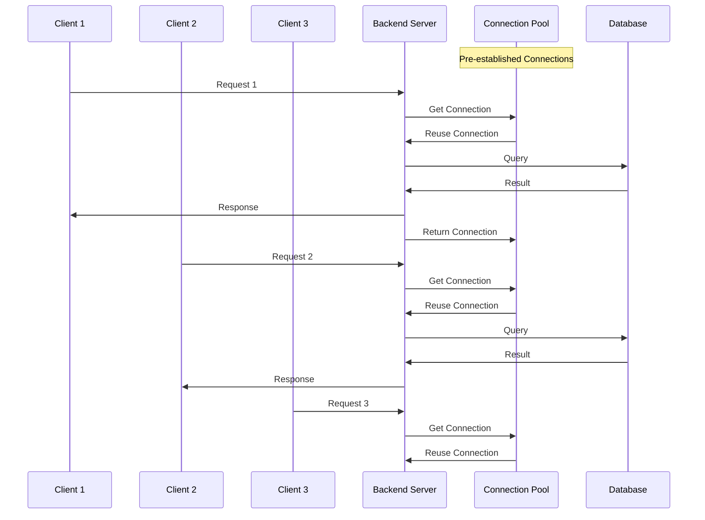

**Performance Comparison:**

| Approach | Connections per Request | Performance | Database Load |
|----------|------------------------|-------------|---------------|
| **No Pooling** | Create new, destroy after | Slow ❌ | Very High ❌ |
| **Connection Pooling** | Reuse existing | Fast ✅ | Low ✅ |

**Example Scenario:**
```
Backend receives 10,000 requests/second

Without Pooling:
- Create 10,000 connections/sec
- Destroy 10,000 connections/sec
- Database overwhelmed ❌

With Pooling (10 connections):
- Reuse 10 connections
- No creation overhead
- Database handles load ✅
```

**Browser Problems:**

| Issue | Impact |
|-------|--------|
| **Each user needs connection** | 10,000 users = 10,000 DB connections ❌ |
| **No pooling mechanism** | Can't reuse connections |
| **Database overwhelmed** | Too many simultaneous connections |
| **No connection management** | Can't efficiently handle queries |

---

### Reason 4: Computing Power

#### Variable Device Capabilities

**User Devices Range:**

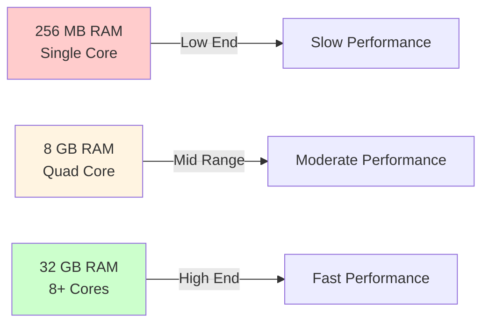

| Device Type | RAM | CPU | Can Handle Heavy Logic? |
|-------------|-----|-----|------------------------|
| **Old Smartphone** | 256 MB - 1 GB | Single/Dual Core | ❌ Lags/Crashes |
| **Budget Laptop** | 2-4 GB | Dual Core | ⚠️ Struggles |
| **Modern Phone** | 6-8 GB | Octa Core | ✅ Moderate |
| **Desktop** | 16+ GB | Multi Core | ✅ Good |

#### Centralized vs Distributed Computing

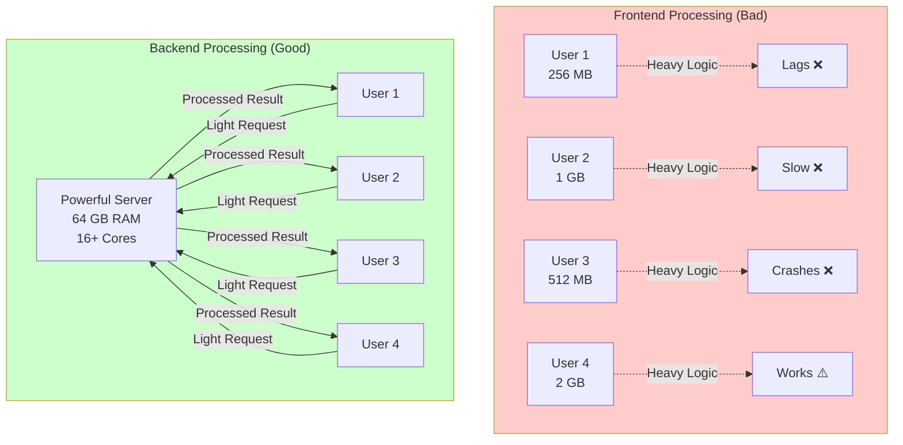

#### Scalability Advantage

**Backend Server Scaling:**

| User Load | Solution | Implementation |
|-----------|----------|----------------|
| **1,000 users** | Single server | 8 GB RAM, 4 cores |
| **10,000 users** | Upgrade server | 16 GB RAM, 8 cores |
| **100,000 users** | Add more servers | Load balancer + multiple servers |
| **1M+ users** | Auto-scaling | Cloud auto-scaling groups |

**Frontend Cannot Scale:**
- Depends on user's device
- No control over resources
- Inconsistent performance
- Cannot upgrade user devices

**Backend Can Scale:**
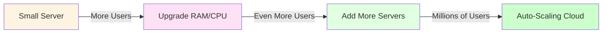

---

## Complete Comparison Summary

### Frontend vs Backend Capabilities

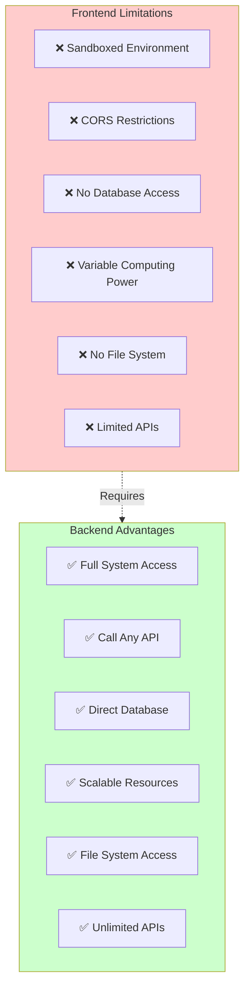

### Four Pillars of Backend Necessity

| Pillar | Frontend Problem | Backend Solution |
|--------|-----------------|------------------|
| **1. Security** | Sandboxed, no system access | Full OS access, file system, env vars |
| **2. Network** | CORS restrictions, same-origin only | Call any API without restrictions |
| **3. Database** | No drivers, no connections | Native drivers, connection pooling |
| **4. Computing** | Variable user devices | Centralized, scalable resources |

---

## Key Takeaways

### ✅ What You Should Understand:

1. **Backend Definition**: A server that listens for requests and serves content over the internet

2. **Request Flow**: Browser → DNS → Firewall → Reverse Proxy → Application Server → Response

3. **Infrastructure Layers**: 
   - DNS for domain resolution
   - Cloud providers for hosting
   - Firewalls for security
   - Reverse proxies for routing
   - Application servers for logic

4. **Frontend Execution**: Code downloads to browser and runs on user's machine

5. **Backend Execution**: Code runs on server, only results sent to user

6. **Four Critical Reasons for Backends**:
   - Security restrictions in browsers
   - CORS limitations
   - Database access requirements
   - Computing power needs

### 🎯 Core Principle:

> **Backend servers exist because browsers are intentionally limited for security and practicality. These limitations make it impossible to build robust, scalable, secure applications purely in the frontend.**

---

This foundation prepares you for deeper backend engineering topics including protocols, databases, authentication, scaling, and production deployments. 🚀
