# Benefits of Learning Backend Engineering from First Principles - Comprehensive Notes

## Table of Contents
1. [Common Developer Challenges](#challenges)
2. [What Are First Principles?](#definition)
3. [Seven Key Benefits](#benefits)
4. [Practical Application Examples](#examples)
5. [Career Impact](#career)

---

## 1. Common Developer Challenges {#challenges}

### Real-World Scenarios

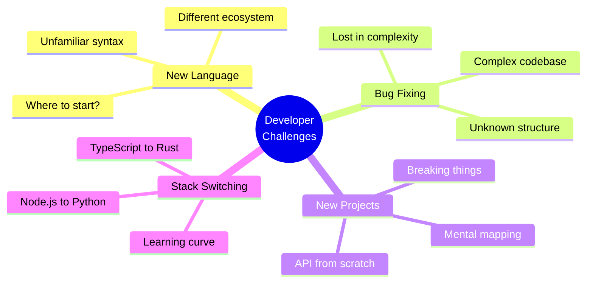
```mermaid
mindmap
  root((Developer<br/>Challenges))
    New Language
      Unfamiliar syntax
      Different ecosystem
      Where to start?
    Bug Fixing
      Complex codebase
      Unknown structure
      Lost in complexity
    New Projects
      API from scratch
      Mental mapping
      Breaking things
    Stack Switching
      TypeScript to Rust
      Node.js to Python
      Learning curve
```

### Challenge Breakdown Table

| Scenario | Challenge | Pain Points | Impact |
|----------|-----------|-------------|---------|
| **Frontend → Backend** | Asked to fix backend bug | • Unknown language<br>• Where to start?<br>• Getting lost in complexity | Lost time, confusion |
| **API Creation** | Build API from scratch | • Mental map formation<br>• Following standards<br>• Avoiding breaking changes | Quality concerns, slow progress |
| **Language Switch** | TypeScript/Go → Rust/Python | • New frameworks (FastAPI, Axum)<br>• New ORMs (SQLAlchemy, Diesel)<br>• Library documentation overload | Wasted hours, frustration |
| **Existing Codebase** | Navigate unfamiliar code | • Overwhelming structure<br>• Engineering complexity<br>• Can't identify core logic | Paralysis, errors |

### The Core Problem

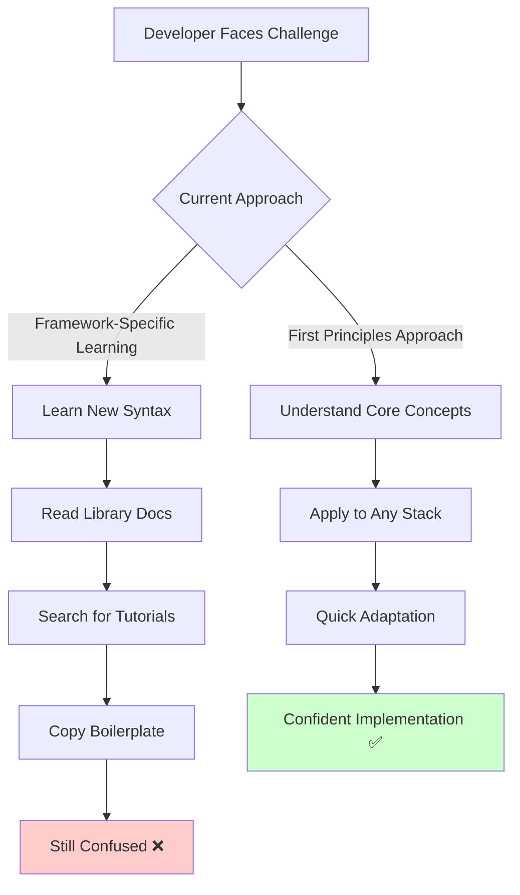
```mermaid
graph TB
    A[Developer Faces Challenge] --> B{Current Approach}
    B -->|Framework-Specific Learning| C[Learn New Syntax]
    C --> D[Read Library Docs]
    D --> E[Search for Tutorials]
    E --> F[Copy Boilerplate]
    F --> G[Still Confused ❌]
    
    B -->|First Principles Approach| H[Understand Core Concepts]
    H --> I[Apply to Any Stack]
    I --> J[Quick Adaptation]
    J --> K[Confident Implementation ✅]
    
    style G fill:#ffcccc
    style K fill:#ccffcc
```

---

## 2. What Are First Principles? {#definition}

### Definition

> **First Principles**: Foundational blocks or components around which the entire codebase revolves, regardless of size or complexity. A generic map of backend engineering territory that helps you navigate any codebase.

### Not Just Rules

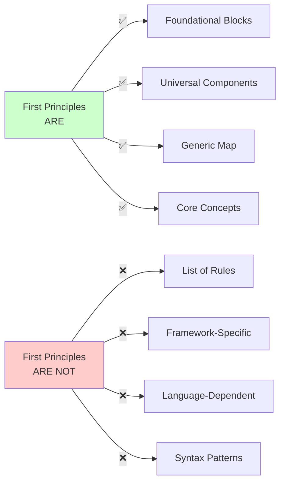
```mermaid
graph LR
    A[First Principles<br/>ARE] -->|✅| B[Foundational Blocks]
    A -->|✅| C[Universal Components]
    A -->|✅| D[Generic Map]
    A -->|✅| E[Core Concepts]
    
    F[First Principles<br/>ARE NOT] -->|❌| G[List of Rules]
    F -->|❌| H[Framework-Specific]
    F -->|❌| I[Language-Dependent]
    F -->|❌| J[Syntax Patterns]
    
    style A fill:#ccffcc
    style F fill:#ffcccc
```

### Characteristics Table

| Aspect | First Principles | Framework-Specific Learning |
|--------|-----------------|----------------------------|
| **Scope** | Universal across all backends | Limited to one framework |
| **Longevity** | Permanent knowledge | Changes with versions |
| **Transferability** | Works in any language/stack | Locked to specific tools |
| **Learning Time** | Longer initial investment | Quick but shallow |
| **Long-term Value** | Compounds over time | Depreciates with tech changes |
| **Applicability** | Small to large codebases | Only similar projects |

---

## 3. Seven Key Benefits {#benefits}

### Overview Diagram

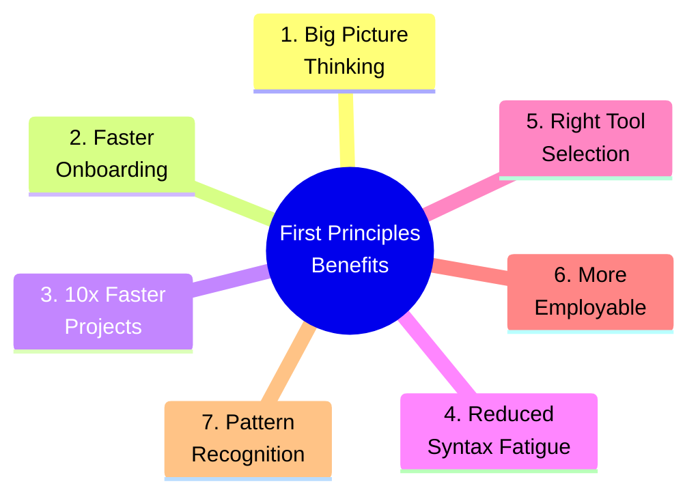
```mermaid
mindmap
  root((First Principles<br/>Benefits))
    1. Big Picture<br/>Thinking
    2. Faster<br/>Onboarding
    3. 10x Faster<br/>Projects
    4. Reduced<br/>Syntax Fatigue
    5. Right Tool<br/>Selection
    6. More<br/>Employable
    7. Pattern<br/>Recognition
```

---

### Benefit 1: Seeing the Big Picture

#### What It Means

**Ability to mentally separate complex systems into distinct, manageable parts**

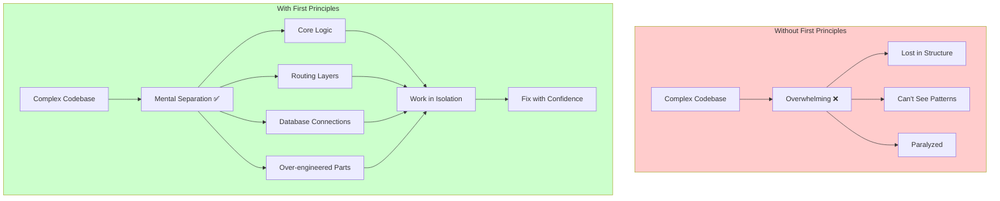
```mermaid
graph TB
    subgraph Before["Without First Principles"]
        A1[Complex Codebase] --> A2[Overwhelming ❌]
        A2 --> A3[Lost in Structure]
        A2 --> A4[Can't See Patterns]
        A2 --> A5[Paralyzed]
    end
    
    subgraph After["With First Principles"]
        B1[Complex Codebase] --> B2[Mental Separation ✅]
        B2 --> B3[Core Logic]
        B2 --> B4[Routing Layers]
        B2 --> B5[Database Connections]
        B2 --> B6[Over-engineered Parts]
        
        B3 & B4 & B5 & B6 --> B7[Work in Isolation]
        B7 --> B8[Fix with Confidence]
    end
    
    style Before fill:#ffcccc
    style After fill:#ccffcc
```

#### Codebase Mental Model

When entering an unfamiliar codebase, first principles allow you to:

| Layer | What You Identify | What You Can Do |
|-------|------------------|----------------|
| **Routing Layer** | How requests are directed | Trace request flow, add new routes |
| **Core Logic** | Business rules, algorithms | Fix bugs, modify behavior |
| **Database Connections** | Data persistence layer | Optimize queries, fix data issues |
| **Middleware** | Request/response processing | Add logging, authentication |
| **Over-engineered Parts** | Unnecessary complexity | Simplify, refactor |

#### Senior Engineer Pattern Recognition

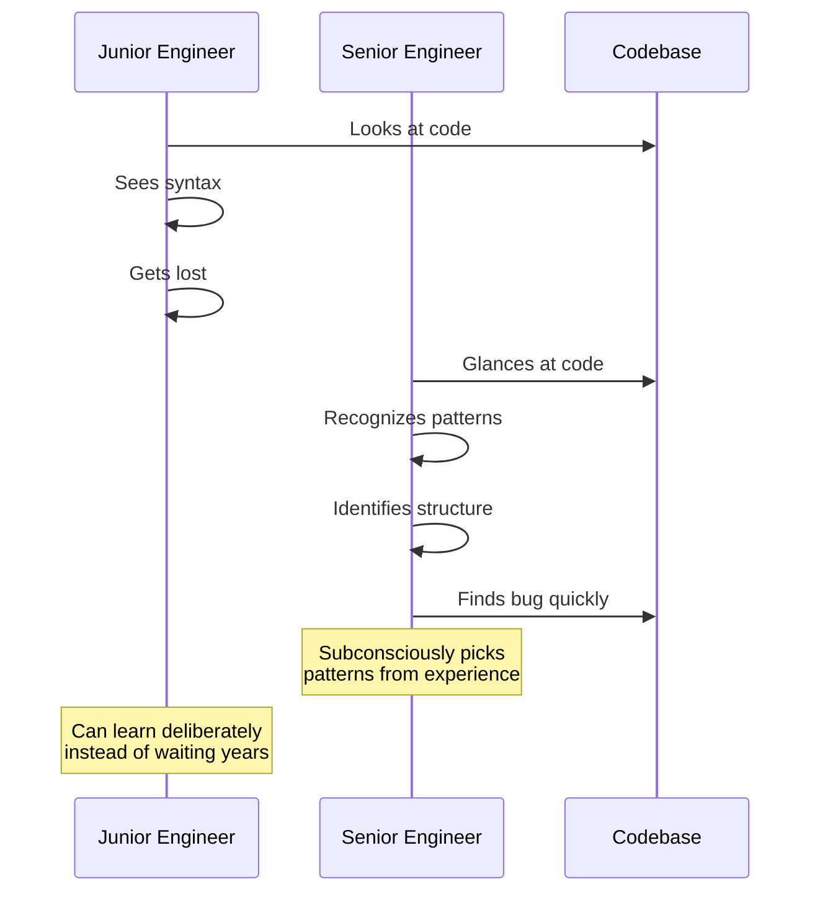
```mermaid
sequenceDiagram
    participant Junior as Junior Engineer
    participant Senior as Senior Engineer
    participant Code as Codebase
    
    Junior->>Code: Looks at code
    Junior->>Junior: Sees syntax
    Junior->>Junior: Gets lost
    
    Senior->>Code: Glances at code
    Senior->>Senior: Recognizes patterns
    Senior->>Senior: Identifies structure
    Senior->>Code: Finds bug quickly
    
    Note over Senior: Subconsciously picks<br/>patterns from experience
    Note over Junior: Can learn deliberately<br/>instead of waiting years
```

#### Timeline Comparison

| Approach | Time to Competence | Method | Result |
|----------|-------------------|--------|---------|
| **Traditional** | 5-10 years | Accumulate experience unconsciously | Eventually recognize patterns |
| **First Principles** | 6-12 months | Deliberate practice from day one | Actively recognize patterns |

**Key Quote**: 
> "Why wait for years of experience? You can deliberately practice from day one and get good at this in 6 months or 1 year."

---

### Benefit 2: Faster Onboarding

#### Core Concept

Understanding universal principles enables rapid adaptation to any technology stack.

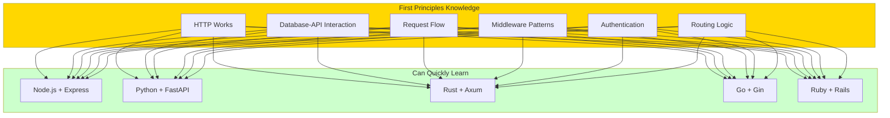
```mermaid
graph TB
    subgraph Knowledge["First Principles Knowledge"]
        A[HTTP Works]
        B[Database-API Interaction]
        C[Request Flow]
        D[Middleware Patterns]
        E[Authentication]
        F[Routing Logic]
    end
    
    subgraph Application["Can Quickly Learn"]
        G[Node.js + Express]
        H[Python + FastAPI]
        I[Rust + Axum]
        J[Go + Gin]
        K[Ruby + Rails]
    end
    
    A & B & C & D & E & F --> G
    A & B & C & D & E & F --> H
    A & B & C & D & E & F --> I
    A & B & C & D & E & F --> J
    A & B & C & D & E & F --> K
    
    style Knowledge fill:#ffd700
    style Application fill:#ccffcc
```

#### Learning Time Comparison


```mermaid
gantt
    title Time to Productivity in New Stack
    dateFormat X
    axisFormat %s

    section Framework-First
    Learn syntax           :0, 20
    Read docs             :20, 40
    Follow tutorials      :40, 80
    Understand concepts   :80, 120
    Build confidently     :120, 160
    
    section First-Principles
    Review syntax         :0, 10
    Map to known concepts :10, 20
    Start building        :20, 40
    Full productivity     :40, 60
```

#### Onboarding Process Comparison

| Phase | Traditional Approach | First Principles Approach |
|-------|---------------------|--------------------------|
| **Day 1-3** | Read framework docs | Map syntax to known concepts |
| **Day 4-7** | Follow tutorials | Identify familiar patterns |
| **Week 2** | Copy boilerplate code | Start implementing |
| **Week 3-4** | Still confused about architecture | Fully productive |
| **Month 2** | Beginning to understand | Mentoring others |

#### What You No Longer Need

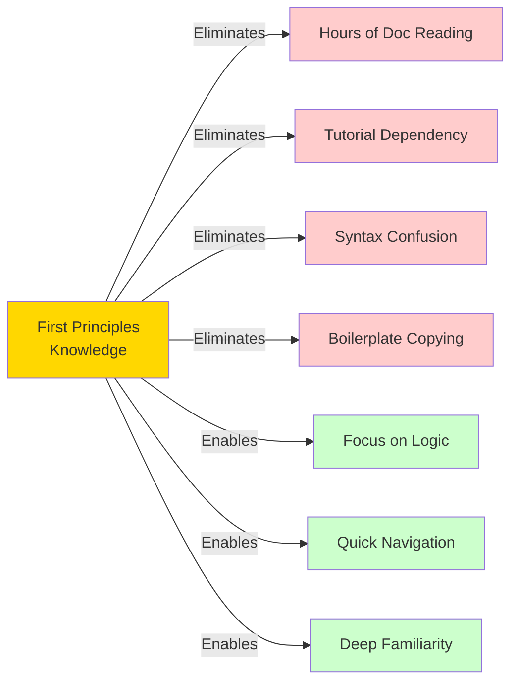
```mermaid
graph LR
    A[First Principles<br/>Knowledge] -->|Eliminates| B[Hours of Doc Reading]
    A -->|Eliminates| C[Tutorial Dependency]
    A -->|Eliminates| D[Syntax Confusion]
    A -->|Eliminates| E[Boilerplate Copying]
    
    A -->|Enables| F[Focus on Logic]
    A -->|Enables| G[Quick Navigation]
    A -->|Enables| H[Deep Familiarity]
    
    style A fill:#ffd700
    style B fill:#ffcccc
    style C fill:#ffcccc
    style D fill:#ffcccc
    style E fill:#ffcccc
    style F fill:#ccffcc
    style G fill:#ccffcc
    style H fill:#ccffcc
```

---

### Benefit 3: 10x Faster in New Projects

#### Speed and Quality Combined

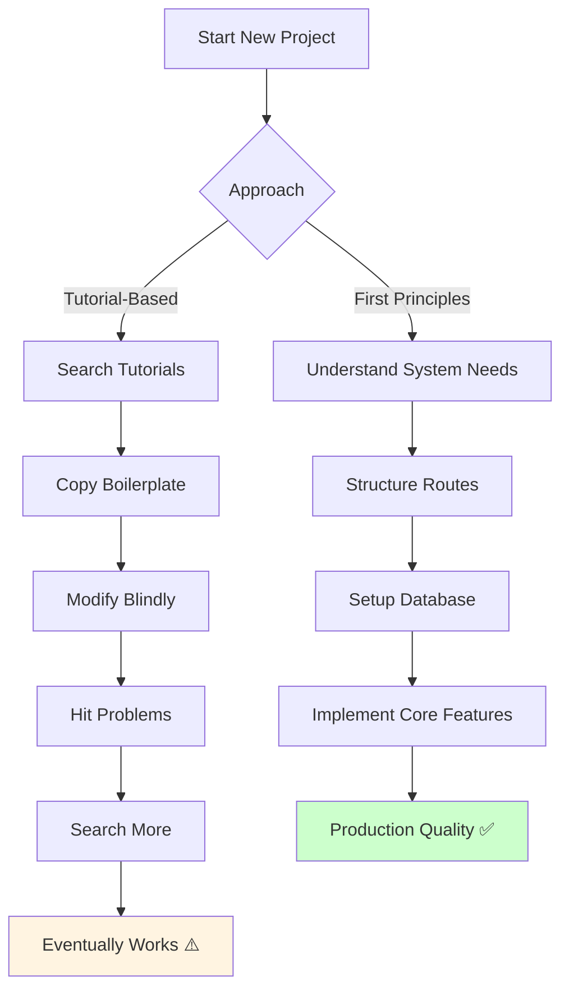
```mermaid
graph TB
    A[Start New Project] --> B{Approach}
    
    B -->|Tutorial-Based| C[Search Tutorials]
    C --> D[Copy Boilerplate]
    D --> E[Modify Blindly]
    E --> F[Hit Problems]
    F --> G[Search More]
    G --> H[Eventually Works ⚠️]
    
    B -->|First Principles| I[Understand System Needs]
    I --> J[Structure Routes]
    J --> K[Setup Database]
    K --> L[Implement Core Features]
    L --> M[Production Quality ✅]
    
    style H fill:#fff4e1
    style M fill:#ccffcc
```

#### MVP Development Comparison

| Aspect | Tutorial-Following | First Principles |
|--------|-------------------|------------------|
| **Speed** | Slow (lots of searching) | Fast (direct implementation) |
| **Quality** | Questionable | Production-ready |
| **Understanding** | Shallow (copy-paste) | Deep (systems thinking) |
| **Confidence** | Low (unsure if correct) | High (know why it works) |
| **Reference Needs** | Constant documentation lookup | Minimal reference needed |
| **Adaptability** | Locked to tutorial pattern | Can adjust to requirements |

#### What You Can Do Without Constantly Referencing Docs

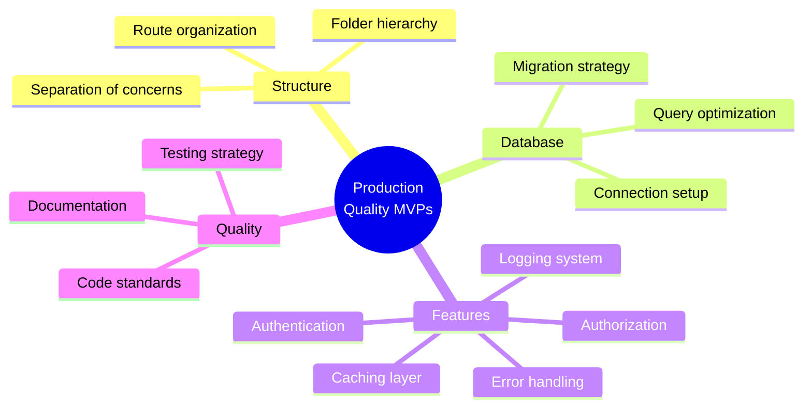
```mermaid
mindmap
  root((Production<br/>Quality MVPs))
    Structure
      Route organization
      Folder hierarchy
      Separation of concerns
    Database
      Connection setup
      Query optimization
      Migration strategy
    Features
      Caching layer
      Error handling
      Logging system
      Authentication
      Authorization
    Quality
      Testing strategy
      Documentation
      Code standards
```

#### Development Timeline

| Week | Tutorial Approach | First Principles Approach |
|------|------------------|--------------------------|
| **Week 1** | Setup + follow tutorial | Complete core architecture |
| **Week 2** | Debug boilerplate issues | Core features implemented |
| **Week 3** | Add features slowly | Polish + advanced features |
| **Week 4** | Still fixing basics | Production-ready MVP |

---

### Benefit 4: No More Syntax Fatigue

#### The Problem

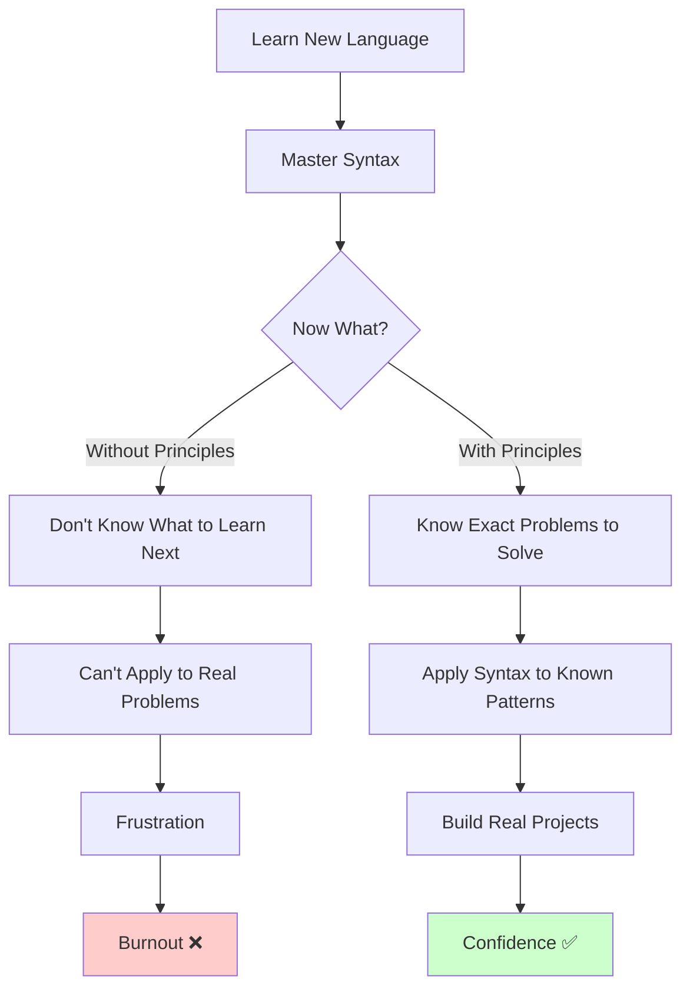
```mermaid
graph TB
    A[Learn New Language] --> B[Master Syntax]
    B --> C{Now What?}
    C -->|Without Principles| D[Don't Know What to Learn Next]
    D --> E[Can't Apply to Real Problems]
    E --> F[Frustration]
    F --> G[Burnout ❌]
    
    C -->|With Principles| H[Know Exact Problems to Solve]
    H --> I[Apply Syntax to Known Patterns]
    I --> J[Build Real Projects]
    J --> K[Confidence ✅]
    
    style G fill:#ffcccc
    style K fill:#ccffcc
```

#### Language Learning Stages

| Stage | Without First Principles | With First Principles |
|-------|-------------------------|----------------------|
| **1. Syntax** | Learn syntax, feel lost | Learn syntax, know purpose |
| **2. Concepts** | What to learn next? ❌ | Map to known building blocks ✅ |
| **3. Application** | Can't apply to real problems ❌ | Apply right syntax to known problems ✅ |
| **4. Confidence** | Frustrated, burning out ❌ | Building production code ✅ |

#### Switching Languages Becomes Easy

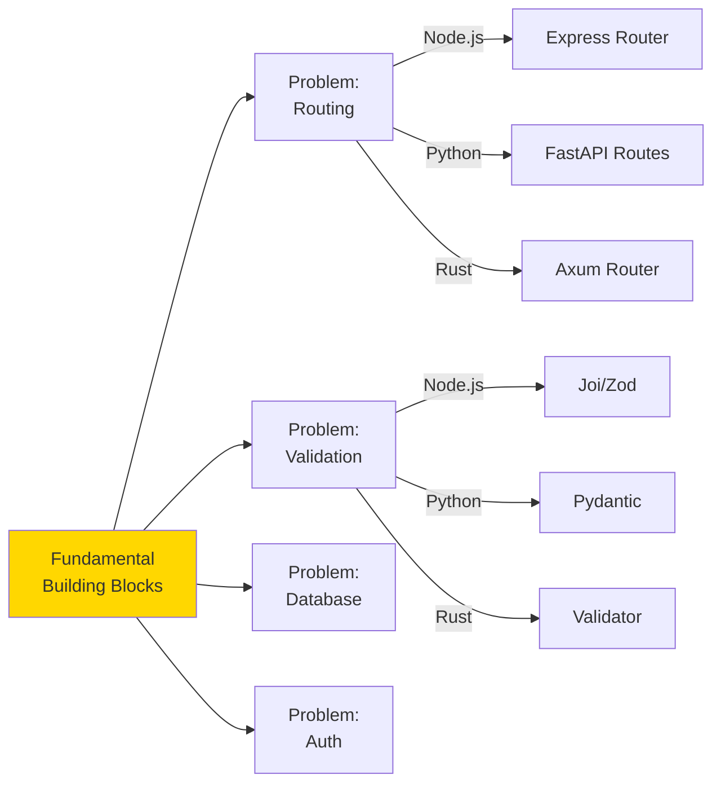
```mermaid
graph LR
    A[Fundamental<br/>Building Blocks] --> B[Problem:<br/>Routing]
    A --> C[Problem:<br/>Validation]
    A --> D[Problem:<br/>Database]
    A --> E[Problem:<br/>Auth]
    
    B -->|Node.js| F1[Express Router]
    B -->|Python| F2[FastAPI Routes]
    B -->|Rust| F3[Axum Router]
    
    C -->|Node.js| G1[Joi/Zod]
    C -->|Python| G2[Pydantic]
    C -->|Rust| G3[Validator]
    
    style A fill:#ffd700
```

#### Reduced Frustration Timeline


```mermaid
gantt
    title Learning Curve Comparison
    dateFormat X
    axisFormat %s

    section Without Principles
    Syntax learning       :done, 0, 30
    Confusion phase      :crit, 30, 90
    Frustration builds   :crit, 90, 150
    Potential burnout    :crit, 150, 180
    
    section With Principles
    Syntax learning      :done, 0, 30
    Apply to patterns    :active, 30, 60
    Build projects       :active, 60, 90
    Full confidence      :90, 120
```

---

### Benefit 5: Choosing the Right Tool for the Right Job

#### Problem: Label Limitation

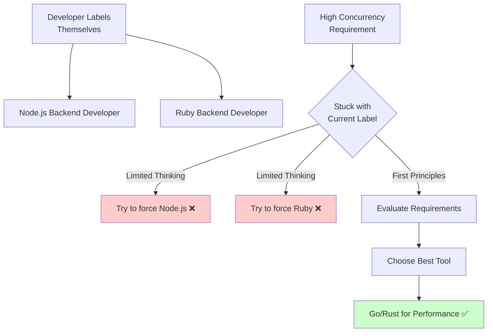
```mermaid
graph TB
    A[Developer Labels<br/>Themselves] --> B[Node.js Backend Developer]
    A --> C[Ruby Backend Developer]
    
    D[High Concurrency<br/>Requirement] --> E{Stuck with<br/>Current Label}
    
    E -->|Limited Thinking| F[Try to force Node.js ❌]
    E -->|Limited Thinking| G[Try to force Ruby ❌]
    
    E -->|First Principles| H[Evaluate Requirements]
    H --> I[Choose Best Tool]
    I --> J[Go/Rust for Performance ✅]
    
    style F fill:#ffcccc
    style G fill:#ffcccc
    style J fill:#ccffcc
```

#### Technology Selection Matrix

| Requirement | Without First Principles | With First Principles |
|-------------|-------------------------|----------------------|
| **High Concurrency** | Stuck with familiar tool | Choose Go, Rust, or Java |
| **Low Latency** | Force current framework | Select compiled language |
| **Rapid Prototyping** | Use what you know | Python or Node.js |
| **Real-time Streaming** | Try to hack solution | Use Kafka, Redis Streams |
| **Caching Layer** | Build from scratch | Redis, Memcached |
| **Relational Data** | Use any database | PostgreSQL, MySQL |
| **Unstructured Data** | Force relational DB | MongoDB, DynamoDB |

#### Core Problems & Solutions Map

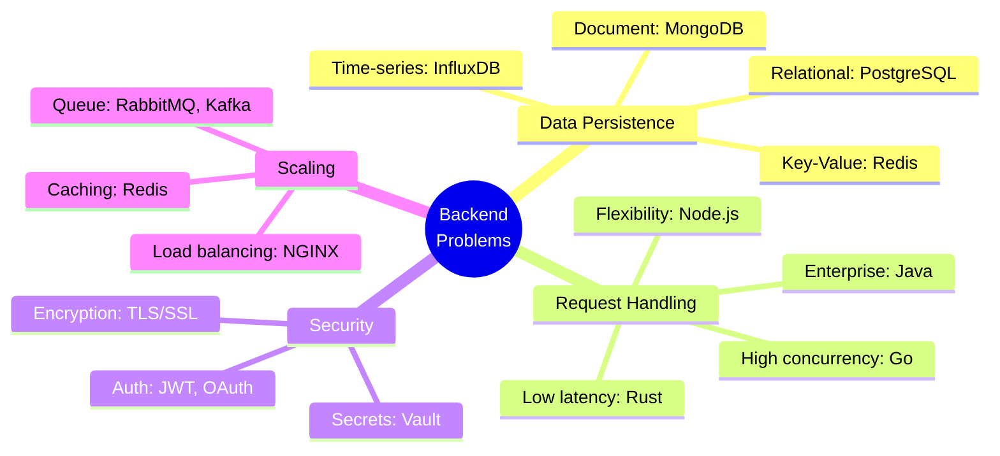
```mermaid
mindmap
  root((Backend<br/>Problems))
    Data Persistence
      Relational: PostgreSQL
      Document: MongoDB
      Key-Value: Redis
      Time-series: InfluxDB
    Request Handling
      High concurrency: Go
      Low latency: Rust
      Flexibility: Node.js
      Enterprise: Java
    Security
      Auth: JWT, OAuth
      Encryption: TLS/SSL
      Secrets: Vault
    Scaling
      Load balancing: NGINX
      Caching: Redis
      Queue: RabbitMQ, Kafka
```

#### Decision-Making Process

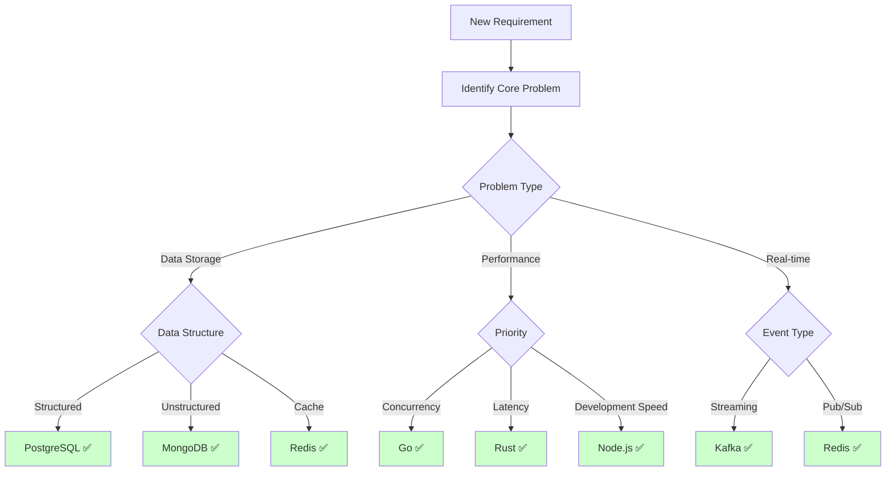
```mermaid
graph TD
    A[New Requirement] --> B[Identify Core Problem]
    B --> C{Problem Type}
    
    C -->|Data Storage| D{Data Structure}
    D -->|Structured| E[PostgreSQL ✅]
    D -->|Unstructured| F[MongoDB ✅]
    D -->|Cache| G[Redis ✅]
    
    C -->|Performance| H{Priority}
    H -->|Concurrency| I[Go ✅]
    H -->|Latency| J[Rust ✅]
    H -->|Development Speed| K[Node.js ✅]
    
    C -->|Real-time| L{Event Type}
    L -->|Streaming| M[Kafka ✅]
    L -->|Pub/Sub| N[Redis ✅]
    
    style E fill:#ccffcc
    style F fill:#ccffcc
    style G fill:#ccffcc
    style I fill:#ccffcc
    style J fill:#ccffcc
    style K fill:#ccffcc
    style M fill:#ccffcc
    style N fill:#ccffcc
```

---

### Benefit 6: More Employable

#### Market Value Transformation

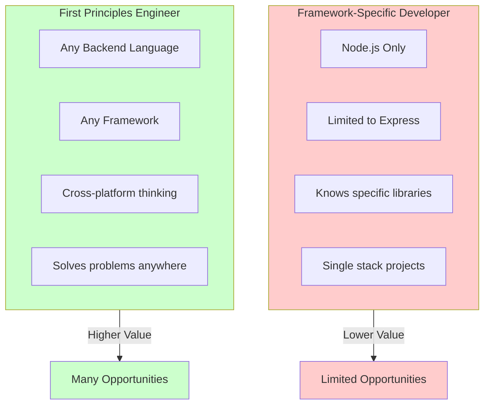
```mermaid
graph TB
    subgraph Framework["Framework-Specific Developer"]
        A1[Node.js Only]
        A2[Limited to Express]
        A3[Knows specific libraries]
        A4[Single stack projects]
    end
    
    subgraph Adaptable["First Principles Engineer"]
        B1[Any Backend Language]
        B2[Any Framework]
        B3[Cross-platform thinking]
        B4[Solves problems anywhere]
    end
    
    Framework -->|Lower Value| C[Limited Opportunities]
    Adaptable -->|Higher Value| D[Many Opportunities]
    
    style Framework fill:#ffcccc
    style Adaptable fill:#ccffcc
    style C fill:#ffcccc
    style D fill:#ccffcc
```

#### Employer Perspective

| Trait | Framework-Specific | First Principles Engineer |
|-------|-------------------|---------------------------|
| **Adaptability** | Limited to one stack | Works in any environment |
| **Onboarding Time** | Slow if different stack | Quick regardless of stack |
| **Problem Solving** | Depends on familiarity | Thinks critically, independently |
| **Team Contribution** | Only in specific projects | Value to any team |
| **Learning Curve** | Steep for new tools | Shallow for any tool |
| **Long-term Value** | Decreases with tech changes | Increases with experience |

#### Career Trajectory

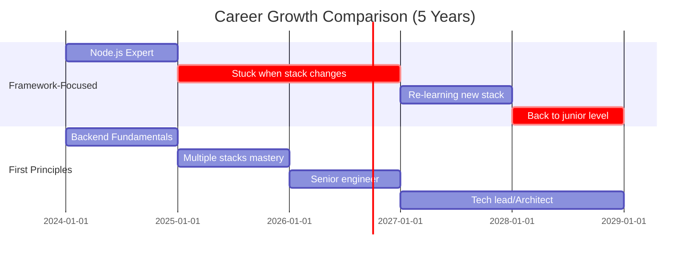
```mermaid
gantt
    title Career Growth Comparison (5 Years)
    dateFormat YYYY
    
    section Framework-Focused
    Node.js Expert          :2024, 1y
    Stuck when stack changes:crit, 2025, 2y
    Re-learning new stack   :2027, 1y
    Back to junior level    :crit, 2028, 1y
    
    section First Principles
    Backend Fundamentals    :2024, 1y
    Multiple stacks mastery :2025, 1y
    Senior engineer         :2026, 1y
    Tech lead/Architect     :2027, 2y
```

#### What Employers Want

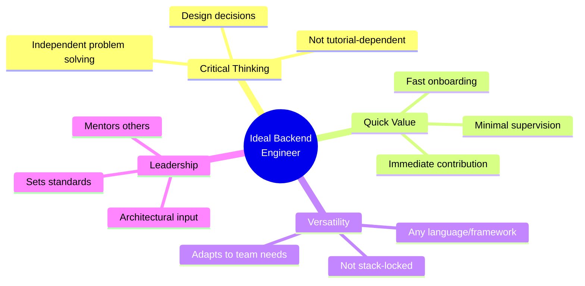
```mermaid
mindmap
  root((Ideal Backend<br/>Engineer))
    Critical Thinking
      Independent problem solving
      Not tutorial-dependent
      Design decisions
    Quick Value
      Fast onboarding
      Immediate contribution
      Minimal supervision
    Versatility
      Any language/framework
      Adapts to team needs
      Not stack-locked
    Leadership
      Mentors others
      Sets standards
      Architectural input
```

---

### Benefit 7: Pattern Recognition (Implicit)

#### From Experience to Deliberate Practice

```mermaid
graph TB
    subgraph Traditional["Traditional Path (5-10 years)"]
        A1[Junior Developer]
        A2[Write Code]
        A3[Make Mistakes]
        A4[Fix Problems]
        A5[Repeat for Years]
        A6[Subconsciously Pick Patterns]
        A7[Senior Engineer]
        
        A1 --> A2 --> A3 --> A4 --> A5 --> A6 --> A7
    end
    
    subgraph Deliberate["First Principles Path (6-12 months)"]
        B1[Learn Core Concepts]
        B2[Study Patterns Explicitly]
        B3[Apply Deliberately]
        B4[Build Projects]
        B5[Recognize Patterns Consciously]
        B6[Confident Engineer]
        
        B1 --> B2 --> B3 --> B4 --> B5 --> B6
    end
    
    style A7 fill:#fff4e1
    style B6 fill:#ccffcc
```

#### Pattern Recognition Abilities

| Pattern Type | Recognizable Elements | Benefit |
|--------------|----------------------|---------|
| **Architecture** | MVC, Layered, Microservices | Quick codebase understanding |
| **Data Flow** | Request → Middleware → Handler → Response | Trace bugs efficiently |
| **Error Handling** | Try-catch placement, error types | Fix issues faster |
| **Authentication** | Token-based, session-based, OAuth | Implement security correctly |
| **Database** | Repository pattern, ORM vs raw SQL | Optimize data layer |
| **Caching** | Where and when to cache | Performance improvements |

---

## 4. Practical Application Example {#examples}

### Case Study: Node.js → Rust Transition

#### The Challenge

**Scenario**: You're a Node.js backend developer wanting to become a Rust backend engineer.

**Problem**: 
- Rust is relatively new
- Limited project-based resources compared to Node.js
- Know basic Rust syntax but can't build end-to-end production applications

#### Traditional Approach (Doesn't Work Well)

```mermaid
graph TD
    A[Want to Learn Rust Backend] --> B[Search for Complete Project Tutorial]
    B --> C[Need 4-5 hour comprehensive video]
    C --> D[Must include production standards]
    D --> E{Problem}
    E -->|Limited Resources| F[Few Rust projects available ❌]
    E -->|Quality Issues| G[Not production-grade ❌]
    E -->|Stuck| H[Can't cross threshold ❌]
    
    style F fill:#ffcccc
    style G fill:#ffcccc
    style H fill:#ffcccc
```

#### First Principles Approach (Works)

```mermaid
graph TB
    A[Understand Backend Components] --> B[Break Down into Layers]
    
    B --> C[Routing]
    B --> D[Middleware]
    B --> E[Database Interactions]
    B --> F[Logging]
    B --> G[Error Handling]
    B --> H[Async Code]
    B --> I[Authentication/Authorization]
    
    J[Learn Basic Rust Syntax] --> K[Start Rust Project]
    
    K --> L[Target Each Component Separately]
    
    C --> M[Learn Rust Routing]
    D --> N[Learn Rust Middleware]
    E --> O[Learn Rust DB Patterns]
    F --> P[Learn Rust Logging]
    G --> Q[Learn Rust Errors]
    H --> R[Learn Rust Async]
    I --> S[Learn Rust Auth]
    
    M & N & O & P & Q & R & S --> T[Production-Quality Rust Backend]
    T --> U[In 2-3 Days! ✅]
    
    style T fill:#ccffcc
    style U fill:#ffd700
```

#### Step-by-Step Process

##### Phase 1: Foundation (Already Have)

| Component | What You Know (Node.js) | Patterns You Understand |
|-----------|------------------------|------------------------|
| **Routing** | Express routing, RESTful design | Production-quality route structure |
| **Validation** | Joi, Zod validation patterns | Input validation best practices |
| **Database** | Sequelize, Prisma patterns | Repository pattern, handlers |
| **Authentication** | JWT, Passport strategies | Auth/authorization flows |
| **Error Handling** | Try-catch, error middleware | Proper error propagation |

##### Phase 2: Rust Syntax (Learn)

```rust
// Basic Rust concepts to learn
- Ownership and borrowing
- Data structures (Vec, HashMap, Option, Result)
- Error handling (Result<T, E>)
- Async/await syntax
- Traits and implementations
```

##### Phase 3: Component-by-Component Implementation

```mermaid
sequenceDiagram
    participant You
    participant Pattern
    participant Rust
    participant Production
    
    Note over You: Day 1: Validation
    You->>Pattern: I know validation patterns
    You->>Rust: How to do validation in Rust?
    Rust-->>You: Find library (e.g., validator)
    You->>Production: Mix pattern + Rust syntax
    Production-->>You: Production-quality validation module ✅
    
    Note over You: Day 1: Routing
    You->>Pattern: I know routing patterns
    You->>Rust: How to route in Rust?
    Rust-->>You: Find Axum routing
    You->>Production: Mix pattern + Rust syntax
    Production-->>You: Production-quality routes ✅
    
    Note over You: Day 2: Database
    You->>Pattern: I know repository pattern
    You->>Rust: How to use SQLx/Diesel?
    Rust-->>You: Find Rust DB driver
    You->>Production: Mix pattern + Rust syntax
    Production-->>You: Production-quality data layer ✅
    
    Note over You: Day 2-3: Authentication, Error Handling, etc.
    You->>Production: Repeat for each module
    Production-->>You: Complete production codebase in 2-3 days! 🎉
```

##### Detailed Example: Validation Module

| Step | Action | Result |
|------|--------|--------|
| **1** | You know: "Validation should happen before business logic, return clear errors, use schemas" | Pattern understanding ✅ |
| **2** | Search: "How to do validation in Rust" | Find: `validator` crate |
| **3** | Learn: Rust validation syntax | Basic usage of library |
| **4** | Combine: Pattern knowledge + Rust syntax | Production-quality validation |

**Node.js Pattern You Know:**
```javascript
// Validation pattern in Node.js
const schema = Joi.object({
  email: Joi.string().email().required(),
  age: Joi.number().min(18).required()
});

const validate = (data) => {
  const { error } = schema.validate(data);
  if (error) throw new ValidationError(error);
  return data;
};
```

**Apply to Rust:**
```rust
// Same pattern in Rust
use validator::Validate;

#[derive(Validate)]
struct User {
    #[validate(email)]
    email: String,
    #[validate(range(min = 18))]
    age: u8,
}

fn validate_user(data: User) -> Result<User, ValidationError> {
    data.validate()?;
    Ok(data)
}
```

#### Timeline Comparison

```mermaid
gantt
    title Learning Rust Backend
    dateFormat X
    axisFormat %s days

    section Waiting for Tutorial
    Search for resources  :0, 30
    Wait for good content :30, 90
    Still no perfect tutorial :crit, 90, 180
    Frustrated :crit, 180, 365
    
    section First Principles
    Learn Rust syntax     :0, 7
    Apply to each module  :7, 10
    Complete codebase     :10, 13
    Production ready      :13, 15
```

---

## 5. Career Impact Summary {#career}

### Complete Transformation

```mermaid
graph TB
    subgraph Before["Before First Principles"]
        A1[Framework-Locked Developer]
        A2[Slow Onboarding]
        A3[Tutorial-Dependent]
        A4[Syntax Fatigue]
        A5[Single Stack]
        A6[Limited Employability]
    end
    
    subgraph After["After First Principles"]
        B1[True Software Engineer]
        B2[Rapid Adaptation]
        B3[Independent Builder]
        B4[Language Agnostic]
        B5[Multi-Stack Expert]
        B6[Highly Employable]
    end
    
    Before -->|Apply First Principles| After
    
    style Before fill:#ffcccc
    style After fill:#ccffcc
```

### Value Proposition Table

| Metric | Traditional Path | First Principles Path |
|--------|-----------------|----------------------|
| **Time to Expertise** | 5-10 years | 6-12 months intensive |
| **Adaptability** | Low | Very High |
| **Confidence Level** | Varies greatly | Consistently high |
| **Salary Growth** | Slow, step-like | Faster, continuous |
| **Job Opportunities** | Limited to known stack | Open to all stacks |
| **Learning New Tech** | Painful, slow | Quick, enjoyable |
| **Problem Solving** | Framework-dependent | Independent |
| **Career Ceiling** | Senior in one stack | Architect across stacks |

### Freedom Achieved

```mermaid
mindmap
  root((First Principles<br/>Freedom))
    Explore
      New Languages
      New Frameworks
      New Architectures
      Emerging Tech
    Build
      Robust Systems
      Scalable Solutions
      Maintainable Code
      Production Quality
    Contribute
      Any Team
      Any Project
      Immediate Value
      Leadership
    Grow
      Continuous Learning
      Career Advancement
      Higher Compensation
      Job Security
```

---

## Key Takeaways

### Core Insights

| Insight | Explanation | Impact |
|---------|-------------|--------|
| **1. Patterns Over Syntax** | Focus on universal patterns, not language-specific details | Transfer knowledge across all stacks |
| **2. Deliberate vs Subconscious** | Actively learn patterns instead of waiting years for experience | 10x faster skill development |
| **3. Components Over Frameworks** | Understand foundational blocks that exist in every backend | Navigate any codebase confidently |
| **4. Problems Over Tools** | Know what problems you're solving, tools become obvious | Choose right technology for job |
| **5. Principles Over Rules** | Internalize foundational concepts, not memorize rules | Adapt to any situation |

### The Mental Shift

```mermaid
graph LR
    A[Old Mindset:<br/>I am a Node.js developer] --> B[Mental Prison]
    B --> C[Limited Opportunities]
    
    D[New Mindset:<br/>I am a Backend Engineer] --> E[Mental Freedom]
    E --> F[Unlimited Opportunities]
    
    style A fill:#ffcccc
    style D fill:#ccffcc
    style B fill:#ffcccc
    style E fill:#ccffcc
```

### What First Principles Give You

1. **Big Picture Thinking**: See patterns, not just code
2. **Fast Onboarding**: Navigate any codebase quickly
3. **Rapid Development**: Build production-quality MVPs 10x faster
4. **No Syntax Fatigue**: Apply knowledge across languages
5. **Tool Selection**: Choose the right tool for each job
6. **Employability**: Become valuable in any team
7. **Confidence**: Know you can handle any backend challenge

### Final Transformation

```mermaid
graph TD
    A[Frontend Developer<br/>or<br/>Framework-Specific Engineer] --> B[Learn First Principles]
    
    B --> C[Understand Core Problems]
    C --> D[Recognize Universal Patterns]
    D --> E[Apply Across Technologies]
    E --> F[Build Production Systems]
    F --> G[True Backend Engineer]
    
    G --> H[Not Limited by Stack]
    G --> I[Understands Core Problems]
    G --> J[Explores New Tech Easily]
    G --> K[Valuable Asset to Teams]
    
    style A fill:#e1f5ff
    style B fill:#fff4e1
    style G fill:#ffd700
    style H fill:#ccffcc
    style I fill:#ccffcc
    style J fill:#ccffcc
    style K fill:#ccffcc
```

---

## Conclusion

### The Promise

> **Learning backend from first principles elevates you from a framework-specific developer to a true software engineer—one who is not limited by a particular stack or toolset but understands the core problems backend engineering solves.**

### What You Gain

- ✅ **Freedom** to explore any language or framework with ease
- ✅ **Confidence** to tackle unfamiliar codebases
- ✅ **Speed** in building production-quality applications
- ✅ **Value** as an adaptable, versatile engineer
- ✅ **Career** positioning as a valuable asset in any team

### Next Steps

The journey continues with exploring the actual **foundational components** (the "map") that make up backend engineering territory, starting from the next video in the series.

---

**Remember**: First principles are not a list of rules—they're a **generic map of backend engineering territory** that helps you find your way regardless of the language, framework, or codebase you encounter. 🚀
