# HTTP Routing - Comprehensive Notes

## Table of Contents
1. [Introduction to Routing](#introduction-to-routing)
2. [HTTP Methods and Routing Relationship](#http-methods-and-routing-relationship)
3. [Types of Routes](#types-of-routes)
4. [Route Parameters](#route-parameters)
5. [Advanced Routing Concepts](#advanced-routing-concepts)
6. [Best Practices](#best-practices)

---

## Introduction to Routing

### What is Routing?

**Routing** is the mechanism that maps URL patterns to server-side logic. While HTTP methods express the **"WHAT"** of a request (what action to perform), routing expresses the **"WHERE"** of a request (which resource to act upon).

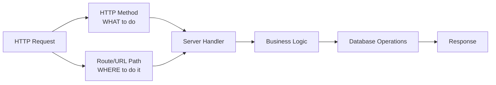

### Core Concept

> **Routing = Mapping URL parameters to server-side logic**

The combination of:
- **HTTP Method** (GET, POST, PUT, DELETE, etc.)
- **Route Path** (URL structure)

Creates a **unique key** that maps to a specific handler or set of instructions on the server.

---

## HTTP Methods and Routing Relationship

### The Intent and Address Model

| Component | Purpose | Example |
|-----------|---------|---------|
| **HTTP Method** | Expresses the intent/action | `GET`, `POST`, `PUT`, `DELETE` |
| **Route Path** | Specifies the resource/location | `/api/books`, `/api/users/123` |
| **Combined Key** | Unique identifier for handler | `GET /api/books` |

### Example Request Analysis

```http
GET /api/books HTTP/1.1
Host: localhost:3001
```

**Breakdown:**
- **Method**: `GET` → Intent is to **fetch/retrieve** data
- **Route**: `/api/books` → Resource is **books**
- **Combined**: Server maps `GET /api/books` to a specific handler

```http
POST /api/books HTTP/1.1
Host: localhost:3001
Content-Type: application/json
```

**Breakdown:**
- **Method**: `POST` → Intent is to **create** new data
- **Route**: `/api/books` → Resource is **books**
- **Combined**: Server maps `POST /api/books` to a different handler

### Important Note

Same route path with different methods = Different handlers:
- `GET /api/books` ≠ `POST /api/books`
- These are two distinct routes that never clash

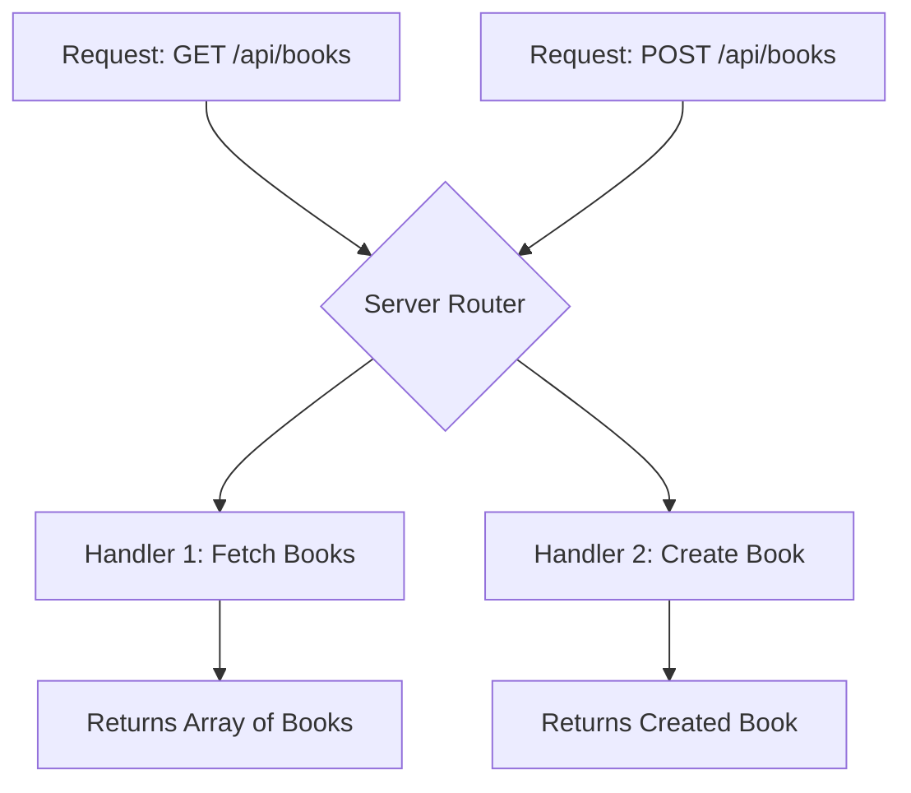

---

## Types of Routes

### 1. Static Routes

**Definition**: Routes with fixed, constant URL paths that don't contain any variable parameters.

**Characteristics:**
- Path never changes
- Always returns the same type of response structure
- Most straightforward type of routing

#### Examples

| Route | Method | Purpose | Response Type |
|-------|--------|---------|---------------|
| `/api/books` | GET | Fetch all books | Array of book objects |
| `/api/books` | POST | Create new book | Created book object |
| `/api/users` | GET | Fetch all users | Array of user objects |

#### Server Implementation Pattern

```javascript
// Pseudo-code representation
router.get('/api/books', (req, res) => {
    // Handler for GET /api/books
    const books = fetchAllBooks();
    res.json(books);
});

router.post('/api/books', (req, res) => {
    // Handler for POST /api/books
    const newBook = createBook(req.body);
    res.json(newBook);
});
```

#### Example Request & Response

**Request:**
```http
GET /api/books HTTP/1.1
Host: localhost:3001
```

**Response:**
```json
{
  "data": [
    {
      "id": "1",
      "title": "Book 1",
      "author": "Author 1"
    },
    {
      "id": "2",
      "title": "Book 2",
      "author": "Author 2"
    }
  ]
}
```

---

### 2. Dynamic Routes with Path Parameters

**Definition**: Routes that contain variable segments (placeholders) that can accept different values.

**Characteristics:**
- Contains dynamic segments identified by special syntax (usually `:paramName`)
- Same route structure can handle different values
- Values are extracted and available in the handler

#### Path Parameter Syntax

The colon (`:`) notation indicates a dynamic parameter:

```
/api/users/:id
```

**Convention:** `:paramName` is industry-wide standard across:
- Node.js (Express)
- Python (Flask, Django)
- Java (Spring)
- Go (Gin)
- Rust (Actix)

#### How It Works

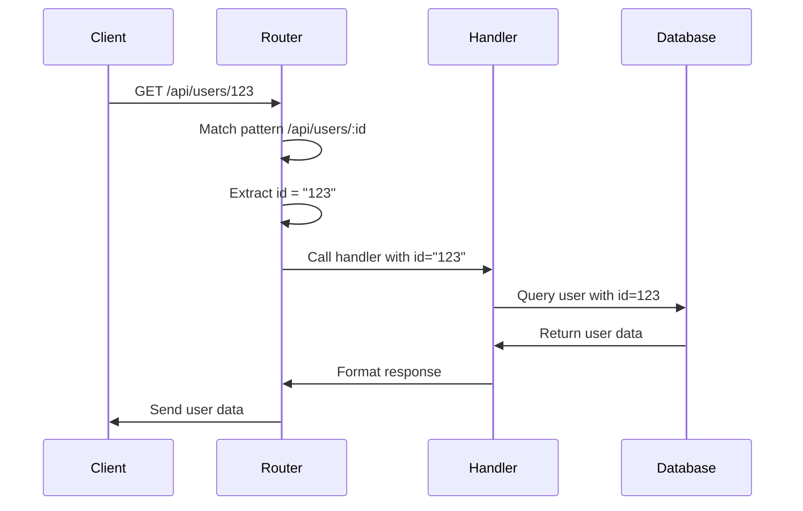

#### Server Implementation Pattern

```javascript
// Express.js example
router.get('/api/users/:id', (req, res) => {
    const userId = req.params.id;  // Extract the dynamic parameter
    const user = fetchUserById(userId);
    res.json({ message: `Dynamic route: User ID is ${userId}`, user });
});
```

#### Example Request & Response

**Request:**
```http
GET /api/users/123 HTTP/1.1
Host: localhost:3001
```

**Response:**
```json
{
  "message": "Dynamic route: User ID is 123",
  "user": {
    "id": "123",
    "name": "John Doe",
    "email": "john@example.com"
  }
}
```

#### Semantic Readability

Dynamic routes are human-readable and express clear intent:

```
GET /api/users/123
```

Reads as: **"Fetch the user with ID 123"**

```
DELETE /api/posts/456
```

Reads as: **"Delete the post with ID 456"**

---

### 3. Query Parameters

**Definition**: Key-value pairs appended to the URL after a question mark (`?`) that provide additional information to the server.

**Characteristics:**
- Not part of the route path itself
- Multiple parameters separated by `&`
- Optional in most cases
- Commonly used with GET requests

#### Syntax Structure

```
/route/path?key1=value1&key2=value2&key3=value3
```

**Components:**
- `?` → Start of query parameters
- `key=value` → Key-value pair
- `&` → Separator between parameters

#### Why Query Parameters?

**Problem:** GET requests don't have a request body in REST APIs.

**Solution:** Query parameters allow sending metadata with GET requests.

#### Comparison Table

| Feature | Path Parameters | Query Parameters |
|---------|----------------|------------------|
| **Purpose** | Identify specific resources | Filter, sort, paginate results |
| **Required** | Usually required | Usually optional |
| **Example** | `/users/123` | `/users?page=2&limit=20` |
| **Semantic** | Part of resource identity | Modifies how resource is retrieved |
| **Location** | In the path | After `?` in URL |

#### Common Use Cases

| Use Case | Example | Description |
|----------|---------|-------------|
| **Search** | `/api/search?query=javascript` | Search functionality |
| **Pagination** | `/api/books?page=2&limit=20` | Paginated results |
| **Filtering** | `/api/products?category=electronics&price=100-500` | Filter results |
| **Sorting** | `/api/users?sortBy=name&order=asc` | Sort order |

#### Pagination Example

**Request:**
```http
GET /api/books?page=2&limit=20 HTTP/1.1
Host: localhost:3001
```

**Response Structure:**
```json
{
  "data": [
    { "id": "21", "title": "Book 21", "author": "Author 21" },
    { "id": "22", "title": "Book 22", "author": "Author 22" }
  ],
  "metadata": {
    "total": 100,
    "currentPage": 2,
    "totalPages": 5,
    "limit": 20
  }
}
```

#### How Server Uses Metadata

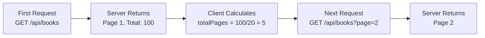

#### Pagination Workflow

**Step 1:** Initial request without query params
```http
GET /api/books HTTP/1.1
```

**Step 2:** Server returns first page with metadata
```json
{
  "data": [ /* 20 books */ ],
  "metadata": {
    "total": 100,
    "currentPage": 1,
    "totalPages": 5,
    "limit": 20
  }
}
```

**Step 3:** Client requests next page
```http
GET /api/books?page=2 HTTP/1.1
```

#### Search Example

**Request:**
```http
GET /api/search?query=some+value HTTP/1.1
Host: localhost:3001
```

**Note:** Spaces in URLs are encoded as `+` or `%20`

**Response:**
```json
{
  "results": [
    { "id": "1", "title": "Some Value Match" }
  ]
}
```

#### Why Not Path Parameters for Search?

**Bad Practice:**
```
/api/search/some+value
```

**Problems:**
- Defeats REST semantic expression
- Hard to maintain
- Confusing resource identity
- Multiple search terms become complex

**Good Practice:**
```
/api/search?query=some+value&type=books&limit=10
```

**Advantages:**
- Clear separation of resource and filters
- Easy to add more filters
- Maintains REST semantics
- Flexible and extensible

---

### 4. Nested Routes

**Definition**: Routes that express hierarchical relationships between resources through multiple path segments.

**Characteristics:**
- Multiple levels of resources
- Expresses parent-child relationships
- Each level can have dynamic parameters
- Provides semantic clarity

#### Structure and Levels

```
/api/users/123/posts/456
```

Can be broken down into levels:

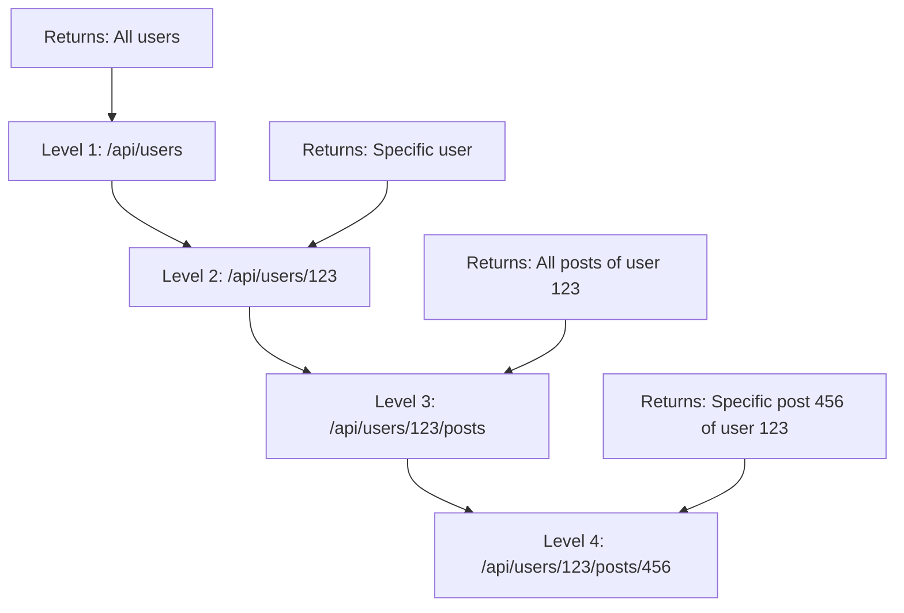

#### Level-by-Level Analysis

| Level | Route | Meaning | Response |
|-------|-------|---------|----------|
| 1 | `/api/users` | All users collection | Array of all users |
| 2 | `/api/users/123` | Specific user | Details of user 123 |
| 3 | `/api/users/123/posts` | User's posts collection | All posts by user 123 |
| 4 | `/api/users/123/posts/456` | Specific user's post | Post 456 by user 123 |

#### Server Implementation Pattern

```javascript
// Level 1: Get all users
router.get('/api/users', (req, res) => {
    const users = getAllUsers();
    res.json(users);
});

// Level 2: Get specific user
router.get('/api/users/:userId', (req, res) => {
    const user = getUserById(req.params.userId);
    res.json(user);
});

// Level 3: Get all posts of a user
router.get('/api/users/:userId/posts', (req, res) => {
    const posts = getPostsByUserId(req.params.userId);
    res.json(posts);
});

// Level 4: Get specific post of a user
router.get('/api/users/:userId/posts/:postId', (req, res) => {
    const post = getPostByUserAndPostId(
        req.params.userId, 
        req.params.postId
    );
    res.json(post);
});
```

#### Semantic Expression

Each level adds semantic meaning:

```
GET /api/users/123/posts/456
```

**Reads as:**
1. "In the API" → `/api`
2. "Access users collection" → `/users`
3. "For user with ID 123" → `/123`
4. "Access their posts collection" → `/posts`
5. "Get post with ID 456" → `/456`

#### Example Request & Response

**Request:**
```http
GET /api/users/123/posts/456 HTTP/1.1
Host: localhost:3001
```

**Response:**
```json
{
  "message": "User 123 - Post 456",
  "user": {
    "id": "123",
    "name": "John Doe"
  },
  "post": {
    "id": "456",
    "title": "My Blog Post",
    "content": "Post content here...",
    "authorId": "123"
  }
}
```

#### Real-World Use Cases

| Scenario | Nested Route | Description |
|----------|-------------|-------------|
| **Blog Comments** | `/api/posts/123/comments/456` | Comment 456 on post 123 |
| **Order Items** | `/api/orders/789/items/012` | Item 012 in order 789 |
| **Course Lessons** | `/api/courses/101/lessons/5` | Lesson 5 of course 101 |
| **Team Members** | `/api/teams/42/members/99` | Member 99 of team 42 |

#### Nesting Best Practices

**Good Nesting (2-3 levels):**
```
/api/users/123/posts
/api/companies/456/employees/789
```

**Bad Nesting (too deep):**
```
/api/countries/us/states/ca/cities/sf/streets/main/buildings/101
```

**Recommendation:** Keep nesting to 2-3 levels maximum for maintainability.

---

### 5. Route Versioning and Deprecation

**Definition**: A strategy to manage breaking changes in API responses by maintaining multiple versions of the same endpoint.

**Characteristics:**
- Multiple versions coexist
- Allows gradual migration
- Prevents breaking existing clients
- Clear deprecation path

#### Why Version APIs?

**Scenario:**
1. You have an API serving data in format A
2. New requirements need format B
3. Existing clients depend on format A
4. Changing format A breaks existing clients

**Solution:** Version your API!

#### Versioning Strategy

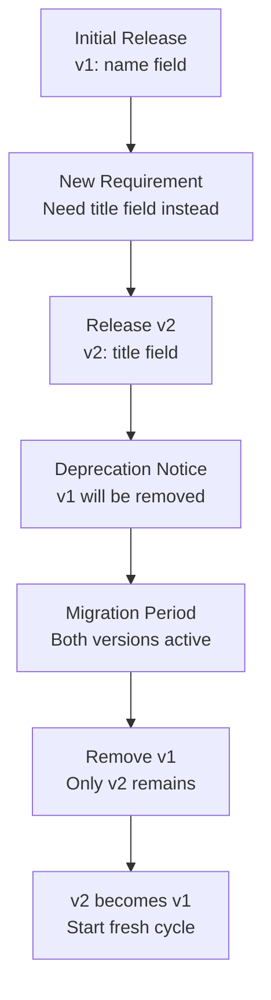

#### Version Comparison Example

**Version 1:**
```http
GET /api/v1/products HTTP/1.1
```

**Response:**
```json
{
  "data": [
    {
      "id": "1",
      "name": "Product 1",
      "price": 100
    },
    {
      "id": "2",
      "name": "Product 2",
      "price": 200
    }
  ]
}
```

**Version 2:**
```http
GET /api/v2/products HTTP/1.1
```

**Response:**
```json
{
  "data": [
    {
      "id": "1",
      "title": "Product 1",  
      "price": 100
    },
    {
      "id": "2",
      "title": "Product 2",  
      "price": 200
    }
  ]
}
```

**Key Difference:** `name` → `title`

#### Versioning Timeline

| Phase | Duration | v1 Status | v2 Status | Action |
|-------|----------|-----------|-----------|---------|
| **Release** | Day 0 | Active | Released | v2 is now available |
| **Deprecation** | Week 1 | Deprecated | Active | Notice sent to clients |
| **Migration** | 2-3 months | Active but deprecated | Active | Clients migrate to v2 |
| **Removal** | After migration | Removed | Active | v1 is shut down |
| **Normalization** | Next cycle | - | Becomes v1 | Clean slate |

#### Benefits of Versioning

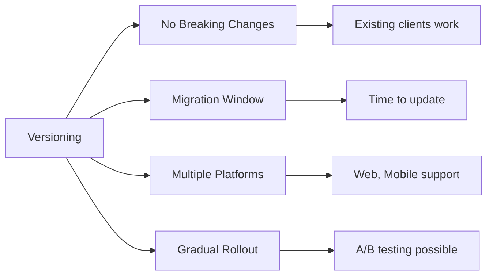

#### Alternative Approaches

**Bad Approach:**
```
/api/products (old format)
/api/new_products (new format)
```

**Problems:**
- Unclear versioning
- Route proliferation
- Semantic confusion

**Good Approach:**
```
/api/v1/products (old format)
/api/v2/products (new format)
```

**Advantages:**
- Clear version indication
- Same route structure
- Easy to track versions

#### Deprecation Notice Example

**Header in v1 Response:**
```http
HTTP/1.1 200 OK
Warning: 299 - "API v1 is deprecated. Please migrate to v2 by 2025-12-31"
Sunset: Sat, 31 Dec 2025 23:59:59 GMT
```

---

### 6. Catch-All Route (404 Handler)

**Definition**: A fallback route that handles all requests that don't match any defined routes.

**Characteristics:**
- Always defined last in routing configuration
- Catches unmatched routes
- Returns user-friendly error message
- Typically returns 404 status code

#### How It Works

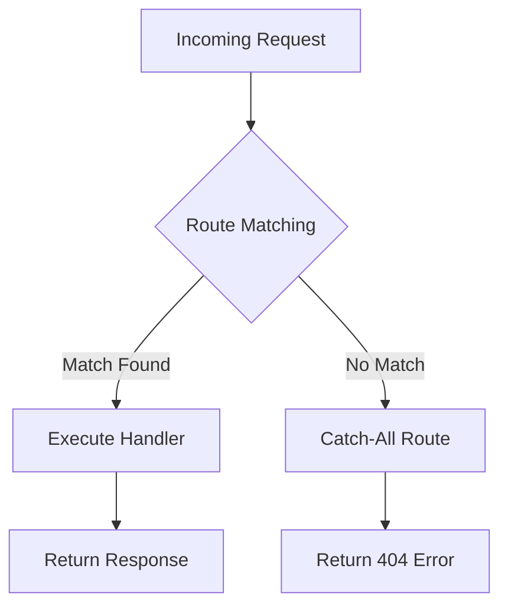

#### Server Implementation Pattern

```javascript
// Define all routes first
router.get('/api/users', handleUsers);
router.get('/api/posts', handlePosts);
router.get('/api/v1/products', handleProductsV1);
router.get('/api/v2/products', handleProductsV2);

// Catch-all route MUST be defined last
router.all('*', (req, res) => {
    res.status(404).json({
        message: "Route not found",
        requestedRoute: req.path,
        method: req.method
    });
});
```

#### Example Request & Response

**Request:**
```http
GET /api/v3/products HTTP/1.1
Host: localhost:3001
```

**Response:**
```http
HTTP/1.1 404 Not Found
Content-Type: application/json

{
  "message": "Route not found",
  "requestedRoute": "/api/v3/products",
  "method": "GET"
}
```

#### Without Catch-All Handler

**Default Behavior:**
- Server returns empty response
- Generic 404 page (if configured)
- No useful information for debugging
- Poor user experience

#### With Catch-All Handler

**Improved Behavior:**
- User-friendly error message
- Clear indication of what went wrong
- Helpful for debugging
- Better developer experience
- Can include suggestions for correct routes

#### Enhanced Error Response

```json
{
  "error": "Route not found",
  "message": "The requested endpoint does not exist",
  "requestedRoute": "/api/v3/products",
  "method": "GET",
  "suggestions": [
    "/api/v1/products",
    "/api/v2/products"
  ],
  "documentation": "https://api.example.com/docs"
}
```

---

## Route Parameters

### Comparison: Path Parameters vs Query Parameters

| Aspect | Path Parameters | Query Parameters |
|--------|----------------|------------------|
| **Syntax** | `/users/:id` | `/users?id=123` |
| **Position** | Part of URL path | After `?` in URL |
| **Separator** | Forward slash `/` | Ampersand `&` |
| **Purpose** | Identify resources | Filter/modify results |
| **Required** | Usually required | Usually optional |
| **Semantic** | Part of resource identity | Metadata about request |
| **Example** | `/api/users/123` | `/api/users?page=2&limit=20` |
| **REST Usage** | All HTTP methods | Primarily GET requests |
| **Multiple Values** | Multiple path segments | Multiple key-value pairs |

### When to Use Which?

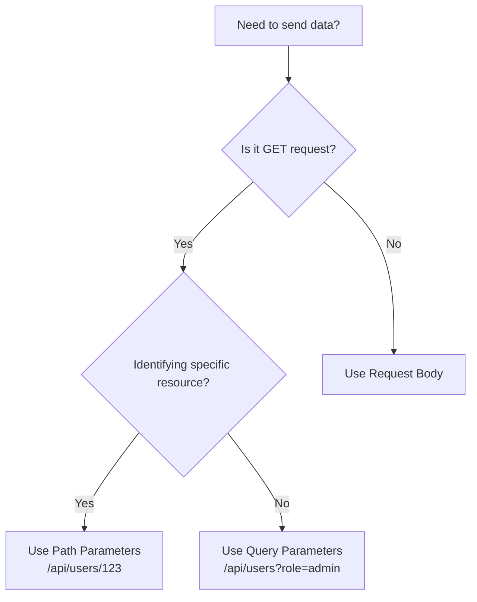

### Examples Comparison

#### Path Parameters
```http
GET /api/users/123 HTTP/1.1
```
**Meaning:** Get the user with ID 123

#### Query Parameters
```http
GET /api/users?role=admin&active=true HTTP/1.1
```
**Meaning:** Get all users who are admins and active

#### Combined
```http
GET /api/users/123/posts?status=published&limit=10 HTTP/1.1
```
**Meaning:** Get 10 published posts of user 123

---

## Advanced Routing Concepts

### 1. Route Priority and Order

Routes are matched in the order they are defined. More specific routes should be defined before generic ones.

```javascript
// CORRECT ORDER
router.get('/api/users/active', handleActiveUsers);    // Specific
router.get('/api/users/:id', handleUserById);          // Generic

// WRONG ORDER - Will never reach active handler
router.get('/api/users/:id', handleUserById);          // Matches first!
router.get('/api/users/active', handleActiveUsers);    // Never reached
```

### 2. Route Constraints

Some frameworks allow adding constraints to route parameters:

```javascript
// Only match numeric IDs
router.get('/api/users/:id(\\d+)', handleUserById);

// Only match UUIDs
router.get('/api/posts/:id([0-9a-f]{8}-[0-9a-f]{4}-...)', handlePostById);
```

### 3. Optional Parameters

Some routes may have optional segments:

```javascript
// Category is optional
router.get('/api/products/:category?', handleProducts);

// Matches both:
// /api/products
// /api/products/electronics
```

### 4. Wildcard Routes

```javascript
// Match any path after /api/files/
router.get('/api/files/*', handleFileAccess);

// Matches:
// /api/files/documents/report.pdf
// /api/files/images/photo.jpg
```

---

## Best Practices

### 1. RESTful URL Design

✅ **Good:**
```
GET    /api/users           # Get all users
GET    /api/users/123       # Get user 123
POST   /api/users           # Create user
PUT    /api/users/123       # Update user 123
DELETE /api/users/123       # Delete user 123
```

❌ **Bad:**
```
GET  /api/getUsers
GET  /api/getUser?id=123
POST /api/createUser
POST /api/updateUser?id=123
POST /api/deleteUser?id=123
```

### 2. Use Nouns, Not Verbs

✅ **Good:**
```
GET /api/books
POST /api/books
```

❌ **Bad:**
```
GET /api/getBooks
POST /api/createBook
```

### 3. Keep URLs Consistent

✅ **Good:**
```
/api/users
/api/users/123
/api/users/123/posts
```

❌ **Bad:**
```
/api/users
/api/user/123           # Inconsistent (user vs users)
/api/users/123/post     # Inconsistent (post vs posts)
```

### 4. Use Plural Nouns

✅ **Good:**
```
/api/users
/api/products
/api/orders
```

❌ **Bad:**
```
/api/user
/api/product
/api/order
```

### 5. Nested Routes Best Practices

✅ **Good (2-3 levels):**
```
/api/users/123/posts
/api/courses/101/lessons/5
```

❌ **Bad (too deep):**
```
/api/countries/us/states/ca/cities/sf/streets/main/buildings/101
```

**Alternative for deep nesting:**
```
/api/buildings/101?street=main&city=sf&state=ca&country=us
```

### 6. Query Parameter Conventions

✅ **Good:**
```
/api/users?page=2&limit=20&sortBy=name&order=asc
/api/products?category=electronics&minPrice=100&maxPrice=500
```

❌ **Bad:**
```
/api/users?p=2&l=20&s=name&o=asc  # Unclear abbreviations
```

### 7. Versioning Conventions

✅ **Good:**
```
/api/v1/users
/api/v2/users
```

✅ **Also Good:**
```
Header: Accept: application/vnd.api+json; version=1
```

❌ **Bad:**
```
/api/users_v1
/api/new_users
```

### 8. Error Responses

Always provide meaningful error responses:

```json
{
  "error": {
    "code": 404,
    "message": "Resource not found",
    "details": "User with ID 123 does not exist",
    "requestId": "abc-123-def-456"
  }
}
```

---

## Route Matching Algorithm

### How Servers Match Routes

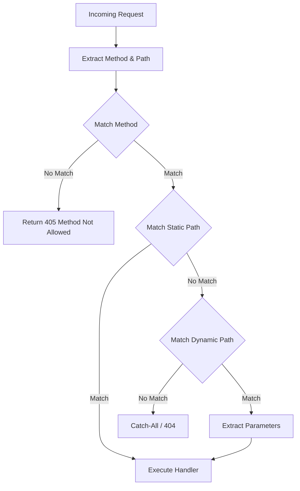

### Matching Priority

1. **Exact static matches** (highest priority)
2. **Static paths with dynamic segments**
3. **Paths with multiple dynamic segments**
4. **Wildcard routes**
5. **Catch-all routes** (lowest priority)

### Example Matching Order

```javascript
router.get('/api/users/admin', handler1);        // Priority 1
router.get('/api/users/:id', handler2);          // Priority 2
router.get('/api/users/:id/:action', handler3);  // Priority 3
router.get('/api/*', handler4);                   // Priority 4
router.all('*', handler5);                        // Priority 5
```

Given request: `GET /api/users/admin`
- Matches handler1 (most specific)

Given request: `GET /api/users/123`
- Skips handler1 (no match)
- Matches handler2

---

## Complete Example: E-commerce API

### Route Structure

```
/api/v1
  /products
    GET    /              # List all products
    GET    /:id           # Get product by ID
    POST   /              # Create product
    PUT    /:id           # Update product
    DELETE /:id           # Delete product
    
  /products/:id/reviews
    GET    /              # Get all reviews for product
    GET    /:reviewId     # Get specific review
    POST   /              # Create review
    PUT    /:reviewId     # Update review
    DELETE /:reviewId     # Delete review
    
  /users
    GET    /              # List all users
    GET    /:id           # Get user by ID
    POST   /              # Create user
    PUT    /:id           # Update user
    DELETE /:id           # Delete user
    
  /users/:id/orders
    GET    /              # Get all orders for user
    GET    /:orderId      # Get specific order
    POST   /              # Create order
    
  /search
    GET    ?query=...&type=...&page=...&limit=...
```

### Example Requests

```http
# Get all products
GET /api/v1/products HTTP/1.1

# Get product with ID 42
GET /api/v1/products/42 HTTP/1.1

# Get reviews for product 42
GET /api/v1/products/42/reviews HTTP/1.1

# Get specific review
GET /api/v1/products/42/reviews/99 HTTP/1.1

# Search products
GET /api/v1/search?query=laptop&type=products&minPrice=500&maxPrice=2000 HTTP/1.1

# Get user's orders with pagination
GET /api/v1/users/123/orders?page=2&limit=10&status=completed HTTP/1.1
```

---

## Summary

### Key Takeaways

1. **Routing maps URLs to server logic** - It's the "where" of your request

2. **HTTP Method + Route = Unique Handler** - The combination creates a unique key

3. **Types of Routes:**
   - **Static**: Fixed paths (`/api/books`)
   - **Dynamic**: Variable segments (`/api/users/:id`)
   - **Query**: Key-value pairs (`?page=2&limit=20`)
   - **Nested**: Hierarchical (`/api/users/123/posts/456`)
   - **Versioned**: Multiple API versions (`/api/v1/...`, `/api/v2/...`)

4. **Parameters:**
   - **Path Parameters**: Identify resources (`/:id`)
   - **Query Parameters**: Filter/modify results (`?filter=value`)

5. **Best Practices:**
   - Use nouns, not verbs
   - Keep URLs consistent
   - Use plural nouns
   - Limit nesting to 2-3 levels
   - Version your APIs
   - Provide meaningful error messages

### Route Selection Decision Tree

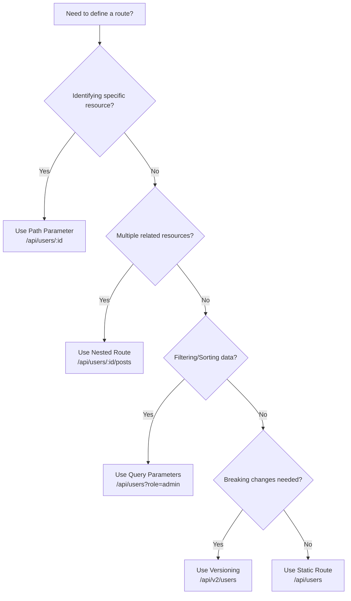

---

## Conclusion

Routing is fundamental to building RESTful APIs. Understanding how routes work, when to use different types, and following best practices ensures your API is:

- **Intuitive**: Easy to understand and use
- **Maintainable**: Easy to update and extend
- **Scalable**: Can grow with your application
- **Semantic**: Self-documenting through URL structure

Master these concepts, and you'll be able to design clean, professional APIs that are a joy to work with!
