# Serialization and Deserialization - Comprehensive Notes for Backend Engineers

## Table of Contents
1. [Introduction](#introduction)
2. [The Problem: Cross-Language Communication](#the-problem-cross-language-communication)
3. [The Solution: Serialization Standards](#the-solution-serialization-standards)
4. [OSI Model Context](#osi-model-context)
5. [Types of Serialization Standards](#types-of-serialization-standards)
6. [JSON - The Most Popular Standard](#json---the-most-popular-standard)
7. [Serialization Flow in Practice](#serialization-flow-in-practice)
8. [Backend Engineer's Mental Model](#backend-engineers-mental-model)
9. [Best Practices and Summary](#best-practices-and-summary)

---

## Introduction

### What is Serialization and Deserialization?

**Serialization** and **Deserialization** are techniques for converting data to and from a common format to enable:
- **Cross-language communication** (language-agnostic data exchange)
- **Data transmission** over networks
- **Data storage** in files or databases
- **Interoperability** between different systems

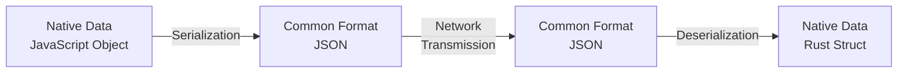

### Key Definition

> **Serialization**: The process of converting data from a programming language's native format into a common, standardized format.

> **Deserialization**: The reverse process of converting data from the common format back into a programming language's native format.

---

## The Problem: Cross-Language Communication

### The Scenario

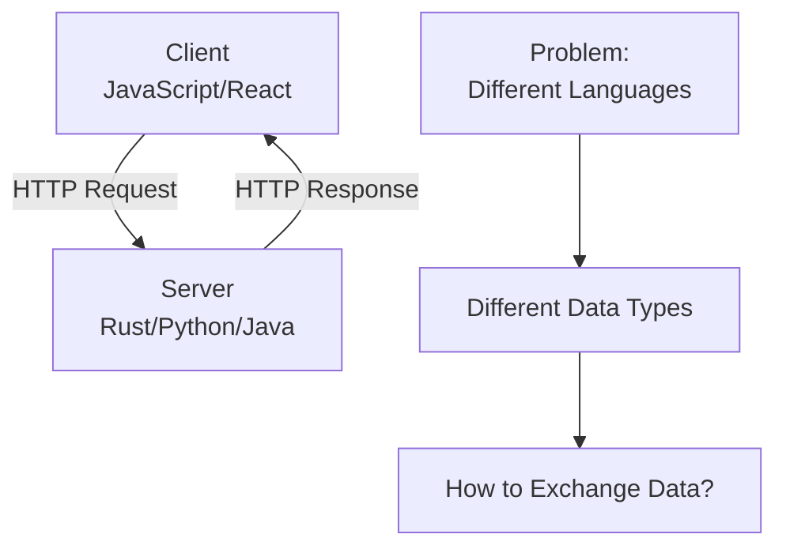

### Typical Client-Server Architecture

| Component | Technology | Location | Data Types |
|-----------|-----------|----------|------------|
| **Frontend/Client** | JavaScript (React, Angular, Vue) | Browser (Chrome, Firefox, etc.) | JavaScript objects, arrays, primitives |
| **Backend/Server** | Rust, Python, Java, Go, etc. | Local or Cloud (AWS, GCP, Azure) | Structs, Classes, strongly-typed data |
| **Communication** | HTTP (REST APIs) | Network/Internet | ??? (This is what we need to solve) |

### The Challenge Visualized

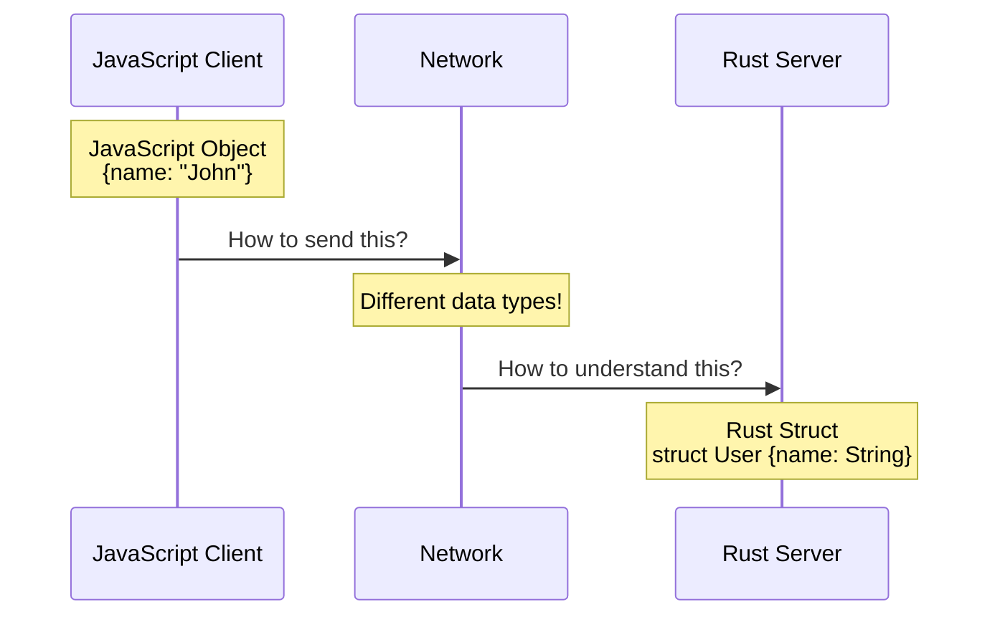

### Why This is a Problem

**JavaScript (Dynamic Language):**
```javascript
// Loosely typed, not compiled
const user = {
    name: "John",
    age: 30,
    active: true
};
```

**Rust (Strongly Typed, Compiled Language):**
```rust
// Strictly typed, compiled
struct User {
    name: String,
    age: u32,
    active: bool
}
```

**Key Issues:**
1. **Different type systems** - JavaScript is dynamic, Rust is strongly typed
2. **Different memory models** - Different languages store data differently
3. **Different compilation models** - JavaScript is interpreted, Rust is compiled
4. **Incompatible native formats** - Cannot directly transfer language-specific data

### Real-World Example

```mermaid
graph TB
    subgraph Client["Client (JavaScript)"]
        A[User Object<br/>{name: 'Alice', id: 123}]
    end
    
    subgraph Network["Network Transmission"]
        B[??? Format ???]
    end
    
    subgraph Server["Server (Rust)"]
        C[User Struct<br/>User {name: String, id: i32}]
    end
    
    A -.->|"How to convert?"| B
    B -.->|"How to parse?"| C
    
    style B fill:#ff6b6b
```

---

## The Solution: Serialization Standards

### The Common Standard Approach

The solution is to establish a **common standard** (format) that both client and server agree to use for data exchange.

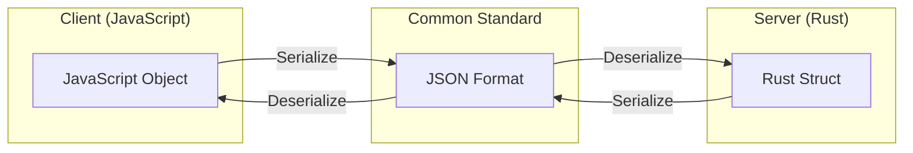

### The Complete Flow

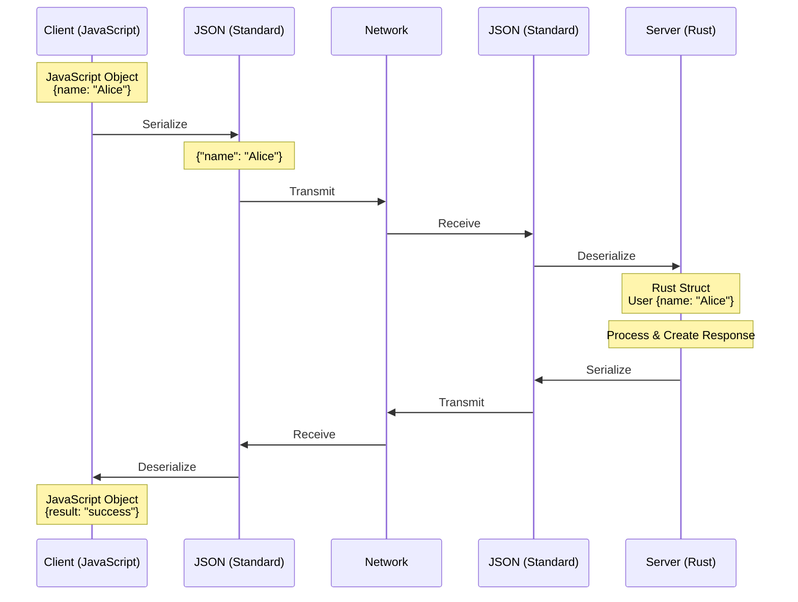

### Key Principles

| Principle | Description |
|-----------|-------------|
| **Agreement** | Both client and server must agree on the standard format |
| **Conversion** | Each side converts its native format to/from the standard |
| **Language Agnostic** | The standard format is independent of any programming language |
| **Bidirectional** | Works for both request (client→server) and response (server→client) |

### The Conversion Process

#### Client Side (JavaScript to JSON)

```javascript
// Step 1: Native JavaScript object
const userData = {
    name: "Alice",
    age: 30,
    email: "alice@example.com"
};

// Step 2: Serialize to JSON (common format)
const jsonString = JSON.stringify(userData);
// Result: '{"name":"Alice","age":30,"email":"alice@example.com"}'

// Step 3: Send over network
fetch('/api/users', {
    method: 'POST',
    body: jsonString
});
```

#### Server Side (JSON to Rust)

```rust
// Step 1: Receive JSON string from network
let json_string = r#"{"name":"Alice","age":30,"email":"alice@example.com"}"#;

// Step 2: Deserialize from JSON to Rust struct
#[derive(Deserialize)]
struct User {
    name: String,
    age: u32,
    email: String,
}

let user: User = serde_json::from_str(&json_string)?;
// Result: User { name: "Alice", age: 30, email: "alice@example.com" }

// Step 3: Use in business logic
process_user(user);
```

---

## OSI Model Context

### Understanding Network Layers

Before diving deeper, it's helpful to understand the **OSI (Open Systems Interconnection) Model** - a conceptual framework for network communication.

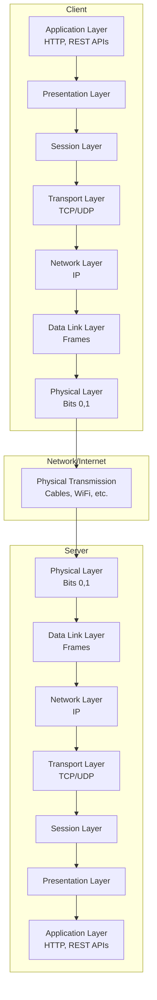

### OSI Layers Overview

| Layer | Name | Function | Example |
|-------|------|----------|---------|
| **7** | Application | Where applications interact with network | HTTP, REST APIs, JSON |
| **6** | Presentation | Data formatting, encryption | Serialization happens here |
| **5** | Session | Manages sessions/connections | Session tokens |
| **4** | Transport | Reliable data transfer | TCP, UDP |
| **3** | Network | Routing and logical addressing | IP addresses, routing |
| **2** | Data Link | Physical addressing, error detection | MAC addresses, Ethernet frames |
| **1** | Physical | Physical transmission of bits | Cables, WiFi signals, voltage |

### Backend Engineer's Perspective

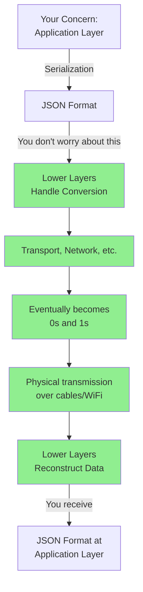

### Mental Model for Backend Engineers

**What You Should Focus On:**
- ✅ Application Layer (Layer 7)
- ✅ JSON serialization/deserialization
- ✅ HTTP requests and responses
- ✅ Business logic

**What You DON'T Need to Worry About:**
- ❌ How JSON gets converted to IP packets (Layer 3)
- ❌ How data gets converted to frames (Layer 2)
- ❌ How bits get transmitted as electrical signals (Layer 1)
- ❌ Voltage levels, optical fibers, etc.

### Simplified View

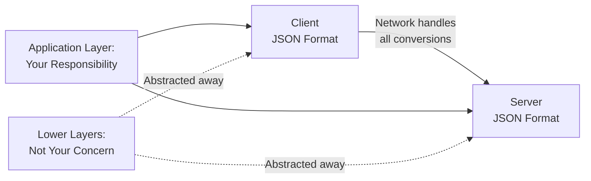

**Key Point:**
> As a backend engineer, you work at the **Application Layer**. The data you send is JSON, and the data you receive is JSON. Everything in between (conversion to packets, frames, bits) is handled by lower layers - **you don't need to worry about it**.

---

## Types of Serialization Standards

### Overview

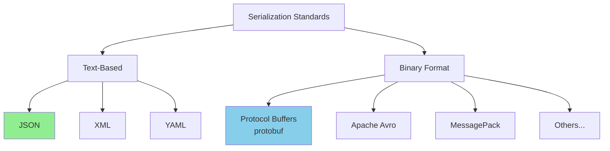

### Text-Based vs Binary Format

| Aspect | Text-Based | Binary Format |
|--------|-----------|---------------|
| **Human Readable** | ✅ Yes - can read with text editor | ❌ No - needs special tools |
| **Size** | Larger (more bytes) | Smaller (compact) |
| **Speed** | Slower parsing | Faster parsing |
| **Debugging** | Easy to debug | Harder to debug |
| **Use Cases** | REST APIs, Config files, Logs | High-performance systems, gRPC |
| **Examples** | JSON, XML, YAML | Protocol Buffers, Avro |

### Popular Serialization Standards

#### 1. Text-Based Formats

**JSON (JavaScript Object Notation)**
```json
{
  "name": "Alice",
  "age": 30,
  "active": true,
  "hobbies": ["reading", "coding"]
}
```

**Characteristics:**
- ✅ Most popular for REST APIs
- ✅ Human-readable
- ✅ Language-agnostic
- ✅ Built-in support in most languages
- ❌ Larger file size

**XML (Extensible Markup Language)**
```xml
<?xml version="1.0" encoding="UTF-8"?>
<user>
    <name>Alice</name>
    <age>30</age>
    <active>true</active>
    <hobbies>
        <hobby>reading</hobby>
        <hobby>coding</hobby>
    </hobbies>
</user>
```

**Characteristics:**
- ✅ Self-descriptive with tags
- ✅ Supports schemas (XSD)
- ❌ Very verbose
- ❌ Larger size than JSON
- 📊 Still used in enterprise/legacy systems

**YAML (YAML Ain't Markup Language)**
```yaml
name: Alice
age: 30
active: true
hobbies:
  - reading
  - coding
```

**Characteristics:**
- ✅ Most human-readable
- ✅ Popular for configuration files
- ❌ Indentation-sensitive
- ❌ Can be error-prone
- 📊 Used in Docker Compose, Kubernetes configs

#### 2. Binary Formats

**Protocol Buffers (Protobuf)**
```protobuf
// Schema definition
message User {
    string name = 1;
    int32 age = 2;
    bool active = 3;
    repeated string hobbies = 4;
}
```

**Characteristics:**
- ✅ Very compact (3-10x smaller than JSON)
- ✅ Very fast parsing
- ✅ Strongly typed with schema
- ❌ Not human-readable
- ❌ Requires schema definition
- 📊 Used in gRPC, microservices

**Apache Avro**
- Similar to Protobuf but with dynamic typing
- Schema stored with data
- Popular in Hadoop ecosystem

**MessagePack**
- Binary version of JSON
- Smaller and faster than JSON
- Compatible with JSON

### Usage Statistics

| Format | HTTP REST APIs | gRPC | Config Files | Logs | Storage |
|--------|---------------|------|--------------|------|---------|
| **JSON** | ~80% ✅ | ❌ | Common | Common | Common |
| **XML** | ~10% | ❌ | Legacy | Rare | Legacy |
| **YAML** | Rare | ❌ | Very Common ✅ | Rare | Rare |
| **Protobuf** | Rare | ~100% ✅ | Rare | Rare | High-perf |

### Technology Stack Comparison

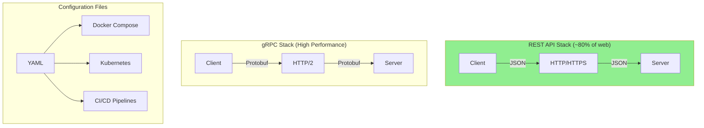

### When to Use What

| Scenario | Recommended Format | Reason |
|----------|-------------------|--------|
| **REST APIs** | JSON | Industry standard, wide support |
| **Configuration Files** | YAML | Human-readable, easy to edit |
| **Legacy Enterprise** | XML | Existing infrastructure |
| **High-performance microservices** | Protocol Buffers | Speed and size efficiency |
| **Logging** | JSON | Structured, queryable logs |
| **Real-time streaming** | Binary (MessagePack/Avro) | Low latency |
| **Mobile apps** | JSON (REST) or Protobuf (gRPC) | Based on performance needs |

### Focus for Learning

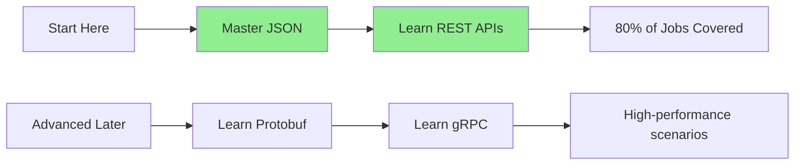

**Recommendation for Beginners:**
1. **Start with JSON** - It's used in 80% of web APIs
2. **Master REST APIs** - Most common interview topics
3. **Learn other formats later** - As needed in your career

---

## JSON - The Most Popular Standard

### Introduction to JSON

**JSON (JavaScript Object Notation)** is the most widely used serialization format for client-server communication in REST APIs.

### Why JSON?

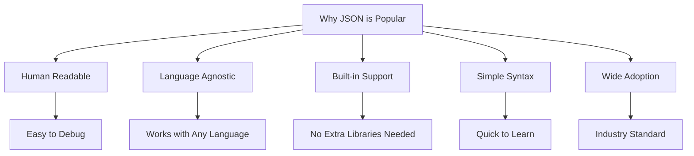

### Key Characteristics

| Feature | Description |
|---------|-------------|
| **Name Origin** | JavaScript Object Notation (looks like JS objects) |
| **File Extension** | `.json` |
| **MIME Type** | `application/json` |
| **Human Readable** | Yes - can be read and edited in any text editor |
| **Data Types** | String, Number, Boolean, Array, Object, null |
| **Use Cases** | REST APIs, Config files, Log files, Data storage |

### JSON Syntax Rules

#### 1. Structure

```json
{
  "key": "value"
}
```

**Rules:**
- ✅ Starts with opening brace `{`
- ✅ Ends with closing brace `}`
- ✅ Contains key-value pairs
- ✅ Each pair separated by comma `,`

#### 2. Keys

```json
{
  "name": "value",
  "age": 30
}
```

**Rules:**
- ✅ Keys MUST be strings
- ✅ Keys MUST be enclosed in double quotes `"`
- ❌ Single quotes `'` are NOT allowed
- ❌ Keys cannot be numbers or booleans

#### 3. Values

JSON supports six data types for values:

##### String
```json
{
  "name": "Alice",
  "city": "New York"
}
```
- Must be enclosed in double quotes `"`
- Can contain any Unicode characters

##### Number
```json
{
  "age": 30,
  "price": 99.99,
  "temperature": -5.5
}
```
- Integers and decimals
- No quotes needed
- Can be positive or negative

##### Boolean
```json
{
  "active": true,
  "verified": false
}
```
- Only two values: `true` or `false`
- Lowercase only (not `True` or `FALSE`)

##### Array
```json
{
  "hobbies": ["reading", "coding", "gaming"],
  "scores": [95, 87, 92]
}
```
- Enclosed in square brackets `[]`
- Can contain any JSON data type
- Values separated by commas

##### Object (Nested)
```json
{
  "user": {
    "name": "Alice",
    "age": 30
  }
}
```
- Enclosed in curly braces `{}`
- Can contain any JSON structure
- Allows nesting of objects

##### Null
```json
{
  "middleName": null
}
```
- Represents absence of value
- Lowercase only

### Complete JSON Example

```json
{
  "id": 1,
  "name": "Alice Johnson",
  "age": 30,
  "email": "alice@example.com",
  "active": true,
  "address": {
    "country": "India",
    "phoneNumber": 9876543210,
    "city": "Mumbai",
    "zipCode": "400001"
  },
  "hobbies": ["reading", "coding", "traveling"],
  "scores": [95, 87, 92, 88],
  "middleName": null,
  "preferences": {
    "newsletter": true,
    "notifications": {
      "email": true,
      "sms": false
    }
  }
}
```

### JSON Data Types Summary Table

| Data Type | Syntax | Example | Notes |
|-----------|--------|---------|-------|
| **String** | `"value"` | `"Alice"` | Must use double quotes |
| **Number** | `123` or `45.67` | `30`, `99.99` | No quotes, integers or decimals |
| **Boolean** | `true` or `false` | `true` | Lowercase only |
| **Array** | `[item1, item2]` | `[1, 2, 3]` | Can contain any type |
| **Object** | `{key: value}` | `{"name": "Alice"}` | Nested structures |
| **Null** | `null` | `null` | Represents no value |

### JSON Validation Rules

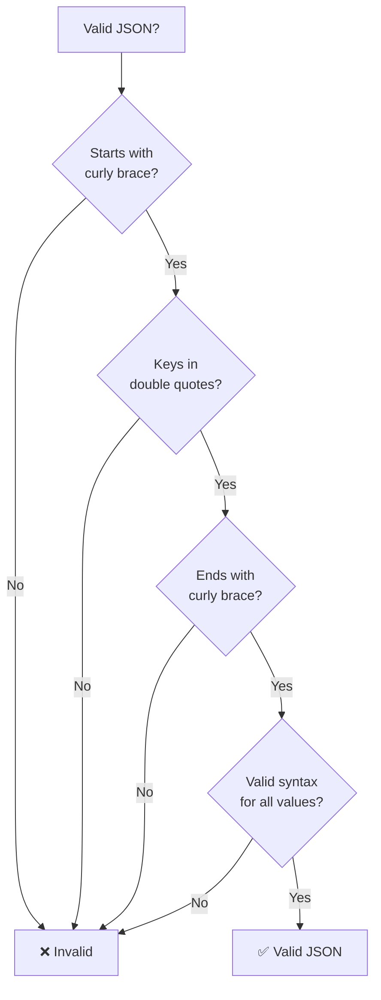

### Common JSON Mistakes

| ❌ Wrong | ✅ Correct | Issue |
|---------|----------|-------|
| `{name: "Alice"}` | `{"name": "Alice"}` | Keys must be in double quotes |
| `{'name': 'Alice'}` | `{"name": "Alice"}` | Must use double quotes, not single |
| `{name: "Alice",}` | `{"name": "Alice"}` | Trailing comma not allowed |
| `{name: "Alice" age: 30}` | `{"name": "Alice", "age": 30}` | Missing comma between pairs |
| `{name: undefined}` | `{"name": null}` | Use null, not undefined |
| `{True: false}` | `{"True": false}` | Keys must be strings |

### JSON vs JavaScript Object

While JSON looks similar to JavaScript objects, there are key differences:

| Feature | JavaScript Object | JSON |
|---------|------------------|------|
| **Keys** | Can be unquoted | Must be quoted |
| **Quotes** | Single or double | Must be double |
| **Trailing Commas** | Allowed | Not allowed |
| **Functions** | Allowed | Not allowed |
| **Comments** | Allowed | Not allowed |
| **Undefined** | Allowed | Not allowed (use null) |
| **Date Objects** | Allowed | Not allowed (use string) |

**JavaScript Object:**
```javascript
const obj = {
    name: 'Alice',        // Single quotes OK, no quotes OK
    age: 30,
    greet: function() {   // Functions allowed
        return "Hello";
    },
    value: undefined,     // Undefined allowed
};  // Trailing comma allowed
```

**JSON:**
```json
{
  "name": "Alice",
  "age": 30,
  "value": null
}
```

### JSON Structure Patterns

#### Flat Structure
```json
{
  "id": 1,
  "name": "Alice",
  "email": "alice@example.com"
}
```

#### Nested Structure
```json
{
  "id": 1,
  "user": {
    "name": "Alice",
    "contact": {
      "email": "alice@example.com",
      "phone": "1234567890"
    }
  }
}
```

#### Array of Objects
```json
{
  "users": [
    {
      "id": 1,
      "name": "Alice"
    },
    {
      "id": 2,
      "name": "Bob"
    }
  ]
}
```

#### Complex Nested Structure
```json
{
  "company": {
    "name": "Tech Corp",
    "departments": [
      {
        "name": "Engineering",
        "employees": [
          {
            "id": 1,
            "name": "Alice",
            "skills": ["JavaScript", "Python"]
          }
        ]
      }
    ]
  }
}
```

### JSON Tools and Resources

| Tool | Purpose | URL |
|------|---------|-----|
| **JSONLint** | Validate JSON syntax | jsonlint.com |
| **JSON Formatter** | Format/beautify JSON | jsonformatter.org |
| **JSON Editor Online** | Edit JSON with GUI | jsoneditoronline.org |
| **Postman** | Test REST APIs with JSON | postman.com |

---

## Serialization Flow in Practice

### Complete Request-Response Cycle

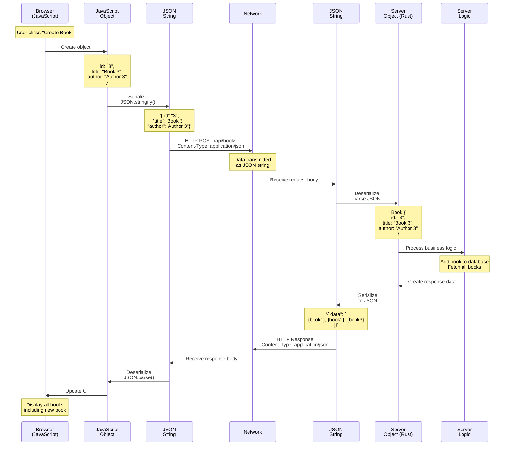

### POST Request Example

#### Step 1: Client Creates Data (JavaScript)

```javascript
// Browser: User submits form
const bookData = {
    id: "3",
    title: "Book 3",
    author: "Author 3"
};

console.log(bookData);
// Output: { id: '3', title: 'Book 3', author: 'Author 3' }
```

#### Step 2: Client Serializes to JSON

```javascript
// Serialize JavaScript object to JSON string
const jsonString = JSON.stringify(bookData);

console.log(jsonString);
// Output: '{"id":"3","title":"Book 3","author":"Author 3"}'
```

#### Step 3: Client Sends HTTP Request

```http
POST /api/books HTTP/1.1
Host: localhost:3001
Content-Type: application/json
Content-Length: 45

{"id":"3","title":"Book 3","author":"Author 3"}
```

**Key Points:**
- Method: `POST`
- URL: `/api/books`
- Header: `Content-Type: application/json` (tells server it's JSON)
- Body: JSON string

#### Step 4: Server Receives JSON String

```rust
// Server receives raw JSON string
let json_body = r#"{"id":"3","title":"Book 3","author":"Author 3"}"#;
```

#### Step 5: Server Deserializes JSON

```rust
// Deserialize JSON string to Rust struct
#[derive(Deserialize, Serialize)]
struct Book {
    id: String,
    title: String,
    author: String,
}

let book: Book = serde_json::from_str(&json_body)?;

// Now we have: Book { id: "3", title: "Book 3", author: "Author 3" }
```

#### Step 6: Server Processes Business Logic

```rust
// Server adds book to database
database.add_book(book);

// Server fetches all books
let all_books = database.get_all_books();
// Returns: vec![
//     Book { id: "1", title: "Book 1", author: "Author 1" },
//     Book { id: "2", title: "Book 2", author: "Author 2" },
//     Book { id: "3", title: "Book 3", author: "Author 3" }
// ]
```

#### Step 7: Server Creates Response Data

```rust
// Create response structure
#[derive(Serialize)]
struct Response {
    data: Vec<Book>,
}

let response = Response {
    data: all_books
};
```

#### Step 8: Server Serializes Response to JSON

```rust
// Serialize Rust struct to JSON string
let json_response = serde_json::to_string(&response)?;

// Result: '{"data":[{"id":"1","title":"Book 1","author":"Author 1"},{"id":"2","title":"Book 2","author":"Author 2"},{"id":"3","title":"Book 3","author":"Author 3"}]}'
```

#### Step 9: Server Sends HTTP Response

```http
HTTP/1.1 200 OK
Content-Type: application/json
Content-Length: 144

{"data":[
  {"id":"1","title":"Book 1","author":"Author 1"},
  {"id":"2","title":"Book 2","author":"Author 2"},
  {"id":"3","title":"Book 3","author":"Author 3"}
]}
```

#### Step 10: Client Receives JSON Response

```javascript
// Browser receives response
const responseText = '{"data":[{"id":"1","title":"Book 1","author":"Author 1"},{"id":"2","title":"Book 2","author":"Author 2"},{"id":"3","title":"Book 3","author":"Author 3"}]}';
```

#### Step 11: Client Deserializes JSON

```javascript
// Deserialize JSON string to JavaScript object
const responseData = JSON.parse(responseText);

console.log(responseData);
// Output: 
// {
//   data: [
//     { id: '1', title: 'Book 1', author: 'Author 1' },
//     { id: '2', title: 'Book 2', author: 'Author 2' },
//     { id: '3', title: 'Book 3', author: 'Author 3' }
//   ]
// }
```

#### Step 12: Client Updates UI

```javascript
// Render books in UI
responseData.data.forEach(book => {
    const bookElement = document.createElement('div');
    bookElement.innerHTML = `
        <h3>${book.title}</h3>
        <p>By ${book.author}</p>
    `;
    document.getElementById('books-list').appendChild(bookElement);
});
```

### Visual Data Transformation

```mermaid
graph TD
    A["Client Side<br/>(JavaScript)"] --> B["JavaScript Object<br/>{id: '3', title: 'Book 3'}"]
    B -->|"JSON.stringify()"| C["JSON String<br/>'{\"id\":\"3\",\"title\":\"Book 3\"}'"]
    C -->|"HTTP POST"| D["Network<br/>Transmission"]
    D --> E["JSON String<br/>'{\"id\":\"3\",\"title\":\"Book 3\"}'"]
    E -->|"Deserialize"| F["Server Object<br/>Book {id: '3', title: 'Book 3'}"]
    F --> G["Server Side<br/>(Rust)"]
    
    H["Server Side<br/>(Rust)"] --> I["Server Object<br/>Response {data: [books]}"]
    I -->|"Serialize"| J["JSON String<br/>'{\"data\":[...]}'"]
    J -->|"HTTP Response"| K["Network<br/>Transmission"]
    K --> L["JSON String<br/>'{\"data\":[...]}'"]
    L -->|"JSON.parse()"| M["JavaScript Object<br/>{data: [books]}"]
    M --> N["Client Side<br/>(JavaScript)"]
```

### Real HTTP Request/Response from BurpSuite

#### Request (as shown in transcript)

```http
POST /api/books HTTP/1.1
Host: localhost:3001
Content-Length: 45
Pragma: no-cache
Cache-Control: no-cache
sec-ch-ua-platform: "macOS"
Accept-Language: en-GB,en;q=0.9
sec-ch-ua: "Chromium";v="129", "Not=A?Brand";v="8"
User-Agent: Mozilla/5.0
Content-Type: application/json
Accept: application/json, text/plain, */*

{"id":"3","title":"Book 3","author":"Author 3"}
```

**Key Parts:**
1. **Method & Path**: `POST /api/books`
2. **Content-Type Header**: `application/json` (crucial!)
3. **Body**: JSON string `{"id":"3","title":"Book 3","author":"Author 3"}`

#### Response (as shown in transcript)

```http
HTTP/1.1 200 OK
Content-Type: application/json
Content-Length: 144

{
  "data": [
    {
      "id": "1",
      "title": "Book 1",
      "author": "Author 1"
    },
    {
      "id": "2",
      "title": "Book 2",
      "author": "Author 2"
    },
    {
      "id": "3",
      "title": "Book 3",
      "author": "Author 3"
    }
  ]
}
```

**Key Parts:**
1. **Status**: `200 OK`
2. **Content-Type Header**: `application/json`
3. **Body**: JSON array of books

### Important Headers for JSON

| Header | Direction | Purpose | Example |
|--------|-----------|---------|---------|
| `Content-Type: application/json` | Both | Indicates JSON format | Required |
| `Accept: application/json` | Request | Client wants JSON response | Optional but common |
| `Content-Length` | Both | Size of JSON body in bytes | Auto-calculated |

---

## Backend Engineer's Mental Model

### What to Focus On

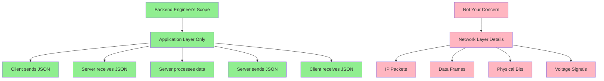

### Simplified Data Flow

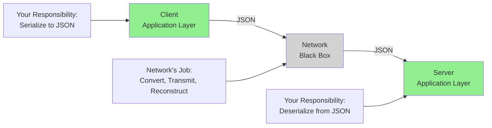

### The Black Box Principle

**As a backend engineer, treat the network as a black box:**

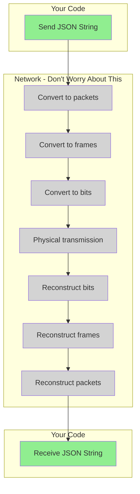

### Your Mental Model Should Be

```
Client (JavaScript)
    ↓
[Serialize to JSON]
    ↓
Send JSON string
    ↓
════════════════════════════
  Network Does Its Magic
  (You don't care how)
════════════════════════════
    ↓
Receive JSON string
    ↓
[Deserialize from JSON]
    ↓
Server (Rust/Python/Java/etc.)
    ↓
[Process Business Logic]
    ↓
[Serialize to JSON]
    ↓
Send JSON string
    ↓
════════════════════════════
  Network Does Its Magic
  (You don't care how)
════════════════════════════
    ↓
Receive JSON string
    ↓
[Deserialize from JSON]
    ↓
Client (JavaScript)
```

### What You Actually Do

#### Client Side (Frontend Developer)

```javascript
// 1. Create data
const userData = { name: "Alice", age: 30 };

// 2. Serialize to JSON
const jsonData = JSON.stringify(userData);

// 3. Send via HTTP
fetch('/api/users', {
    method: 'POST',
    headers: { 'Content-Type': 'application/json' },
    body: jsonData
})
.then(response => response.json())  // 4. Deserialize response
.then(data => {
    // 5. Use data
    console.log(data);
});
```

**That's it! You don't worry about:**
- How the JSON string travels through network cables
- How it gets converted to IP packets
- How packets get routed
- How bits get transmitted

#### Server Side (Backend Developer)

```rust
// 1. Receive JSON string (framework does this)
// e.g., Express/Axum/Actix handles HTTP for you

// 2. Deserialize from JSON
#[derive(Deserialize)]
struct User {
    name: String,
    age: u32,
}

let user: User = serde_json::from_str(&json_body)?;

// 3. Business logic
database.save_user(user);
let result = database.get_users();

// 4. Serialize to JSON
let json_response = serde_json::to_string(&result)?;

// 5. Send response (framework does this)
// Returns JSON string with Content-Type: application/json
```

**That's it! You don't worry about:**
- How the JSON gets converted to bytes
- How TCP packets are created
- How data travels through routers
- How bits are transmitted physically

### Key Takeaways

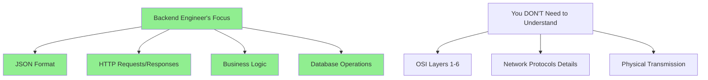

**Your Responsibility:**
1. ✅ Understand JSON format
2. ✅ Serialize data before sending
3. ✅ Deserialize data after receiving
4. ✅ Set correct headers (`Content-Type: application/json`)
5. ✅ Handle business logic

**Not Your Responsibility:**
1. ❌ How JSON becomes network packets
2. ❌ How packets travel through internet
3. ❌ How data becomes electrical signals
4. ❌ Physical layer details

---

## Best Practices and Summary

### Serialization Best Practices

#### 1. Always Validate JSON

```javascript
// Client Side - Before sending
function validateAndSend(data) {
    try {
        const jsonString = JSON.stringify(data);
        // If no error, JSON is valid
        sendToServer(jsonString);
    } catch (error) {
        console.error('Invalid data for JSON:', error);
    }
}
```

```rust
// Server Side - Before processing
fn process_request(json_body: &str) -> Result<User, Error> {
    match serde_json::from_str::<User>(json_body) {
        Ok(user) => Ok(user),
        Err(e) => Err(Error::InvalidJSON(e))
    }
}
```

#### 2. Always Set Content-Type Header

```javascript
// ✅ CORRECT
fetch('/api/users', {
    method: 'POST',
    headers: {
        'Content-Type': 'application/json'  // IMPORTANT!
    },
    body: JSON.stringify(userData)
});

// ❌ WRONG - Missing Content-Type
fetch('/api/users', {
    method: 'POST',
    body: JSON.stringify(userData)
});
```

#### 3. Handle Errors Gracefully

```javascript
// Client Side
fetch('/api/users', {
    method: 'POST',
    headers: { 'Content-Type': 'application/json' },
    body: JSON.stringify(userData)
})
.then(response => {
    if (!response.ok) {
        throw new Error(`HTTP error! status: ${response.status}`);
    }
    return response.json();
})
.catch(error => {
    console.error('Request failed:', error);
    // Show user-friendly error message
});
```

#### 4. Use Type Safety

```typescript
// TypeScript - Define types
interface User {
    id: number;
    name: string;
    email: string;
}

// Type-safe serialization
const user: User = {
    id: 1,
    name: "Alice",
    email: "alice@example.com"
};

const jsonString = JSON.stringify(user);
```

```rust
// Rust - Use structs with Serde
#[derive(Serialize, Deserialize)]
struct User {
    id: u32,
    name: String,
    email: String,
}
```

#### 5. Keep JSON Structure Simple

```json
// ✅ GOOD - Simple, flat structure
{
  "id": 1,
  "name": "Alice",
  "email": "alice@example.com"
}

// ❌ AVOID - Overly nested (unless necessary)
{
  "user": {
    "data": {
      "info": {
        "personal": {
          "details": {
            "name": "Alice"
          }
        }
      }
    }
  }
}
```

#### 6. Use Consistent Naming Conventions

```json
// ✅ GOOD - Consistent camelCase
{
  "userId": 1,
  "userName": "Alice",
  "isActive": true
}

// ✅ ALSO GOOD - Consistent snake_case
{
  "user_id": 1,
  "user_name": "Alice",
  "is_active": true
}

// ❌ BAD - Mixed conventions
{
  "user_id": 1,
  "userName": "Alice",
  "is-active": true
}
```

### Common Pitfalls to Avoid

| ❌ Pitfall | ✅ Solution |
|-----------|-----------|
| Forgetting `Content-Type: application/json` header | Always set header in requests |
| Not handling JSON parse errors | Use try-catch blocks |
| Sending non-serializable data (functions, undefined) | Validate data before serializing |
| Large JSON payloads | Paginate or use compression |
| Deeply nested JSON | Keep structure flat when possible |
| Inconsistent field naming | Establish naming convention |
| Not validating server responses | Always validate JSON structure |

### Serialization Workflow Checklist

```mermaid
graph TD
    A[Start] --> B{Sending Data?}
    B -->|Yes| C[Create data object]
    C --> D[Validate data]
    D --> E[Serialize to JSON<br/>JSON.stringify]
    E --> F[Set Content-Type header]
    F --> G[Send HTTP request]
    
    B -->|No| H{Receiving Data?}
    H -->|Yes| I[Receive HTTP response]
    I --> J[Check Content-Type header]
    J --> K[Parse JSON<br/>JSON.parse]
    K --> L[Validate structure]
    L --> M[Use data]
    
    style C fill:#90EE90
    style D fill:#90EE90
    style E fill:#90EE90
    style F fill:#90EE90
    style I fill:#87CEEB
    style J fill:#87CEEB
    style K fill:#87CEEB
    style L fill:#87CEEB
```

### Summary: Key Concepts

#### 1. What is Serialization?

> Converting data from a programming language's native format to a common standard format (like JSON)

#### 2. What is Deserialization?

> Converting data from the common standard format back to a programming language's native format

#### 3. Why Do We Need It?

- **Language Agnostic**: Different languages can communicate
- **Platform Independent**: Works across different systems
- **Human Readable**: Easy to debug (for text formats like JSON)
- **Industry Standard**: Universal adoption ensures compatibility

#### 4. Most Common Standard

**JSON (JavaScript Object Notation)**
- Used in ~80% of REST APIs
- Human-readable
- Simple syntax
- Built-in support in most languages

#### 5. The Flow

```
Native Data → Serialize → JSON → Network → JSON → Deserialize → Native Data
```

#### 6. Your Responsibility as Backend Engineer

✅ **Do:**
- Understand JSON format
- Serialize before sending
- Deserialize after receiving
- Set correct headers
- Validate data
- Handle errors

❌ **Don't Worry About:**
- Network layer details
- IP packets
- Physical transmission
- Lower OSI layers

### Quick Reference Table

| Aspect | Details |
|--------|---------|
| **Most Popular Format** | JSON (JavaScript Object Notation) |
| **File Extension** | `.json` |
| **MIME Type** | `application/json` |
| **Common Uses** | REST APIs, Config files, Logs |
| **Alternatives** | XML, YAML, Protocol Buffers |
| **Key Operations** | `JSON.stringify()`, `JSON.parse()` |
| **Data Types** | String, Number, Boolean, Array, Object, null |
| **Case Sensitive** | Yes |
| **Comments Allowed** | No |
| **Trailing Commas** | Not allowed |

### Technology Stack Overview

```mermaid
graph TD
    A[HTTP Communication] --> B[REST APIs]
    B --> C[JSON Serialization]
    
    D[Database Layer] --> E[PostgreSQL, MySQL]
    E --> F[Store serialized data]
    
    G[Languages] --> H[JavaScript/TypeScript]
    G --> I[Python]
    G --> J[Rust]
    G --> K[Java]
    G --> L[Go]
    
    H --> C
    I --> C
    J --> C
    K --> C
    L --> C
    
    style C fill:#90EE90
```

### Learning Path Recommendation

```mermaid
graph LR
    A[Start Here] --> B[Master JSON]
    B --> C[Learn REST APIs]
    C --> D[Practice with<br/>Real Projects]
    D --> E[Learn Advanced<br/>Protobuf/gRPC]
    
    style B fill:#90EE90
    style C fill:#90EE90
    style D fill:#87CEEB
    style E fill:#FFD700
```

**For Beginners:**
1. ✅ Master JSON thoroughly
2. ✅ Build REST API projects
3. ✅ Use JSON in all projects
4. ⏳ Learn binary formats later (when needed)

---

## Conclusion

**Serialization and Deserialization** are fundamental concepts in backend development that enable:

1. **Cross-language communication** - JavaScript can talk to Rust, Python, Java, etc.
2. **Data transmission** - Send data over networks reliably
3. **Data persistence** - Store data in standardized formats
4. **System interoperability** - Different systems can exchange data

**Key Takeaway:**
> As a backend engineer, focus on the **Application Layer**. Master JSON serialization/deserialization for REST APIs. Everything else (network packets, bits, physical transmission) is handled by lower layers - treat it as a black box.

**Remember:**
- Client sends JSON → Server receives JSON
- Server processes data → Server sends JSON → Client receives JSON
- That's all you need to know!

**Most Important:**
- ✅ JSON is used in ~80% of web APIs
- ✅ Always set `Content-Type: application/json` header
- ✅ Validate JSON before and after parsing
- ✅ Handle errors gracefully
- ✅ Keep JSON structure simple and consistent

---

## Appendix: Quick JSON Syntax Reference

### Valid JSON Structure

```json
{
  "string": "text value",
  "number": 42,
  "float": 3.14,
  "boolean": true,
  "null": null,
  "array": [1, 2, 3],
  "object": {
    "nested": "value"
  }
}
```

### Common JSON Patterns

**User Object:**
```json
{
  "id": 1,
  "username": "alice",
  "email": "alice@example.com",
  "isActive": true
}
```

**API Response:**
```json
{
  "success": true,
  "data": {
    "user": {
      "id": 1,
      "name": "Alice"
    }
  },
  "message": "User created successfully"
}
```

**Error Response:**
```json
{
  "success": false,
  "error": {
    "code": 400,
    "message": "Invalid input",
    "details": "Email is required"
  }
}
```

**Array Response:**
```json
{
  "data": [
    {"id": 1, "name": "Item 1"},
    {"id": 2, "name": "Item 2"}
  ],
  "total": 2
}
```

---

**End of Notes**
