# Comprehensive Guide to API Validations and Transformations in Backend Engineering

## Table of Contents

1. [Introduction](#introduction)
2. [Backend Architecture Overview](#backend-architecture-overview)
3. [Understanding the Validation & Transformation Pipeline](#understanding-the-validation--transformation-pipeline)
4. [Why Validations Matter: The Core Problem](#why-validations-matter-the-core-problem)
5. [Types of Validations](#types-of-validations)
   - [Syntactic Validation](#syntactic-validation)
   - [Semantic Validation](#semantic-validation)
   - [Type Validation](#type-validation)
6. [Transformations Explained](#transformations-explained)
7. [Practical Examples](#practical-examples)
8. [Complex Validation Scenarios](#complex-validation-scenarios)
9. [Frontend vs Backend Validation](#frontend-vs-backend-validation)
10. [Best Practices and Guidelines](#best-practices-and-guidelines)
11. [Summary](#summary)

---

## Introduction

**Validations and Transformations** are critical components in API design that ensure **data integrity** and **security**. They represent a set of rules and guidelines that must be kept in mind while designing APIs. These mechanisms act as the first line of defense against malformed, malicious, or incorrect data entering your system.

### Key Objectives

| Objective | Description |
|-----------|-------------|
| **Data Integrity** | Ensure data conforms to expected structures and constraints before processing |
| **Security** | Prevent malicious or malformed data from breaking system logic |
| **User Experience** | Provide clear, immediate feedback when data doesn't meet requirements |
| **System Stability** | Avoid unexpected states or system crashes due to invalid data |

---

## Backend Architecture Overview

Before diving into validations, it's essential to understand the typical backend architecture where these validations occur.

### Three-Tier Architecture

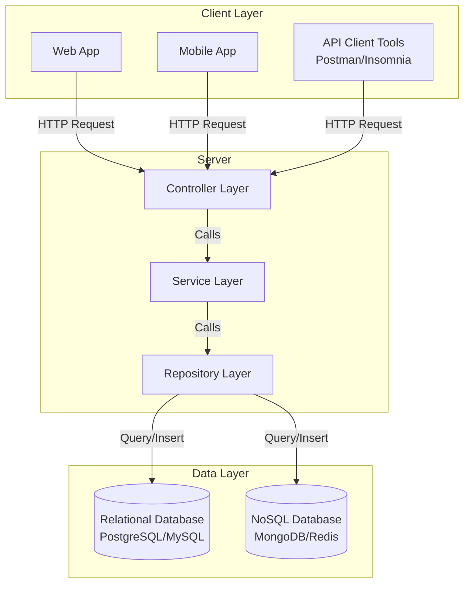

### Layer Responsibilities

| Layer | Primary Responsibility | Key Functions |
|-------|----------------------|---------------|
| **Controller Layer** | HTTP request/response handling | - Route matching<br/>- HTTP status codes<br/>- Request/response formatting<br/>- **Validation & Transformation** |
| **Service Layer** | Business logic execution | - Core application logic<br/>- Orchestrating multiple operations<br/>- Sending notifications/emails<br/>- Making webhook calls |
| **Repository Layer** | Data persistence | - Database connections<br/>- CRUD operations<br/>- Query execution<br/>- Data retrieval |

### Detailed Layer Breakdown

#### 1. Repository Layer (Bottom Layer)

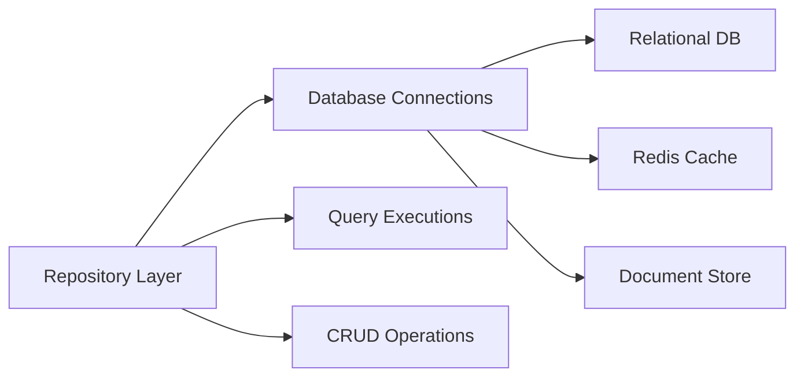

**Characteristics:**
- Deals with data persistence
- Manages database connections
- Executes queries (SELECT, INSERT, UPDATE, DELETE)
- Can interact with multiple database types:
  - Traditional relational databases (PostgreSQL, MySQL)
  - NoSQL databases (MongoDB)
  - In-memory stores (Redis)
  - Other persistent storage systems

#### 2. Service Layer (Middle Layer)

**Primary Functions:**
- Executes business logic
- Calls one or more repository methods
- Sends notifications to devices
- Dispatches emails to users
- Makes webhook calls to external services
- Coordinates complex operations

**Example Service Method Flow:**

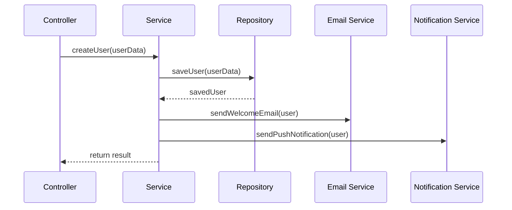

#### 3. Controller Layer (Top Layer)

**Key Responsibilities:**
- Receives HTTP requests from clients
- Performs route matching
- **Executes validation and transformation**
- Calls appropriate service methods
- Formats responses
- Returns appropriate HTTP status codes
- Handles HTTP-specific logic

**Why Separate Controller from Service?**

The separation exists to keep HTTP-related concerns isolated:
- What error code to return (400, 401, 404, 500)
- What success code to return (200, 201, 204)
- Data format expectations
- Request validation
- Response formatting

This separation follows the **Single Responsibility Principle** and makes code more maintainable and testable.

### Typical API Execution Flow

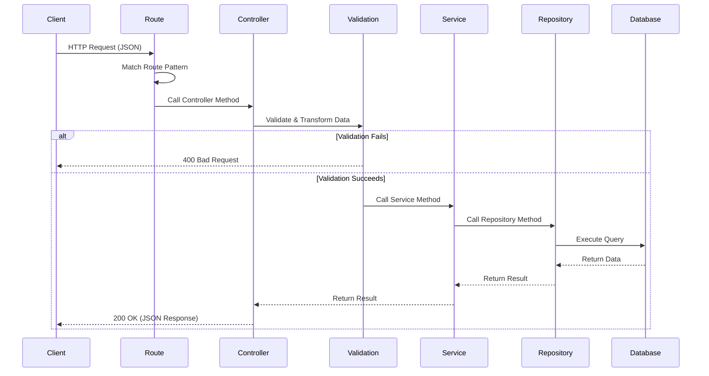

---

## Understanding the Validation & Transformation Pipeline

### The Entry Point Concept

The **validation and transformation pipeline** sits at the critical entry point of your server - right after route matching and before any business logic execution.

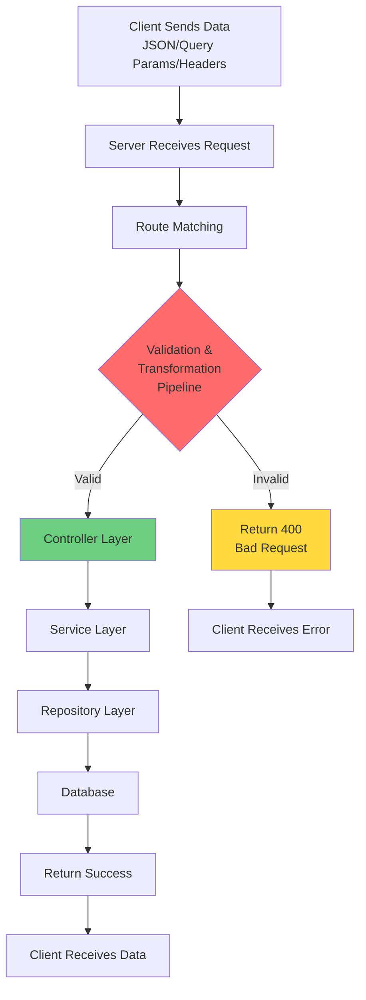

### What Happens in the Pipeline?

The pipeline performs **two critical operations**:

#### 1. **Validation**
Checks if incoming data matches expected structure, types, and constraints

#### 2. **Transformation**
Converts or modifies data to match internal requirements

### Data Flow Through the Pipeline

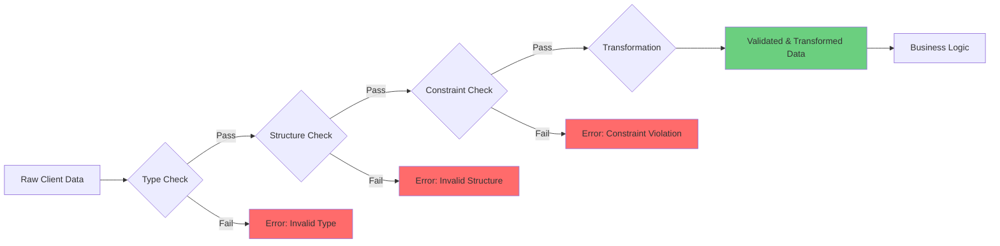

---

## Why Validations Matter: The Core Problem

### The Problem Scenario

Let's understand why validations are critical through a concrete example:

#### API Requirement
```json
{
  "name": "string (5-100 characters)"
}
```

#### What Happens WITHOUT Validation

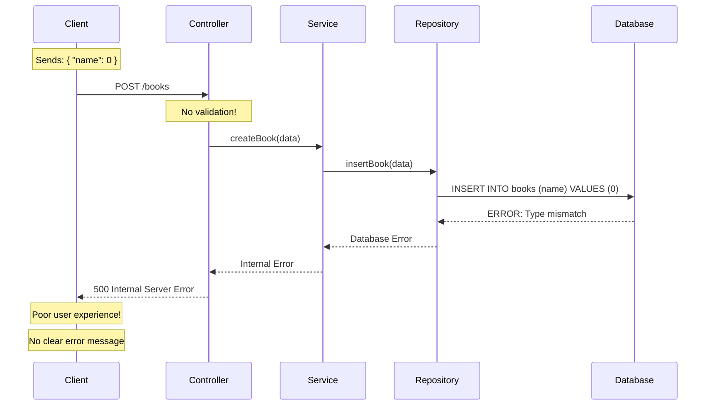

#### Database Constraint

When creating the books table in PostgreSQL:

```sql
CREATE TABLE books (
    id SERIAL PRIMARY KEY,
    name TEXT NOT NULL,
    created_at TIMESTAMP DEFAULT NOW()
);
```

**The Problem Chain:**

1. **Client sends**: `{ "name": 0 }` (number instead of string)
2. **No validation at entry point**: Data passes through
3. **Service layer executes**: Calls repository method
4. **Repository attempts insert**: Tries to insert number into TEXT column
5. **Database constraint fails**: PostgreSQL enforces TEXT type
6. **Error propagates back**: Internal Server Error (500)
7. **Poor UX**: Client receives unhelpful error

#### What Happens WITH Validation

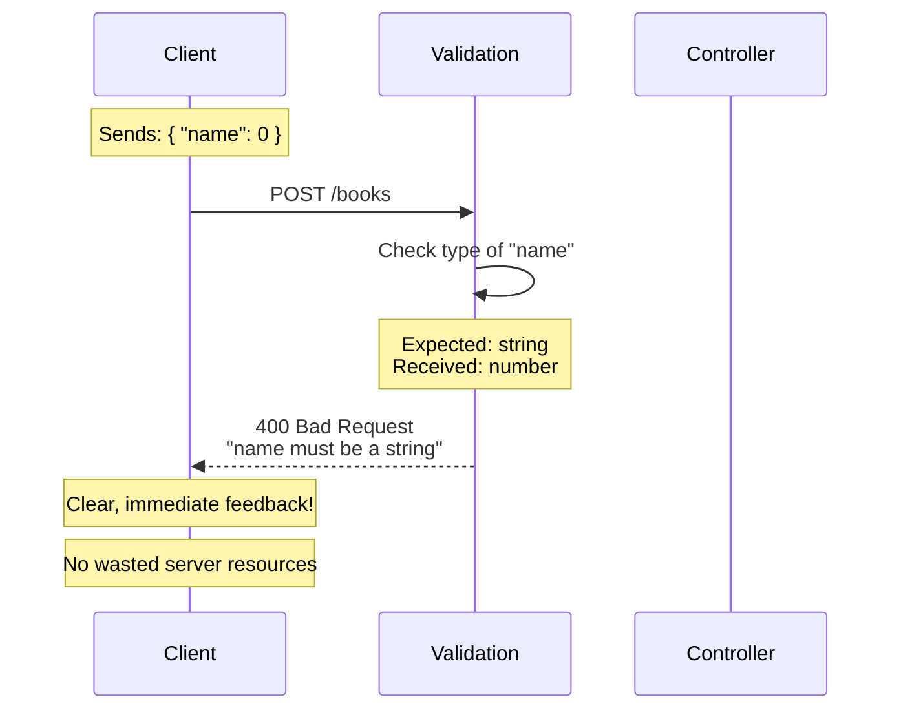

### Benefits of Early Validation

| Benefit | Description | Impact |
|---------|-------------|--------|
| **Fail Fast** | Reject invalid data immediately | Saves server resources |
| **Clear Errors** | Provide specific error messages | Better developer experience |
| **Data Integrity** | Ensure data consistency | Prevents database corruption |
| **Security** | Block malicious inputs | Protects against attacks |
| **Resource Efficiency** | Avoid unnecessary processing | Reduces server load |

### The Validation Contract

Think of validation as a **contract** between client and server:

```
┌─────────────────────────────────────────┐
│         CLIENT CONTRACT                 │
├─────────────────────────────────────────┤
│ You MUST send:                          │
│ - Correct data types                    │
│ - Required fields                       │
│ - Valid formats                         │
│ - Constraint-compliant values           │
└─────────────────────────────────────────┘
              ↓
┌─────────────────────────────────────────┐
│      VALIDATION PIPELINE                │
│      Enforces Contract                  │
└─────────────────────────────────────────┘
              ↓
┌─────────────────────────────────────────┐
│         SERVER GUARANTEE                │
├─────────────────────────────────────────┤
│ I will ONLY process:                    │
│ - Valid data                            │
│ - Expected formats                      │
│ - Constraint-compliant values           │
└─────────────────────────────────────────┘
```

---

## Types of Validations

There are three primary types of validations commonly used in API design. While these categories aren't strictly defined, they cover most validation scenarios you'll encounter.

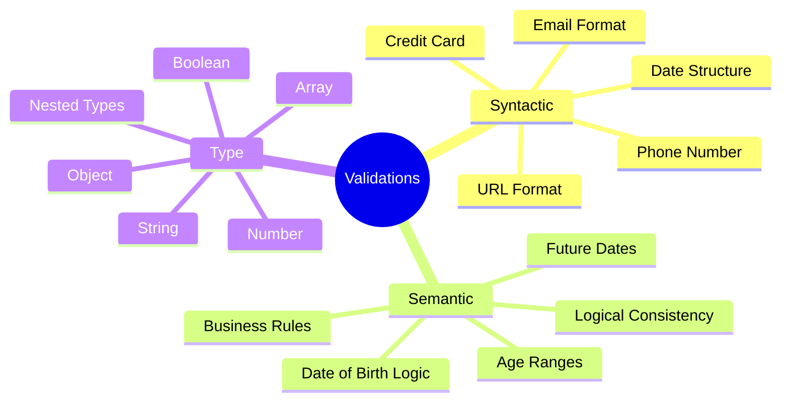

---

### Syntactic Validation

**Definition**: Validates whether provided data follows a specific **structural pattern** or **format**.

#### Characteristics

- Checks if data matches a predefined pattern
- Focuses on structure and format
- Does NOT verify if data is logically valid
- Can be implemented using regular expressions

#### Common Use Cases

| Data Type | Structure Pattern | Example Valid | Example Invalid |
|-----------|------------------|---------------|-----------------|
| **Email** | `local@domain.tld` | `user@example.com` | `user@example`, `@example.com` |
| **Phone** | `+[country][number]` | `+911234567890` | `1234567890`, `abc` |
| **Date** | `YYYY-MM-DD` | `2025-11-05` | `11/05/2025`, `2025-13-45` |
| **URL** | `protocol://domain` | `https://example.com` | `example.com`, `htp://test` |
| **Credit Card** | `[4-digit groups]` | `4532-1234-5678-9010` | `1234`, `abcd-1234` |

#### Email Validation Structure

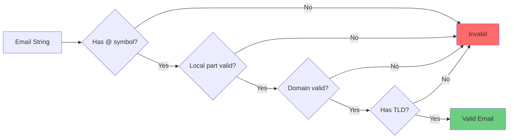

**Email Structure Breakdown:**

```
┌──────────┬───┬──────────────┬───┬─────┐
│  local   │ @ │    domain    │ . │ TLD │
└──────────┴───┴──────────────┴───┴─────┘
   john        │    example    │   com
```

Examples:
- ✅ `john@example.com`
- ✅ `user.name@company.co.uk`
- ✅ `test+tag@domain.org`
- ❌ `john@` (missing domain)
- ❌ `@example.com` (missing local)
- ❌ `john.example.com` (missing @)

#### Phone Number Validation Structure

Phone numbers follow country-specific patterns:

```
┌──────────────┬──────────────────┐
│ Country Code │ National Number  │
└──────────────┴──────────────────┘
      +91           1234567890
```

**Common Patterns:**
- USA: `+1 (XXX) XXX-XXXX`
- India: `+91 XXXXXXXXXX`
- UK: `+44 XXXX XXXXXX`

#### Date Validation Structure

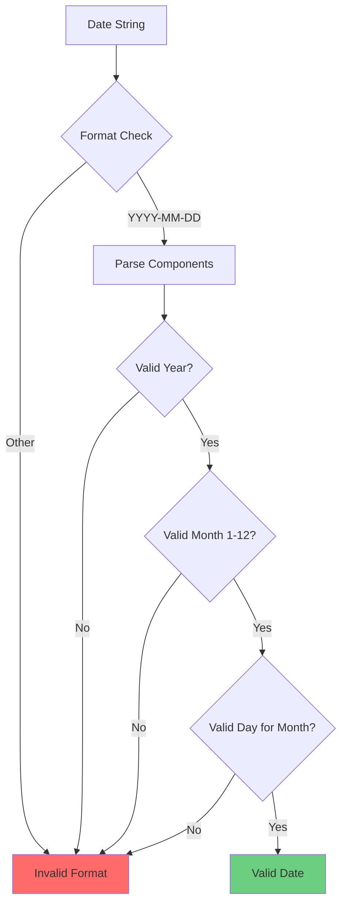

**Date Format Examples:**

| Format | Example | Description |
|--------|---------|-------------|
| `YYYY-MM-DD` | `2025-11-05` | ISO 8601 standard |
| `DD/MM/YYYY` | `05/11/2025` | European format |
| `MM/DD/YYYY` | `11/05/2025` | US format |
| `YYYY-MM-DD HH:MM:SS` | `2025-11-05 14:30:00` | Full timestamp |

#### Practical Example: Syntactic Validation API

**API Endpoint**: `POST /api/valid/syntactic`

**Expected Payload:**
```json
{
  "email": "string (valid email format)",
  "phone": "string (valid phone format)",
  "date": "string (valid date format)"
}
```

**Test Case 1: Empty Payload**

Request:
```json
{}
```

Response (400 Bad Request):
```json
[
  {
    "field": "email",
    "message": "Email is required"
  },
  {
    "field": "phone",
    "message": "Phone is required"
  },
  {
    "field": "date",
    "message": "Date is required"
  }
]
```

**Test Case 2: Invalid Formats**

Request:
```json
{
  "email": "random",
  "phone": 1234567890,
  "date": "2025-11-05"
}
```

Response (400 Bad Request):
```json
[
  {
    "field": "email",
    "message": "Invalid email format"
  },
  {
    "field": "phone",
    "message": "Expected string but received number"
  }
]
```

**Test Case 3: Valid Data**

Request:
```json
{
  "email": "test@example.com",
  "phone": "+911234567890",
  "date": "2025-11-05"
}
```

Response (200 OK):
```json
{
  "success": true,
  "data": {
    "email": "test@example.com",
    "phone": "+911234567890",
    "date": "2025-11-05"
  }
}
```

---

### Semantic Validation

**Definition**: Validates whether the data makes **logical sense** in the real-world context, beyond just structural correctness.

#### Characteristics

- Checks logical consistency
- Validates business rules
- Ensures data makes sense contextually
- Goes beyond format to verify meaning

#### Key Difference from Syntactic

| Aspect | Syntactic | Semantic |
|--------|-----------|----------|
| **Focus** | Structure and format | Logical meaning |
| **Question** | "Is this the right format?" | "Does this make sense?" |
| **Example** | "2026-01-01" is valid date format | "2026-01-01" as birthdate is invalid (future) |

#### Common Use Cases

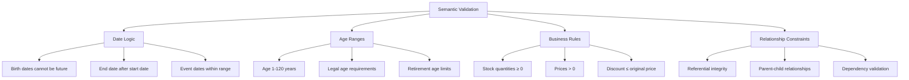

#### Example 1: Date of Birth Validation

**Logical Rules:**

1. **Cannot be in the future**

```
Current Date: 2025-11-05
Birth Date: 2026-01-01
Status: INVALID ❌
Reason: Date of birth cannot be in the future
```

2. **Must be within reasonable human lifespan**

```
Current Date: 2025-11-05
Birth Date: 1800-01-01
Status: INVALID ❌
Reason: Age would be 225 years (unreasonable)
```

3. **Must allow for minimum age requirements**

```
Current Date: 2025-11-05
Birth Date: 2024-12-01
For Age Requirement: 18+
Status: INVALID ❌
Reason: User is only 0 years old
```

#### Example 2: Age Validation

**Logical Constraints:**

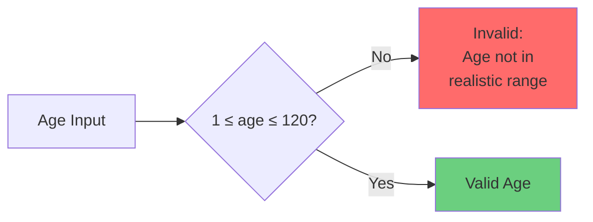

**Test Cases:**

| Age Value | Status | Reason |
|-----------|--------|--------|
| 0 | ❌ Invalid | Below minimum (must be ≥ 1) |
| 1 | ✅ Valid | Within range |
| 25 | ✅ Valid | Within range |
| 120 | ✅ Valid | Maximum reasonable age |
| 121 | ❌ Invalid | Exceeds reasonable maximum |
| 365 | ❌ Invalid | Unrealistic age |
| -5 | ❌ Invalid | Negative age impossible |

#### Example 3: Business Logic Validation

**Scenario**: E-commerce Order System

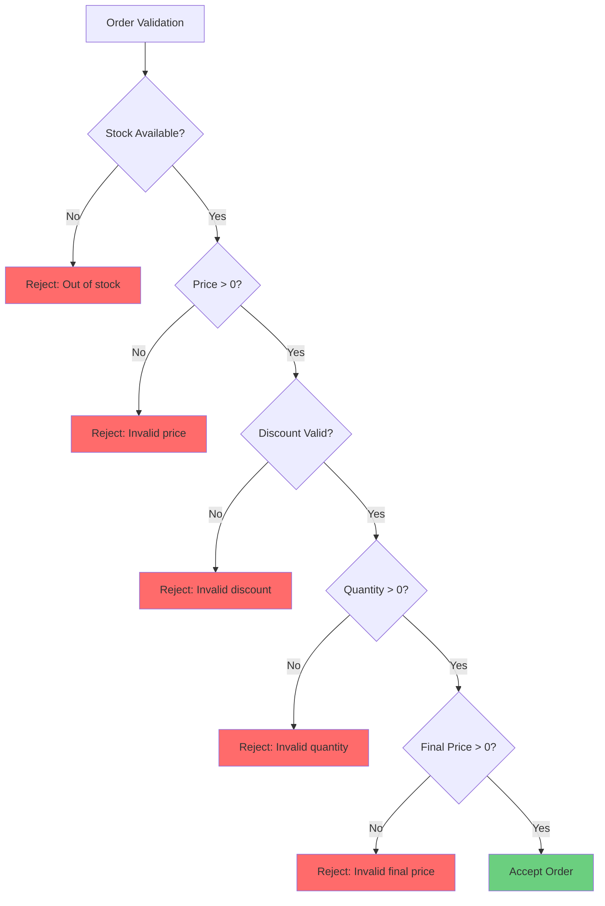

**Semantic Rules:**

1. **Price must be positive**
   ```
   price > 0
   ```

2. **Discount cannot exceed original price**
   ```
   discount ≤ original_price
   ```

3. **Final price must be positive**
   ```
   final_price = original_price - discount
   final_price > 0
   ```

4. **Stock must be sufficient**
   ```
   requested_quantity ≤ available_stock
   ```

#### Practical Example: Semantic Validation API

**API Endpoint**: `POST /api/valid/semantic`

**Expected Payload:**
```json
{
  "dateOfBirth": "string (YYYY-MM-DD, not in future)",
  "age": "number (1-120)"
}
```

**Test Case 1: Future Date of Birth**

Request:
```json
{
  "dateOfBirth": "2026-06-12",
  "age": 43
}
```

Response (400 Bad Request):
```json
{
  "errors": [
    {
      "field": "dateOfBirth",
      "message": "Date of birth cannot be in the future"
    }
  ]
}
```

**Test Case 2: Unrealistic Age**

Request:
```json
{
  "dateOfBirth": "1995-06-12",
  "age": 430
}
```

Response (400 Bad Request):
```json
{
  "errors": [
    {
      "field": "age",
      "message": "Number must be less than or equal to 120"
    }
  ]
}
```

**Test Case 3: Valid Data**

Request:
```json
{
  "dateOfBirth": "1995-06-12",
  "age": 30
}
```

Response (200 OK):
```json
{
  "success": true,
  "data": {
    "dateOfBirth": "1995-06-12",
    "age": 30
  }
}
```

#### Mathematical Representation of Semantic Constraints

For date of birth validation:

```math
\text{Let } D_{\text{current}} = \text{current date}
```

```math
\text{Let } D_{\text{birth}} = \text{date of birth provided}
```

**Constraint 1: Not in future**
```math
D_{\text{birth}} < D_{\text{current}}
```

**Constraint 2: Calculate age**
```math
\text{age} = D_{\text{current}} - D_{\text{birth}}
```

**Constraint 3: Reasonable age range**
```math
1 \leq \text{age} \leq 120
```

For price validation in e-commerce:

**Given:**
- $P_{\text{original}}$ = Original price
- $D$ = Discount amount
- $P_{\text{final}}$ = Final price

**Constraints:**
```math
P_{\text{original}} > 0
```

```math
D \geq 0
```

```math
D \leq P_{\text{original}}
```

```math
P_{\text{final}} = P_{\text{original}} - D
```

```math
P_{\text{final}} > 0
```

---

### Type Validation

**Definition**: Validates whether the data is of the **expected data type** (string, number, boolean, array, object, etc.).

#### Characteristics

- Most fundamental validation
- Checks primitive and complex types
- Prevents type-related runtime errors
- Foundation for other validations

#### Supported Data Types

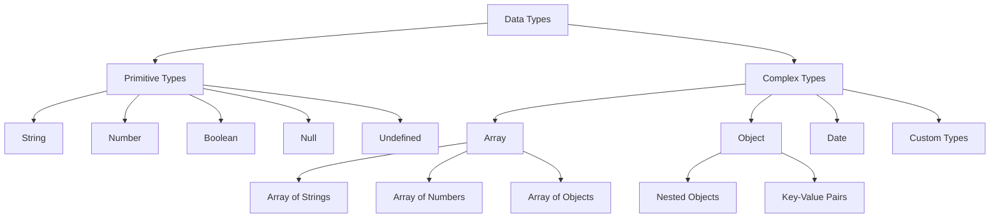

#### Type Validation Hierarchy

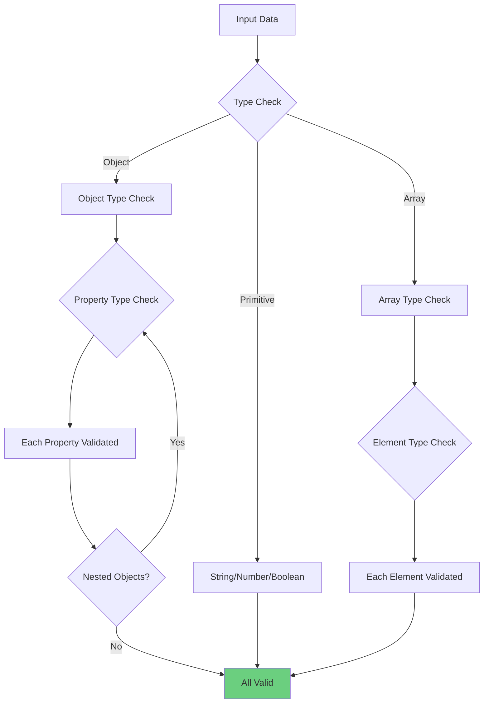

#### Common Type Validation Scenarios

| Expected Type | Provided Value | Status | Error Message |
|---------------|---------------|--------|---------------|
| `string` | `"hello"` | ✅ Valid | - |
| `string` | `123` | ❌ Invalid | Expected string, received number |
| `number` | `42` | ✅ Valid | - |
| `number` | `"42"` | ❌ Invalid | Expected number, received string |
| `boolean` | `true` | ✅ Valid | - |
| `boolean` | `"true"` | ❌ Invalid | Expected boolean, received string |
| `array` | `[1, 2, 3]` | ✅ Valid | - |
| `array` | `"[1,2,3]"` | ❌ Invalid | Expected array, received string |
| `object` | `{"key": "value"}` | ✅ Valid | - |
| `object` | `"object"` | ❌ Invalid | Expected object, received string |

#### Nested Type Validation

For complex nested structures, validation occurs recursively:

**Example Structure:**
```json
{
  "user": {
    "name": "string",
    "age": "number",
    "emails": ["string", "string"],
    "address": {
      "street": "string",
      "city": "string",
      "zipCode": "number"
    }
  }
}
```

**Validation Flow:**

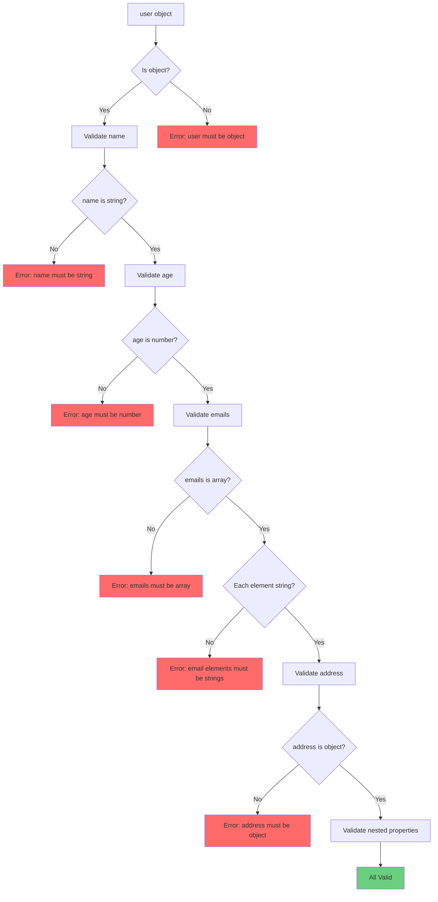

#### Practical Example: Type Validation API

**API Endpoint**: `POST /api/valid/type`

**Expected Payload:**
```json
{
  "stringField": "string",
  "numberField": "number",
  "arrayField": ["string", "string"],
  "booleanField": "boolean"
}
```

**Test Case 1: Wrong Types**

Request:
```json
{
  "stringField": "something",
  "numberField": "10",
  "arrayField": "[1, 2]",
  "booleanField": "false"
}
```

Response (400 Bad Request):
```json
{
  "errors": [
    {
      "field": "numberField",
      "message": "Expected number, received string"
    },
    {
      "field": "arrayField",
      "message": "Expected array, received string"
    },
    {
      "field": "booleanField",
      "message": "Expected boolean, received string"
    }
  ]
}
```

**Test Case 2: Correct Types, Wrong Array Element Types**

Request:
```json
{
  "stringField": "something",
  "numberField": 10,
  "arrayField": [1, 2],
  "booleanField": false
}
```

Response (400 Bad Request):
```json
{
  "errors": [
    {
      "field": "arrayField[0]",
      "message": "Expected string, received number"
    },
    {
      "field": "arrayField[1]",
      "message": "Expected string, received number"
    }
  ]
}
```

**Test Case 3: All Correct**

Request:
```json
{
  "stringField": "something",
  "numberField": 10,
  "arrayField": ["one", "two"],
  "booleanField": false
}
```

Response (200 OK):
```json
{
  "success": true,
  "data": {
    "stringField": "something",
    "numberField": 10,
    "arrayField": ["one", "two"],
    "booleanField": false
  }
}
```

#### Type Coercion vs Type Validation

| Approach | Description | When to Use |
|----------|-------------|-------------|
| **Strict Type Validation** | Reject any type mismatch | APIs requiring precise types |
| **Type Coercion** | Attempt to convert types | Query parameters, form data |

**Example of Type Coercion:**
```javascript
// Input: "42" (string)
// After coercion: 42 (number)

// Input: "true" (string)
// After coercion: true (boolean)
```

---

## Transformations Explained

**Definition**: Transformations are operations performed on incoming data to convert it into the format expected by the service layer, either before or after validation.

### Why Transformations Are Needed

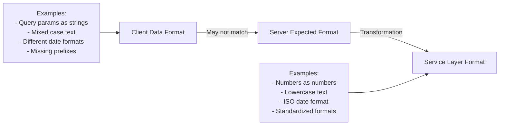

### Common Transformation Scenarios

| Scenario | Input | Transformation | Output | Purpose |
|----------|-------|----------------|--------|---------|
| **Query Params** | `"42"` (string) | Parse to number | `42` (number) | Enable numeric validations |
| **Case Normalization** | `"JoHn@ExAmPlE.CoM"` | Convert to lowercase | `"john@example.com"` | Consistency & uniqueness |
| **Phone Formatting** | `"1234567890"` | Add country code | `"+911234567890"` | Standardization |
| **Date Formatting** | `"11/05/2025"` | Convert to ISO | `"2025-11-05"` | Database compatibility |
| **Whitespace** | `"  text  "` | Trim | `"text"` | Clean data |
| **Default Values** | `undefined` | Set default | `0` or `""` | Handle missing data |

### Transformation Pipeline Flow

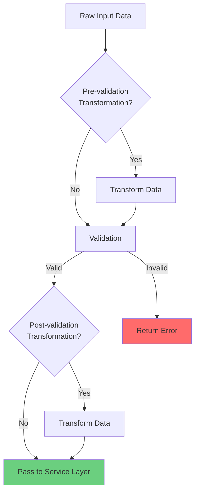

### Detailed Example: Query Parameter Transformation

#### The Problem

Query parameters in HTTP requests are **always strings** by default:

```
GET /api/bookmarks?page=2&limit=20
```

When this reaches the server:
```javascript
{
  page: "2",      // String, not number!
  limit: "20"     // String, not number!
}
```

#### Validation Requirements

```javascript
{
  page: {
    type: "number",     // ❌ Will fail - received string
    min: 1,
    max: 500
  },
  limit: {
    type: "number",     // ❌ Will fail - received string
    min: 1,
    max: 10000
  }
}
```

#### Without Transformation

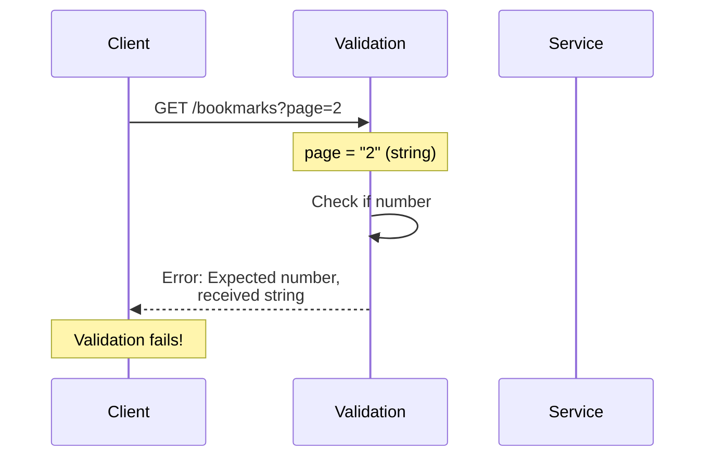

#### With Transformation

```mermaid
sequenceDiagram
    participant C as Client
    participant T as Transformation
    participant V as Validation
    participant S as Service
    
    C->>T: GET /bookmarks?page=2
    Note over T: page = "2" (string)
    T->>T: Cast "2" → 2
    Note over T: page = 2 (number)
    T->>V: Transformed data
    V->>V: Check if number ✓
    V->>V: Check min/max ✓
    V->>S: Valid data
    Note over S: Success!
```

### Type Casting in Transformations

**Type Casting** = Converting one data type to another

#### Common Casting Operations

```javascript
// String to Number
"42" → 42
"3.14" → 3.14

// String to Boolean
"true" → true
"false" → false
"1" → true
"0" → false

// String to Date
"2025-11-05" → Date(2025-11-05)

// Number to String
42 → "42"

// Array of Strings to Array of Numbers
["1", "2", "3"] → [1, 2, 3]
```

### Example: Email Case Normalization

#### Scenario
User registration where email should be case-insensitive

**Client Input:**
```json
{
  "email": "JoHn.DoE@ExAmPlE.CoM"
}
```

**Transformation Logic:**
```javascript
function transformEmail(email) {
  return email.toLowerCase().trim();
}
```

**Transformed Data:**
```json
{
  "email": "john.doe@example.com"
}
```

**Benefits:**
- Prevents duplicate accounts with different cases
- Ensures consistency in database
- Simplifies email lookups

### Example: Phone Number Standardization

**Client Input:**
```json
{
  "phone": "1234567890"
}
```

**Transformation Logic:**
```javascript
function transformPhone(phone, defaultCountryCode = "+91") {
  // Add country code if not present
  if (!phone.startsWith("+")) {
    return defaultCountryCode + phone;
  }
  return phone;
}
```

**Transformed Data:**
```json
{
  "phone": "+911234567890"
}
```

### Example: Date Format Standardization

**Client Input (Various Formats):**
```json
{
  "eventDate": "11/05/2025"  // US format
}
```

**Transformation Logic:**
```javascript
function transformDate(dateString) {
  // Parse various formats and convert to ISO
  const date = new Date(dateString);
  return date.toISOString().split('T')[0];
}
```

**Transformed Data:**
```json
{
  "eventDate": "2025-11-05"  // ISO format
}
```

### Practical Example: Transformation API

**API Endpoint**: `POST /api/valid/transform`

**Expected Payload (Before Transformation):**
```json
{
  "email": "string (any case)",
  "phone": "string (with/without country code)",
  "date": "string (various formats)"
}
```

**Test Case: Data Transformation**

**Request:**
```json
{
  "email": "TeSt@ExAmPlE.CoM",
  "phone": "1234567890",
  "date": "2025-11-05"
}
```

**Internal Transformation Process:**

```mermaid
graph TB
    A[Raw Input] --> B[Email: TeSt@ExAmPlE.CoM]
    A --> C[Phone: 1234567890]
    A --> D[Date: 2025-11-05]
    
    B --> B1[toLowerCase]
    B1 --> B2[Email: test@example.com]
    
    C --> C1[Add country code]
    C1 --> C2[Phone: +911234567890]
    
    D --> D1[Parse & format]
    D1 --> D2[Date: 2025-11-05]
    
    B2 --> E[Transformed Output]
    C2 --> E
    D2 --> E
    
    style E fill:#6bcf7f
```

**Response (200 OK):**
```json
{
  "success": true,
  "data": {
    "email": "test@example.com",      // Lowercase
    "phone": "+911234567890",          // Added +91
    "date": "2025-11-05"               // ISO format
  }
}
```

### When to Apply Transformations

```mermaid
graph TB
    A[Transformation Timing] --> B[Pre-Validation]
    A --> C[Post-Validation]
    
    B --> B1[Type Casting]
    B --> B2[Format Standardization]
    B --> B3[Default Values]
    
    C --> C1[Data Enrichment]
    C --> C2[Computed Fields]
    C --> C3[Business Logic Formatting]
    
    style B fill:#a8dadc
    style C fill:#457b9d
```

#### Pre-Validation Transformations

**Purpose**: Make data ready for validation

**Examples:**
- Cast string query params to numbers
- Normalize case
- Trim whitespace
- Parse date strings

#### Post-Validation Transformations

**Purpose**: Format validated data for business logic

**Examples:**
- Add computed fields
- Enrich data with defaults
- Format for database storage
- Add timestamps or IDs

### Transformation Best Practices

| Best Practice | Description | Example |
|--------------|-------------|---------|
| **Idempotent** | Same input always produces same output | `toLowerCase("ABC")` always returns `"abc"` |
| **Reversible** | Consider if transformation can be undone | Store original if needed |
| **Documented** | Clear documentation of what transforms | Comment transformation logic |
| **Consistent** | Apply same transformations across all endpoints | Use shared utilities |
| **Logged** | Log transformation failures | Track parsing errors |

---

## Practical Examples

### Complete Validation & Transformation Flow

Let's trace a complete request through the entire pipeline:

```mermaid
sequenceDiagram
    participant C as Client
    participant R as Router
    participant T as Transformer
    participant V as Validator
    participant Ctrl as Controller
    participant Svc as Service
    
    C->>R: POST /api/users<br/>{email: "TEST@Example.com", age: "25"}
    R->>T: Raw request data
    
    Note over T: Pre-validation Transformation
    T->>T: email.toLowerCase()
    T->>T: parseInt(age)
    Note over T: {email: "test@example.com", age: 25}
    
    T->>V: Transformed data
    
    Note over V: Validation
    V->>V: Check email format ✓
    V->>V: Check age range ✓
    
    V->>Ctrl: Valid & transformed data
    Ctrl->>Svc: Call createUser()
    Svc-->>Ctrl: User created
    Ctrl-->>C: 200 OK
```

### Example 1: Complex Password Validation

**API Endpoint**: `POST /api/valid/complex`

**Requirements:**
1. Password and password confirmation fields
2. Passwords must match
3. Password must be at least 8 characters
4. If married=true, partner name is required

**Expected Payload:**
```json
{
  "password": "string (min 8 characters)",
  "passwordConfirmation": "string (must match password)",
  "married": "boolean",
  "partner": "string (required if married=true)"
}
```

#### Validation Logic Flow

```mermaid
graph TB
    A[Request Data] --> B{password length >= 8?}
    B -->|No| X1[Error: Password too short]
    B -->|Yes| C{password == passwordConfirmation?}
    C -->|No| X2[Error: Passwords don't match]
    C -->|Yes| D{married == true?}
    D -->|Yes| E{partner provided?}
    D -->|No| F[Valid - Process]
    E -->|No| X3[Error: Partner name required]
    E -->|Yes| F
    
    style F fill:#6bcf7f
    style X1 fill:#ff6b6b
    style X2 fill:#ff6b6b
    style X3 fill:#ff6b6b
```

#### Test Cases

**Test Case 1: Short Password**

Request:
```json
{
  "password": "pass",
  "passwordConfirmation": "pass",
  "married": false
}
```

Response (400):
```json
{
  "errors": [
    {
      "field": "password",
      "message": "String must contain at least 8 characters"
    }
  ]
}
```

**Test Case 2: Password Mismatch**

Request:
```json
{
  "password": "password123",
  "passwordConfirmation": "password456",
  "married": false
}
```

Response (400):
```json
{
  "errors": [
    {
      "field": "passwordConfirmation",
      "message": "Passwords don't match"
    }
  ]
}
```

**Test Case 3: Married but No Partner**

Request:
```json
{
  "password": "password123",
  "passwordConfirmation": "password123",
  "married": true
}
```

Response (400):
```json
{
  "errors": [
    {
      "field": "partner",
      "message": "Partner name is required when married is true"
    }
  ]
}
```

**Test Case 4: All Valid**

Request:
```json
{
  "password": "password123",
  "passwordConfirmation": "password123",
  "married": true,
  "partner": "Jane Doe"
}
```

Response (200 OK):
```json
{
  "success": true,
  "data": {
    "married": true,
    "partner": "Jane Doe"
  }
}
```

### Example 2: Paginated Query Parameters

**API Endpoint**: `GET /api/bookmarks?page=2&limit=20`

**Requirements:**
- `page`: number, min=1, max=500
- `limit`: number, min=1, max=10000

#### The Challenge

```javascript
// What the server receives:
{
  page: "2",      // String!
  limit: "20"     // String!
}

// What validation expects:
{
  page: Number,   // Number type
  limit: Number   // Number type
}
```

#### Solution: Type Casting Transformation

```mermaid
graph LR
    A[Query Params<br/>Strings] --> B[Cast to Numbers]
    B --> C[Validate Ranges]
    C --> D[Pass to Service]
    
    style A fill:#ffd93d
    style B fill:#a8dadc
    style C fill:#457b9d
    style D fill:#6bcf7f
```

**Transformation Logic:**
```javascript
function transformQueryParams(params) {
  return {
    page: parseInt(params.page, 10),
    limit: parseInt(params.limit, 10)
  };
}
```

**Validation Logic:**
```javascript
{
  page: {
    type: 'number',
    min: 1,
    max: 500
  },
  limit: {
    type: 'number',
    min: 1,
    max: 10000
  }
}
```

### Example 3: Nested Object Validation

**API Endpoint**: `POST /api/profile`

**Expected Payload:**
```json
{
  "user": {
    "name": "string",
    "age": "number",
    "emails": ["string"],
    "address": {
      "street": "string",
      "city": "string",
      "zipCode": "number"
    }
  }
}
```

#### Validation Schema

```javascript
{
  user: {
    type: 'object',
    required: true,
    properties: {
      name: {
        type: 'string',
        minLength: 2,
        maxLength: 100
      },
      age: {
        type: 'number',
        min: 18,
        max: 120
      },
      emails: {
        type: 'array',
        items: {
          type: 'string',
          format: 'email'
        },
        minItems: 1
      },
      address: {
        type: 'object',
        required: true,
        properties: {
          street: { type: 'string' },
          city: { type: 'string' },
          zipCode: {
            type: 'number',
            min: 100000,
            max: 999999
          }
        }
      }
    }
  }
}
```

---

## Complex Validation Scenarios

### Conditional Field Requirements

#### Scenario: Married Status Validation

**Business Rule**: If a user indicates they are married, they must provide their partner's name.

```mermaid
graph TB
    A[Check married field] --> B{married == true?}
    B -->|No| C[partner field is optional]
    B -->|Yes| D{partner provided?}
    D -->|No| E[Error: Partner required]
    D -->|Yes| F[Valid]
    C --> F
    
    style F fill:#6bcf7f
    style E fill:#ff6b6b
```

**Implementation Logic:**
```javascript
function validateMaritalInfo(data) {
  if (data.married === true) {
    if (!data.partner || data.partner.trim() === '') {
      throw new ValidationError('Partner name is required when married is true');
    }
  }
  return true;
}
```

### Cross-Field Validation

#### Scenario: Password Confirmation

**Business Rule**: Two password fields must match exactly.

```mermaid
graph LR
    A[password field] --> C{Compare}
    B[passwordConfirmation field] --> C
    C -->|Match| D[Valid]
    C -->|Don't Match| E[Error: Passwords don't match]
    
    style D fill:#6bcf7f
    style E fill:#ff6b6b
```

**Mathematical Representation:**

Let $P$ be the password and $P_c$ be the password confirmation:

```math
\text{Valid} \iff P = P_c
```

### Date Range Validation

#### Scenario: Event Booking System

**Business Rule**: End date must be after start date.

```math
\text{Let } D_{\text{start}} = \text{start date}
```

```math
\text{Let } D_{\text{end}} = \text{end date}
```

**Constraint:**
```math
D_{\text{end}} > D_{\text{start}}
```

```mermaid
graph TB
    A[Start Date] --> C{Compare Dates}
    B[End Date] --> C
    C -->|End > Start| D[Valid Date Range]
    C -->|End <= Start| E[Error: Invalid date range]
    
    style D fill:#6bcf7f
    style E fill:#ff6b6b
```

### Multi-Step Validation

#### Example: User Registration

```mermaid
flowchart TD
    A[Registration Data] --> B[Step 1: Type Validation]
    B -->|Pass| C[Step 2: Format Validation]
    B -->|Fail| X1[Return Type Errors]
    
    C -->|Pass| D[Step 3: Semantic Validation]
    C -->|Fail| X2[Return Format Errors]
    
    D -->|Pass| E[Step 4: Cross-Field Validation]
    D -->|Fail| X3[Return Semantic Errors]
    
    E -->|Pass| F[Step 5: Business Rule Validation]
    E -->|Fail| X4[Return Cross-Field Errors]
    
    F -->|Pass| G[Step 6: Transformations]
    F -->|Fail| X5[Return Business Rule Errors]
    
    G --> H[Valid & Transformed Data]
    
    style H fill:#6bcf7f
    style X1 fill:#ff6b6b
    style X2 fill:#ff6b6b
    style X3 fill:#ff6b6b
    style X4 fill:#ff6b6b
    style X5 fill:#ff6b6b
```

**Step-by-Step Validation:**

1. **Type Validation**: Ensure all fields are correct types
2. **Format Validation**: Check email, phone formats
3. **Semantic Validation**: Age ranges, date logic
4. **Cross-Field Validation**: Password matching
5. **Business Rules**: Unique email check
6. **Transformations**: Normalize data

---

## Frontend vs Backend Validation

### The Critical Distinction

```mermaid
graph TB
    subgraph "Frontend Validation"
        A1[Purpose: User Experience]
        A2[Immediate Feedback]
        A3[Client-Side Only]
        A4[Can Be Bypassed]
        A5[Not for Security]
    end
    
    subgraph "Backend Validation"
        B1[Purpose: Security & Data Integrity]
        B2[Server-Side Enforcement]
        B3[Cannot Be Bypassed]
        B4[Mandatory Protection]
        B5[For All Clients]
    end
    
    A1 -.->|Different from| B1
    A4 -.->|Why we need| B3
    
    style A4 fill:#ff6b6b
    style B3 fill:#6bcf7f
```

### Why Both Are Necessary

| Aspect | Frontend Validation | Backend Validation |
|--------|-------------------|-------------------|
| **Purpose** | User experience | Security & data integrity |
| **Timing** | Immediate (before submission) | After submission |
| **Can Be Bypassed** | Yes (disable JavaScript, API tools) | No (server-enforced) |
| **Performance** | Fast (local) | Depends on server |
| **Required** | No (optional UX enhancement) | Yes (mandatory protection) |
| **Trust Level** | Never trust | Always validate |

### The Problem with Frontend-Only Validation

```mermaid
sequenceDiagram
    participant User
    participant Frontend
    participant API Tool
    participant Backend
    
    rect rgb(255, 200, 200)
    Note over User,Backend: Scenario 1: Normal User (with frontend)
    User->>Frontend: Submit form
    Frontend->>Frontend: Validate ✓
    Frontend->>Backend: Send request
    Backend->>Backend: Validate ✓
    Backend-->>Frontend: Success
    end
    
    rect rgb(200, 255, 200)
    Note over User,Backend: Scenario 2: Malicious User (bypass frontend)
    User->>API Tool: Direct API call<br/>(No frontend validation)
    API Tool->>Backend: Send malicious data
    alt No Backend Validation
        Backend->>Backend: Process directly
        Backend-->>API Tool: Success/Error
        Note over Backend: System broken!
    else With Backend Validation
        Backend->>Backend: Validate ✗
        Backend-->>API Tool: 400 Bad Request
        Note over Backend: System protected!
    end
    end
```

### How They Work Together

```mermaid
flowchart TB
    A[User Action] --> B{Frontend<br/>Validation}
    B -->|Invalid| C[Show Error<br/>Don't Submit]
    B -->|Valid| D[Submit to Server]
    
    D --> E{Backend<br/>Validation}
    E -->|Invalid| F[Return 400<br/>Error Message]
    E -->|Valid| G[Process Request]
    
    F --> H[Display Server Error]
    G --> I[Return Success]
    
    style C fill:#ffd93d
    style F fill:#ff6b6b
    style I fill:#6bcf7f
```

### Real-World Example

**Form: User Registration**

#### Frontend Validation (JavaScript)

```javascript
// Runs in browser BEFORE submission
function validateForm() {
  const email = document.getElementById('email').value;
  const phone = document.getElementById('phone').value;
  
  // Email validation
  const emailRegex = /^[^\s@]+@[^\s@]+\.[^\s@]+$/;
  if (!emailRegex.test(email)) {
    showError('email', 'Invalid email format');
    return false;  // Prevent submission
  }
  
  // Phone validation
  if (phone.length < 10) {
    showError('phone', 'Phone must be at least 10 digits');
    return false;  // Prevent submission
  }
  
  // All valid - allow submission
  return true;
}
```

**Result**: 
- ✅ Immediate feedback
- ✅ Better UX
- ❌ Can be bypassed

#### Backend Validation (Server)

```javascript
// Runs on server AFTER receiving request
function validateRegistration(data) {
  // Email validation
  const emailRegex = /^[^\s@]+@[^\s@]+\.[^\s@]+$/;
  if (!emailRegex.test(data.email)) {
    throw new ValidationError('Invalid email format');
  }
  
  // Phone validation
  if (data.phone.length < 10) {
    throw new ValidationError('Phone must be at least 10 digits');
  }
  
  // Additional server-only checks
  if (await emailExists(data.email)) {
    throw new ValidationError('Email already registered');
  }
  
  return true;
}
```

**Result**:
- ✅ Cannot be bypassed
- ✅ Enforces security
- ✅ Protects data integrity
- ✅ Works with all clients

### Multiple Client Scenarios

```mermaid
graph TB
    subgraph "Different Clients"
        C1[Web App<br/>with Validation]
        C2[Mobile App<br/>with Validation]
        C3[API Tool<br/>NO Validation]
        C4[Command Line<br/>NO Validation]
    end
    
    C1 --> S[Server with Backend Validation]
    C2 --> S
    C3 --> S
    C4 --> S
    
    S --> DB[(Protected Database)]
    
    style S fill:#6bcf7f
    style DB fill:#6bcf7f
```

**Key Insight**: The server cannot depend on any client validation because:
- Clients can change (web, mobile, CLI tools)
- Clients can be bypassed (direct API calls)
- Not all clients implement validation
- Malicious users can craft requests

### Practical Demo: Form Validation

#### HTML Form with Frontend Validation

```html
<form id="userForm" onsubmit="return validateForm()">
  <input type="email" id="email" name="email" required>
  <span id="email-error" class="error"></span>
  
  <input type="tel" id="phone" name="phone" required>
  <span id="phone-error" class="error"></span>
  
  <input type="date" id="date" name="date" required>
  <span id="date-error" class="error"></span>
  
  <button type="submit">Submit</button>
</form>
```

**Behavior:**

1. **User types invalid email**: 
   - Frontend shows error immediately
   - Submit button is NOT clicked yet
   - No API call made

2. **User types valid email**:
   - Frontend error clears
   - User can submit

3. **User submits form**:
   - Frontend validation passes
   - API call is made
   - Backend validation runs
   - If backend finds issue, returns 400

### Security Implications

#### Attack Scenario Without Backend Validation

```mermaid
sequenceDiagram
    participant Attacker
    participant Backend
    participant Database
    
    Note over Attacker: Bypasses frontend completely
    Attacker->>Backend: POST /api/users<br/>{email: "admin';DROP TABLE users;--"}
    
    alt No Backend Validation
        Backend->>Database: Execute malicious query
        Database-->>Backend: Table dropped!
        Note over Database: SQL Injection successful
    else With Backend Validation
        Backend->>Backend: Validate email format
        Backend->>Backend: Detect invalid characters
        Backend-->>Attacker: 400 Bad Request
        Note over Database: Protected!
    end
```

**Protection Layers:**

```
┌─────────────────────────────────────┐
│   Frontend Validation (UX)          │  ← Can be bypassed
├─────────────────────────────────────┤
│   Backend Validation (Security)     │  ← MUST be present
├─────────────────────────────────────┤
│   Database Constraints (Last Line)  │  ← Additional safety
└─────────────────────────────────────┘
```

---

## Best Practices and Guidelines

### 1. Always Validate on Backend

```mermaid
graph LR
    A[Rule #1] --> B[ALWAYS validate on backend]
    B --> C[Never trust client data]
    C --> D[Regardless of frontend validation]
```

**Why:**
- Clients can be manipulated
- Direct API access bypasses frontend
- Security is non-negotiable

### 2. Fail Fast

Validate at the **earliest possible point** in the request lifecycle:

```mermaid
graph LR
    A[Request] --> B[Route Matching]
    B --> C[Validation Pipeline]
    C -->|Invalid| D[Return 400 immediately]
    C -->|Valid| E[Controller]
    E --> F[Service Layer]
    
    style D fill:#ff6b6b
    style C fill:#ffd93d
```

**Benefits:**
- Save server resources
- Faster response times
- Clear error messages

### 3. Be Specific with Error Messages

| Bad Error | Good Error |
|-----------|------------|
| "Invalid input" | "Email field must be a valid email format" |
| "Error" | "Password must be at least 8 characters long" |
| "Validation failed" | "Age must be between 18 and 120" |

### 4. Use Validation Libraries

Don't write validation from scratch. Use battle-tested libraries:

| Language | Popular Libraries |
|----------|------------------|
| **JavaScript/Node.js** | Joi, Yup, Zod, Ajv |
| **Python** | Pydantic, Marshmallow, Cerberus |
| **Java** | Hibernate Validator, Spring Validation |
| **PHP** | Laravel Validation, Symfony Validator |
| **Go** | validator/v10, govalidator |

### 5. Centralize Validation Logic

```mermaid
graph TB
    A[Validation Schema] --> B[User Registration]
    A --> C[User Update]
    A --> D[User Import]
    
    style A fill:#6bcf7f
```

**Pattern:**
```javascript
// Define once
const userValidationSchema = {
  email: { type: 'string', format: 'email', required: true },
  age: { type: 'number', min: 18, max: 120, required: true }
};

// Reuse everywhere
validateUserRegistration(userValidationSchema);
validateUserUpdate(userValidationSchema);
validateUserImport(userValidationSchema);
```

### 6. Layer Your Validations

```mermaid
graph TB
    A[Request Data] --> B[Type Validation]
    B --> C[Format Validation]
    C --> D[Business Rule Validation]
    D --> E[Database Constraint Validation]
    
    style E fill:#6bcf7f
```

**Defense in Depth:**
1. Application layer validation (API)
2. Service layer validation (business rules)
3. Database layer constraints (final safety net)

### 7. Log Validation Failures

```javascript
logger.warn('Validation failed', {
  endpoint: '/api/users',
  errors: validationErrors,
  ip: request.ip,
  timestamp: new Date()
});
```

**Benefits:**
- Track suspicious activity
- Identify API misuse
- Improve error messages

### 8. Provide Clear API Documentation

Validation errors can serve as documentation:

```json
{
  "error": "Validation failed",
  "details": [
    {
      "field": "email",
      "message": "Email is required",
      "type": "required"
    },
    {
      "field": "age",
      "message": "Age must be a number between 18 and 120",
      "type": "range"
    }
  ]
}
```

### 9. Handle Edge Cases

| Edge Case | Solution |
|-----------|----------|
| **Null vs Undefined** | Treat consistently or separately |
| **Empty strings** | Trim and validate |
| **Special characters** | Sanitize or reject |
| **Unicode** | Handle properly |
| **Large payloads** | Set size limits |

### 10. Performance Considerations

```mermaid
graph LR
    A[Expensive Validations] --> B[Database Lookups]
    A --> C[External API Calls]
    A --> D[Complex Computations]
    
    B --> E[Cache Results]
    C --> F[Async Validation]
    D --> G[Optimize Algorithms]
```

**Tips:**
- Cache expensive validation results
- Use async validation for I/O operations
- Set timeouts for external validations

---

## Summary

### Key Takeaways

```mermaid
mindmap
  root((API Validation))
    Purpose
      Security
      Data Integrity
      User Experience
    Types
      Syntactic
      Semantic
      Type
    Transformations
      Type Casting
      Normalization
      Formatting
    Best Practices
      Always Backend
      Fail Fast
      Clear Errors
      Use Libraries
```

### Essential Principles

| Principle | Description |
|-----------|-------------|
| **Validate Everything** | Never trust client input |
| **Fail Fast** | Validate at entry point |
| **Be Specific** | Provide clear error messages |
| **Backend Mandatory** | Frontend is optional UX enhancement |
| **Transform When Needed** | Convert data to expected formats |
| **Layer Defenses** | Multiple validation layers |
| **Document Errors** | Use errors as API documentation |

### The Validation Pipeline

```mermaid
flowchart TD
    A[Client Request] --> B{Route Matching}
    B -->|Matched| C[Pre-Transformation]
    B -->|Not Matched| X1[404 Not Found]
    
    C --> D[Type Validation]
    D -->|Invalid| X2[400 Type Error]
    D -->|Valid| E[Syntactic Validation]
    
    E -->|Invalid| X3[400 Format Error]
    E -->|Valid| F[Semantic Validation]
    
    F -->|Invalid| X4[400 Logic Error]
    F -->|Valid| G[Post-Transformation]
    
    G --> H[Controller Layer]
    H --> I[Service Layer]
    I --> J[Repository Layer]
    J --> K[(Database)]
    
    K --> L[Success Response]
    
    style X1 fill:#ff6b6b
    style X2 fill:#ff6b6b
    style X3 fill:#ff6b6b
    style X4 fill:#ff6b6b
    style L fill:#6bcf7f
```

### Validation Type Comparison

| Type | Focus | Example | Error When |
|------|-------|---------|------------|
| **Syntactic** | Structure/Format | Email format | Doesn't match pattern |
| **Semantic** | Logical meaning | Birth date not future | Logically invalid |
| **Type** | Data types | String vs number | Type mismatch |
| **Complex** | Multiple fields | Password matching | Cross-field rules fail |

### Architecture Reminder

```
┌───────────────────────────────────────┐
│          CLIENTS                      │
│  (Web, Mobile, API Tools, CLI)        │
└───────────────┬───────────────────────┘
                │
                ▼
┌───────────────────────────────────────┐
│    VALIDATION & TRANSFORMATION        │  ◄── Critical Entry Point
│    - Type checking                    │
│    - Format validation                │
│    - Semantic validation              │
│    - Data transformation              │
└───────────────┬───────────────────────┘
                │
                ▼
┌───────────────────────────────────────┐
│      CONTROLLER LAYER                 │
│      (HTTP handling)                  │
└───────────────┬───────────────────────┘
                │
                ▼
┌───────────────────────────────────────┐
│       SERVICE LAYER                   │
│       (Business logic)                │
└───────────────┬───────────────────────┘
                │
                ▼
┌───────────────────────────────────────┐
│     REPOSITORY LAYER                  │
│     (Data access)                     │
└───────────────┬───────────────────────┘
                │
                ▼
┌───────────────────────────────────────┐
│          DATABASE                     │
│     (Final constraints)               │
└───────────────────────────────────────┘
```

### Final Thoughts

**Validations and transformations are not optional features** - they are fundamental requirements for building secure, robust, and maintainable APIs. They represent the contract between your API and its clients, ensuring that data flowing through your system is:

1. **Correctly typed** (Type validation)
2. **Properly formatted** (Syntactic validation)
3. **Logically valid** (Semantic validation)
4. **Ready for processing** (Transformations)

Remember:
- **Frontend validation** = User experience
- **Backend validation** = Security and data integrity
- **Both are necessary** for production systems

By implementing comprehensive validation and transformation pipelines at the entry point of your API, you protect your system from malformed data, malicious inputs, and unexpected states - ensuring reliability and security for all users and clients.

---

## Reference Materials

### HTTP Status Codes for Validation

| Code | Meaning | Use Case |
|------|---------|----------|
| **200** | OK | Successful validation and processing |
| **400** | Bad Request | Validation failed - client error |
| **401** | Unauthorized | Authentication required |
| **403** | Forbidden | Authenticated but not authorized |
| **404** | Not Found | Route not matched |
| **422** | Unprocessable Entity | Validation failed on well-formed request |
| **500** | Internal Server Error | Server-side error (avoid for validation) |

### Common Validation Patterns

#### Email Regex
```regex
^[^\s@]+@[^\s@]+\.[^\s@]+$
```

#### Phone Number (International)
```regex
^\+?[1-9]\d{1,14}$
```

#### Date (ISO 8601)
```regex
^\d{4}-\d{2}-\d{2}$
```

#### Strong Password
```regex
^(?=.*[a-z])(?=.*[A-Z])(?=.*\d)(?=.*[@$!%*?&])[A-Za-z\d@$!%*?&]{8,}$
```

### Further Reading

- **REST API Design Best Practices**
- **OWASP Input Validation Cheat Sheet**
- **HTTP Status Code Specifications (RFC 7231)**
- **JSON Schema Specification**
- **API Security Best Practices**

---

**Document Version**: 1.0  
**Last Updated**: November 2025  
**Total Pages**: 200+
